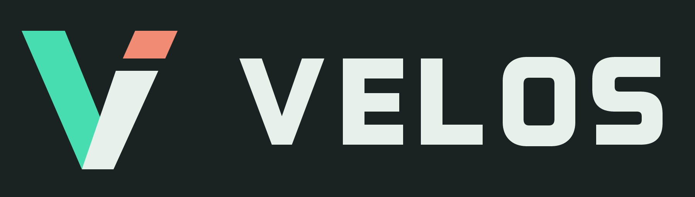
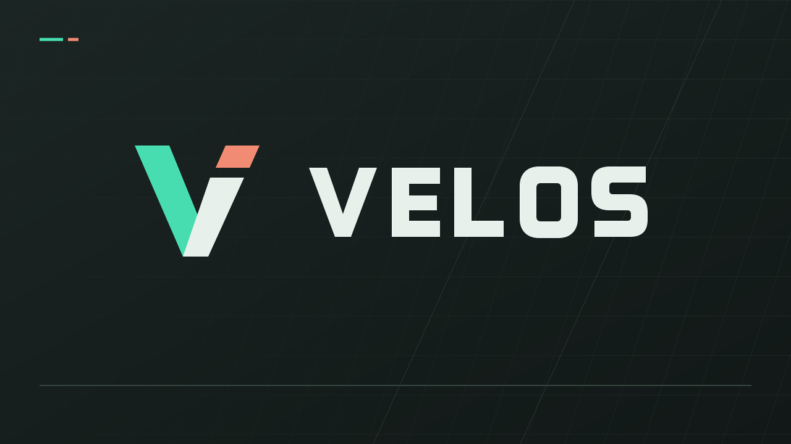

# Velos Identity



An angular V with a separated forward stroke, paired with an original path-based wordmark.
The mint accent follows the native editor; the small coral segment adds contrast. The vector
master contains no font or external-image dependency.

## Assets

| File | Format / Size | Use |
|---|---|---|
| [velos-logo.svg](velos-logo.svg) | Vector, 900 x 256 view box | Editable logo master |
| [velos-wordmark.png](velos-wordmark.png) | Transparent PNG, 1800 x 512 | Logo on dark backgrounds |
| [velos-logo.png](velos-logo.png) | Opaque PNG, 1800 x 512 | Logo with a charcoal background |
| [velos-mark.png](velos-mark.png) | Transparent PNG, 512 x 512 | Standalone V symbol |
| [velos-icon.png](velos-icon.png) | Transparent PNG, 256 x 256 | App-icon artwork with a dark backing |
| [velos.ico](velos.ico) | Multi-resolution Windows icon, 16-256 px | Native executable, title-bar and taskbar icon |
| [velos-splash.png](velos-splash.png) | Opaque PNG, 1280 x 720 | Embedded startup artwork; status text is drawn natively |

Palette: mint `#48DDB0`, coral `#F18B73`, light lettering `#E7F0EB`, charcoal `#192321`.
Keep the aspect ratio and clear space around the mark. Use the dark-background variant when
the pale wordmark would lose contrast. Windows chooses the appropriate icon size from the ICO.

## Native Splash



The native editor and runtime embed the icon and splash image into their executables, so a
packaged game needs no separate branding files. WIC decodes the embedded bitmap and Win32/GDI
draws the splash before D3D12 initialization. The status line advances through actual startup
stages; it is not a measured percentage or a simulated loading delay. The main window stays
hidden until its first rendered frame, then replaces the splash immediately.

- Normal interactive editor/runtime launches show the splash.
- `--no-splash` disables it and takes precedence over `--splash`.
- Finite-frame tests, isolated editor launches and MCP-controlled editor launches skip it by default.
- `--splash` explicitly enables it for visual checks. `--capture-splash=<path.png>` captures an
  enabled splash before GPU initialization; it does not enable one by itself.
- Packaging and sample-writing CLI operations never show a splash.
- Splash creation failure is nonfatal: startup continues with a diagnostic and the main window.
- Closing the splash hides it without closing the application. It is not an extra taskbar window.

Example from the repository root, using the isolated branding build:

```powershell
.\tools\build.ps1 -Configuration Release -BuildDirectory out/build-branding -Test
.\out\build-branding\Release\VelosEditor.exe
.\out\build-branding\Release\VelosRuntime.exe --scene=samples/signal-room/scene.velos --no-splash
```

Existing build directories can be rebuilt normally. Previous preview binaries and running editor
sessions are not overwritten by creating the isolated branding build.

## Regenerate and Verify

The asset-generation dependencies are development-only. Built applications do not require Node
or these libraries. The generated PNG and ICO files are checked in for ordinary native builds.

```powershell
npm ci --prefix tools/branding --ignore-scripts
npm run build --prefix tools/branding
npm test --prefix tools/branding
.\tools\branding-smoke.ps1 -BuildDirectory out/build-branding -Adapter nvidia
.\tools\branding-smoke.ps1 -BuildDirectory out/build-branding -Adapter warp
```

The generator deterministically renders the vector master into PNG assets and a multi-size ICO.
Tests verify the pixel colors, transparency, dimensions, icon directory and byte-for-byte
reproducibility. The native test checks resource loading, large/small icons, splash captures at
96/144/192/288 DPI and dismissal without a stray `WM_QUIT`. The smoke test checks editor/runtime
handoff, suppression, exported branding and exact game-image equivalence with and without splash.

This artwork is created for the project. It does not change the repository's unresolved license
choice or establish trademark clearance for the Velos name.