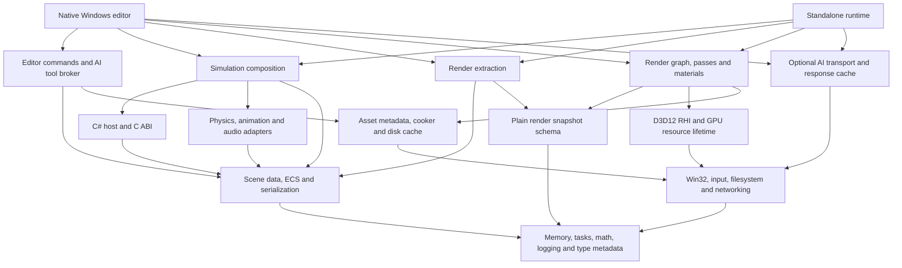
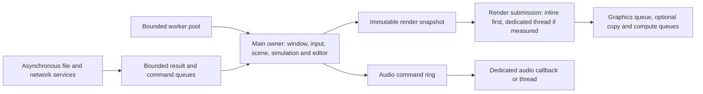
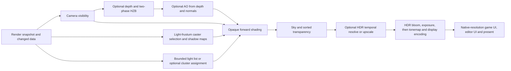
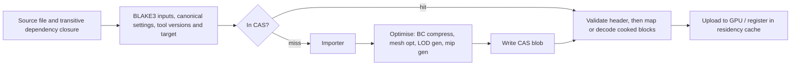
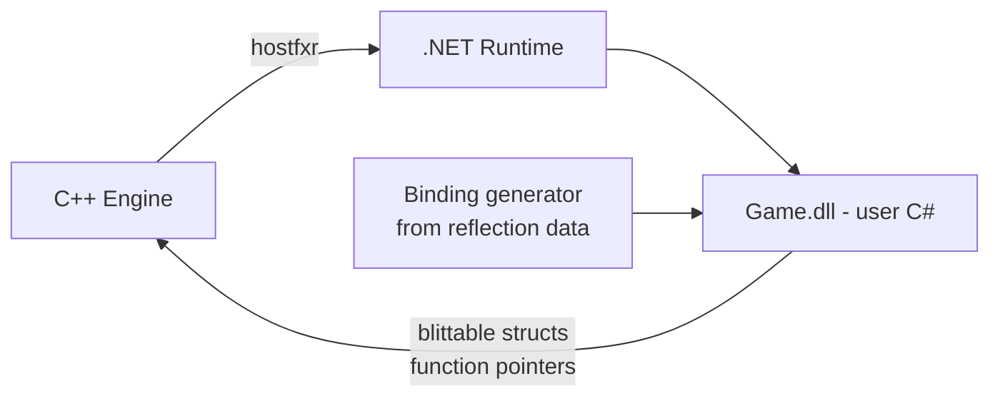
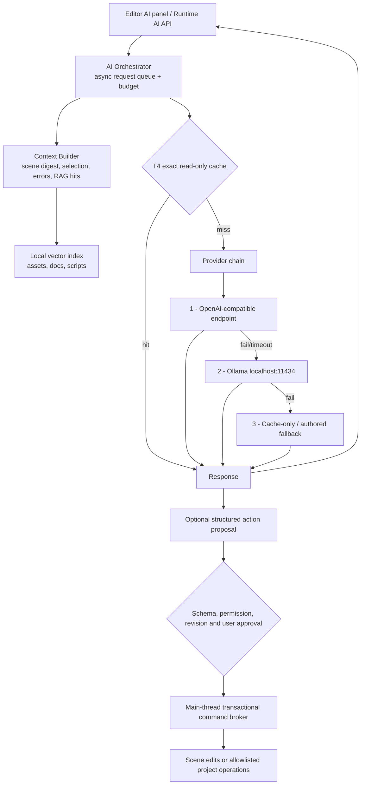
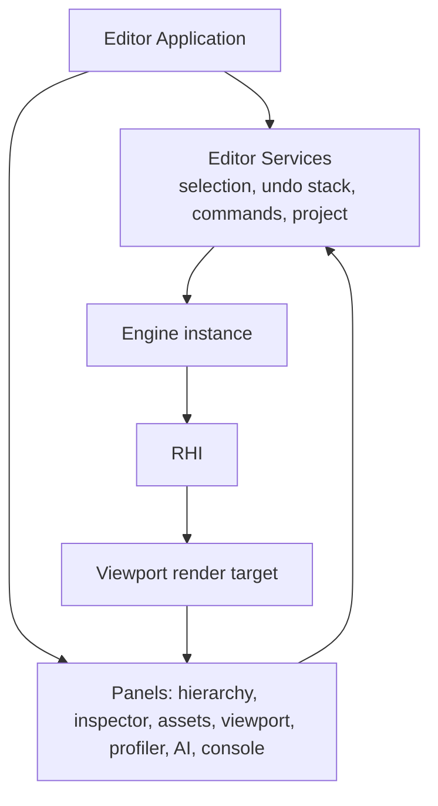

# Architecture - Velos Engine

| Field | Value |
|---|---|
| Document | Architecture / Technical Design |
| Version | 0.2 (draft) |
| Status | Target design; native preview implements a documented subset |
| Last updated | 2026-09-06 |

---

## 1. Architectural principles

1. **Data-oriented before object-oriented.** Layout for the cache line, then write the API.
2. **Use the right processor.** CPU owns gameplay and physics; GPU owns rendering. Move additional
  parallel work only when total frame time improves, including transfers and synchronization.
3. **Layers point downward only.** Enforced mechanically in CI.
4. **Everything is budgeted.** Memory, VRAM, frame time, cache size, AI tokens - all have ceilings
   and all are visible.
5. **Every optional feature has a simpler path.** CPU references validate math/visibility where
  useful; disabled rendering effects are omitted or replaced by cheaper GPU paths.
6. **Content-addressed everything.** If we can hash the inputs, we can cache the outputs.
7. **The editor is a client.** The engine never knows the editor exists.
8. **Fail visible, not fatal.** Missing asset -> magenta placeholder. Bad shader -> last good PSO.
   Dead AI provider -> cached or authored fallback.

---

## 2. Layer map



Arrows mean compile-time dependency, not frame order. Scene data never depends on rendering;
the extraction adapter produces a plain immutable snapshot consumed by the renderer. The asset
cooker has no RHI dependency; GPU upload/residency belongs to the renderer. Optional GPU-assisted
import is a separate adapter, not a mandatory dependency of offline tools.

Applications compose modules. AI transport returns data; only the editor's approved command
broker can mutate an authored scene. Runtime AI integration is optional and omitted from builds
that do not use it. CMake target dependencies and include checks enforce this DAG
(`NFR-MAINT-006`); third-party utility dependencies are explicitly allowlisted.

---

## 3. Threading model



Start with main-thread scene ownership and render submission plus bounded background tasks.
Do not pay for separate simulation/render threads or two frames of latency before measuring a
bottleneck. A dedicated render thread can later consume snapshots without changing scene APIs.

- Snapshots carry frame/revision IDs and stable handles, not pointers into mutable ECS storage.
  A bounded SPSC handoff uses explicit acquire/release ownership; a slot is never overwritten
  while being consumed. Only obsolete pending render snapshots may be coalesced, not physics steps.
- Two or three GPU frame-resource slots are protected by fences; CPU render-ahead is limited
  separately. ImGui draw data is copied or retained until render consumption completes.
- The platform layer owns engine thread policy, including dedicated audio and bounded I/O/network
  services; library-created threads are accounted for. Worker count reserves interactive headroom.
- Audio mixing uses preallocated buffers and bounded command rings, without blocking allocation,
  locks or logging in the callback. Diagnostics are drained by another thread.
- AI and I/O workers post immutable results. The scene owner drains validated commands at safe
  update points. Read/write declarations permit parallel ECS jobs with a structural-change barrier.

---

## 4. Frame pipeline

1. Pump Win32 messages, capture input and apply approved editor commands.
2. Accumulate elapsed time; for each fixed step, call `FixedUpdate`, apply forces/kinematic root
  motion, run the physics solver, then publish contacts and authoritative poses.
3. Run variable-rate script updates and visual animation, apply deferred structural changes,
  update CPU transform hierarchy and interpolate previous/current fixed poses for rendering.
4. Extract a versioned render snapshot, update changed GPU records and build UI draw data.
5. Build/execute the render graph, submit, present and retire resources whose fences completed.

Fixed step defaults to 1/60 s with a documented maximum catch-up count. Time dropped under
overload is reported. GPU timestamps and CPU timers are read asynchronously, never by forcing
a GPU idle every frame. GPU effects that affect gameplay must use an explicitly asynchronous
contract or retain a CPU representation; basic physics does not depend on GPU readback.

---

## 5. Core layer

### 5.1 Memory
| Allocator | Use |
|---|---|
| `LinearAllocator` (frame scratch) | Per-frame temporaries; reset, never freed individually |
| `StackAllocator` | Scoped nested temporaries |
| `PoolAllocator<T>` | Fixed-size objects (entities, components metadata, handles) |
| Platform heap or vetted allocator | Long-lived data; no custom heap required at bring-up |
| `VirtualMemoryArena` | Reserve big address ranges, commit on demand (ECS chunks, streaming buffers) |

Only frame arenas and tagged allocation are initial requirements; introduce extra allocator types
when profiling justifies them. `MemoryTracker` reports live/peak bytes and allocation count by
subsystem, including upload buffers and temporary cache fills. Debug builds add leak checks.

### 5.2 Job system
Wrap a proven task scheduler, such as enkiTS, with dependencies and parallel ranges. Bound the
queue and worker count, avoid fine-grained jobs smaller than their scheduling cost, and keep
blocking I/O away from compute workers. Physics adapters share this budget instead of starting
another full-size pool. CPU math uses a tested library such as DirectXMath, not a new SIMD suite.

### 5.3 Reflection
Use stable type/field IDs and explicit descriptors for serialization and inspector metadata in
M0/M5. Derive binding generation from that registry at M12; do not hand-parse arbitrary C++ headers.
Descriptors supply validation rules, but undo still requires command capture, and serialization
still requires versioning and migrations. Metadata alone does not implement those behaviors.

### 5.4 Coordinate and data conventions

Proposed convention: meters, seconds, radians; right-handed world, +Y up, camera looking along -Z.
Use column-vector semantics, `world = parent * local` and `clip = projection * view * world * position`.
Fix the C++/HLSL memory packing and matrix transpose boundary once, with round-trip tests; adapt
DirectXMath's representation explicitly. Importers convert source axes/units at this boundary.

D3D depth is 0..1; reversed-Z is proposed with clear depth 0 and greater/equal testing. Its HZB
reduction and comparison rules must agree. Keep albedo/emissive color-space conversion explicit:
sRGB inputs decode to linear; normals/roughness/metalness remain linear; tone-map before display
encoding. Nonuniform or negative scale requires correct normal transforms and winding handling.

---

## 6. RHI design

A thin, explicit, handle-based API with generation checks and backend-specific device internals.
Choose dispatch style for clarity first; benchmark overhead before introducing compile-time
backend policies. The initial path is D3D12, with no Vulkan implementation required for v1.0.

```cpp
struct BufferHandle  { u32 index; u32 gen; };
struct TextureHandle { u32 index; u32 gen; };

BufferHandle  CreateBuffer(const BufferDesc&);
TextureHandle CreateTexture(const TextureDesc&);
PipelineHandle CreateGraphicsPipeline(const GraphicsPipelineDesc&);

CommandList& Begin(QueueType);
cmd.SetPipeline(pso);
cmd.BindDescriptorTable(0, table);
cmd.DrawIndexedIndirect(argsBuffer, offset, maxCount, countBuffer);
Submit(cmd, waitFences, signalFence);
```

Key design points:

- **Capabilities first.** Require a working D3D12 device, FL 11_0+ and queried SM 6.0 for the
  proposed DXC path. Query resource binding, root-signature version, formats, wave operations and
  descriptor limits separately. Unsupported adapters receive diagnostics, not a silent claim of
  compatibility. Supporting older shader models or D3D11 requires a separate approved scope.
- **Bound tables first.** Use bounded material descriptor tables on the baseline. Indexed arrays
  or bindless heaps are optional, capability-checked paths. SM 6.6 direct-heap indexing is not the
  same feature as SM 6.0 descriptor-table indexing. Compute and indirect draws do not inherently
  require unrestricted bindless access; D3D11 also offers compute and indirect draws, with limits.
- **Explicit resource states** are computed by the render graph, not by the user.
- **Transient allocator**: render targets and intermediate buffers are sub-allocated from a small
  number of large heaps and aliased based on render-graph lifetimes. On a 2 GB card this is the
  difference between fitting and not.
- **Upload ring buffer** per frame-in-flight for dynamic constants and vertex data.
- **Fence-safe lifetime.** Retain buffers, descriptors and old hot-reloaded resources until every
  queue that uses them signals completion. Atomically publish the new generation; prevent ABA
  reuse and stale snapshot references. A CPU-side eviction decision is not permission to free
  an in-flight GPU resource.
- **Budget policy.** Track native allocations and DXGI usage/budget notifications. Include targets,
  uploads, descriptors and transient heaps before choosing the asset budget; stop admissions on
  pressure, lower detail and report temporary over-budget usage while pending work retires.
- **Conformance suite**: ~200 tests every backend must pass, plus golden images. Vulkan lands
  against a green suite or it does not land.

Open: **OD-03:** D3D12 first (as specified) vs starting with D3D11 for faster bring-up.

---

## 7. Render graph

Frame construction is declarative:

```cpp
graph.AddPass("depth-prepass", [&](Builder& builder){
  builder.Write(depth, Attachment::DepthWrite);
  builder.Read(instanceBuffer);
}, [=](CommandList& commands, const Resources& resources){
  DrawIndirect(commands, resources.Get(instanceBuffer));
});
```

The compiler then:
1. Builds a DAG from resource read/write declarations.
2. Culls passes with no path to a used output.
3. Computes resource lifetimes -> transient memory aliasing.
4. Inserts resource transitions, UAV barriers and aliasing barriers, respecting subresources.
5. Starts with one graphics queue. Optional queue assignment introduces explicit cross-queue
  fences and ownership/lifetime rules; aliased memory is not reused before all consumers finish.
6. Records D3D12 command lists per worker/allocator when profitable. Vulkan secondary command
  buffers are backend-specific, not a presumed D3D12 primitive.

Temporal histories and swapchain outputs are imported/persistent resources, not blindly aliased
transients. Recompile topology when pass configuration changes; do not rebuild an expensive
scheduler unnecessarily each frame. Async compute can increase contention on a small GPU and is
enabled only by measurements. Graph dumps and validation accompany the first graph implementation.

---

## 8. Rendering architecture

### 8.1 Forward first, clustered when useful
| Option | Bandwidth | MSAA | Many lights | Proposed use |
|---|---|---|---|---|
| Simple forward | Low target count | Supported | Per-object light-list cost | Baseline for a small number of lights |
| Deferred | Multiple G-buffer surfaces | More involved | Efficient light accumulation | Not the initial path; evaluate only for a demonstrated need |
| Tiled/clustered forward+ | Light-list and clustering overhead | Supported | Scales better with light count | Optional measured extension |
| Visibility buffer | Different material/visibility cost | More involved | Potentially efficient | Outside basic scope |

Shared memory bandwidth matters on iGPUs, but ALU, geometry, overdraw, driver costs and synchronization
can also dominate. Neither forward+ nor a depth prepass is automatically fastest for every scene.
Select via SRS profiles and a simple-forward reference, with shadows and post accounted separately.

### 8.2 Frame graph (extended path, optional stages shown)



Baseline bypasses HZB, AO, clustering and temporal stages. AO is applied to ambient lighting, not
multiplied over the final transparent image. Temporal stages require current/previous transforms,
motion vectors, jitter, disocclusion handling and history reset on resize/camera cuts. Post history
is scoped per viewport. Shadow casters are selected independently: an off-screen object can cast
a visible shadow and must not be discarded by camera culling.

### 8.3 Two-phase GPU occlusion culling
1. Frustum-test last frame's visible set and draw its current-frame geometry into depth.
2. Build a hierarchical Z-buffer (HZB) mip chain in compute.
3. Test *all* objects' bounding spheres against the HZB in compute -> produce indirect draw args and
   a visible-instance list.
4. Draw surviving new objects into depth and shade the union of both phases; update the visible
  set and invalidate history when camera/scene changes make reuse unsafe.

For reversed-Z, HZB stores a conservative minimum over each footprint and rejects an object only
when its nearest possible depth is behind that occluder bound, with bias. Empty pixels, near-plane
intersections, moving/skinned bounds and camera cuts must not produce false occlusion. Transparent
geometry does not act as an opaque occluder. Indirect buffers have explicit capacities and overflow
fallbacks. Validate against a no-occlusion reference: false positives cost work; false negatives
are correctness failures. Floating-point results need not match a CPU oracle bit-for-bit.

This path avoids synchronous visibility readback, but not GPU work or synchronization cost.
CPU frustum/BVH culling remains the baseline wherever it produces a better frame-time result.

### 8.4 Materials
Materials are **data**, not code paths: a `MaterialInstance` is a row in a GPU structured buffer
containing scalar parameters and texture handles. Bound-table and indexed-descriptor backends
resolve those handles differently. A `MaterialTemplate` maps to a bounded shader permutation set;
batch only draws whose mesh, material and pipeline state are compatible. Alpha blending preserves
correct ordering rather than claiming every material combination can share one draw.

The node-based material editor (M20) generates HLSL fragments compiled into a new permutation -
it does not create a new engine code path.

### 8.5 Lighting detail and decision sequence

| Stage | Design | Check before advancing |
|---|---|---|
| Baseline PBR | GGX metal/roughness, explicit linear/sRGB handling, IBL environment and manual exposure | Material reference scenes, energy/normal-map checks, basic tone mapping |
| Baseline direct light | Small bounded directional/point/spot list; one directional shadow, PCF, optional unshadowed lowest tier | SRS A/B timings and visible-shadow correctness |
| More lights | Cluster dimensions derived from resolution/depth range; 16x9x24 is only an initial experiment | Simple-forward comparison, cluster overflow checks and a deterministic light priority policy |
| Better shadows | Stable cascades, texel snapping, configurable bias; spot/point atlas with per-frame update cap | Camera movement, thin geometry, atlas relocation, off-screen casters and all tier transitions |
| Optional GI | Offline lightmaps or baked probe data, selected by OD-06 | Bake cost, UV/probe authoring, dynamic-object sampling, light leaking and runtime budget |

Point shadows can require six views and are disabled or tightly capped on low tiers. Cache a shadow
only while its light/projection, caster geometry/transforms, alpha-tested materials, atlas placement
and relevant streaming revisions remain valid. Camera-dependent cascades invalidate when their
projection/coverage changes; a simple camera-distance threshold is not a correctness rule. Dynamic
casters either invalidate the map or use a separately designed static/dynamic combination.

IBL does not provide local bounce lighting or contact occlusion. Baked probe volumes do not mean
real-time GI; choose CPU or GPU offline baking separately. Bake keys include geometry, materials,
lights, bake settings and baker version, with safe cancellation and publication. Volumetric fog,
PCSS and area lights are advanced experiments, not mandatory baseline effects.

### 8.6 2D pipeline
Use a separate lightweight pass set sharing the RHI, asset handles, ECS and editor services.
Pure 2D projects do not allocate 3D shadows, cluster grids or temporal histories. Sprites instance
quads with transform, UV rectangle, color and atlas handle; batch adjacent compatible draws without
breaking alpha/layer order. Chunk and cull tilemaps; draw count depends on visible chunks, layers,
atlases and blend states, not a blanket one-draw promise for arbitrary maps.

Orthographic/pixel-perfect cameras, sprite animation and game UI precede optional 2D lighting.
Box2D is proposed for genuine 2D contacts/constraints, Jolt for 3D; their components remain distinct.
In-game UI is independent of Dear ImGui, so packaged games do not link editor tooling.

---

## 9. GPU-first compute strategy

| Workload | GPU path | Authority or simpler path |
|---|---|---|
| Transform hierarchy | Optional level-by-level render-transform passes with inter-level barriers | CPU authoritative hierarchy; snapshot extraction |
| Frustum + occlusion culling | Conservative HZB/indirect path after benchmarking | CPU frustum/BVH traversal |
| Skinning | Vertex shader first; reusable compute output where beneficial | CPU pose sampling and optional small-workload skinning |
| Particles | Compute simulation + indirect draw, GPU sort for blended | Small CPU emitter budget |
| Light clustering | Optional compute froxel assignment | Small forward light list |
| Post-processing | Pixel or compute passes, reduced resolution where useful | Disable optional effects; keep simple GPU tonemap |
| Blend-shape / morph | Compute | CPU |
| Pathfinding grid / flow field | Compute (post-1.0) | A* on CPU |

**Persistent GPU state.** Update dirty instance/material/light records incrementally. Upload volume
scales with the number of changed records and can be large in animated scenes; full rebuilds are
valid on initial load, compaction or device recovery. Batch updates into bounded upload buffers.
Adopt a GPU path only after recording CPU/GPU time, uploaded bytes, occupancy/bandwidth where
available, peak memory and latency against the simpler path on each supported profile.

---

## 10. Asset pipeline & the caching architecture

### 10.1 Pipeline


The format has magic/version, source/dependency digests, block sizes/offsets, alignment, compression
and integrity metadata. Validate before mapping or decompressing. D3D12 texture uploads still
require legal row pitches and copies; a memory map is not direct GPU residency. The persistent
asset database (SQLite proposed) maps UUIDs to source paths, dependencies and current cook keys.
GPU-assisted import, if selected, records its tool/device-dependent determinism constraints.

### 10.2 The four cache tiers

| Tier | Contents | Key | Location | Budget (default) | Eviction |
|---|---|---|---|---|---|
| **T1 Asset CAS** | Cooked meshes, textures, audio, animations | Source + dependency digests + canonical settings + tool versions + target | `project://.velos/cas` | 8 GB | LRU baseline; measured cost-aware extension |
| **T2 Shader/PSO** | Shader artifacts; separate driver-specific PSO blobs | Shader/include/options/compiler hashes; PSO key also includes layout, adapter and driver | `%LOCALAPPDATA%/Velos/shaders` | 1.5 GB | LRU and compatibility invalidation |
| **T3 GPU residency** | Resident mips, LODs and buffers | Asset UUID + content revision + subresource | GPU memory, not persistent | Derived from DXGI budget after render/upload/transient reservations | Fence-safe residency eviction |
| **T4 AI** | Read-only responses and optional embeddings | Project/endpoint/model/messages/context/tools/parameters/version | `project://.velos/ai` | 0.5 GB | TTL + LRU; semantic suggestions opt-in |

T1 + T2 + T4 total **10 GB**, including temporary fills. One budget owner coordinates registered
cache roots and concurrent editor processes; these are subdivisions, not three independent
unbounded allowances. Project AI partitions are never cross-user or cross-project answer caches.
GPU budget includes non-asset resources and responds to OS pressure; 1.4 GB is not guaranteed just
because a card is labeled 2 GB. On an iGPU, asset RAM and GPU shared-memory accounting overlap.

### 10.3 What makes it "smart"
1. **Measured eviction.** Start with deterministic LRU. Compare a recency/frequency/rebuild-cost
  score per byte against recorded traces before adding complexity; expensive does not always
  mean worth retaining if an entry is huge or never reused.
2. **Predictive prefetch.** The residency cache receives camera velocity and the spatial BVH; it
   streams in what is about to enter the frustum, and records a per-scene access trace so the second
   playthrough prefetches from history.
3. **Nonblocking miss handling.** Keep a minimum usable representation or shared placeholder
  pinned. On a miss, render it and queue a budgeted upload. No synchronous asset load occurs on
  the render thread; OS/driver stalls are still measured, not claimed impossible.
4. **Hierarchical keys.** Changing an import setting invalidates one asset. Bumping the cooker
   version invalidates a class of assets. Nothing else moves.
5. **Correctness tooling from day one.** `--no-cache`, `--verify-cache` (recompute and compare
   every hit), and a cache-stats panel. Stale-cache bugs are the most expensive bugs in an engine;
   we build the detector before the cache.
6. **Crash-safe fills.** Reserve space, deduplicate by key, write a temporary entry, validate and
  atomically publish metadata/data. Never overwrite source assets. Cancel, disk-full, corrupted
  index and process-crash tests must leave a recoverable cache.
7. **Residency lifetime.** States are requested, uploading, resident, retiring and evicted.
  Publish only after upload completion; retiring resources and descriptors stay counted until
  all consumer fences finish. Defer admissions when nothing can safely be evicted. Stream mips
  using supported resource techniques; tiled-resource support is separately queried, not assumed.

PSO blobs are not portable shipping assets. Precompile HLSL and store pipeline descriptions at
build time; create/warm driver-specific PSOs on the target device. Rebuild after driver or adapter
changes and retain compatible last-good state during hot reload. AI cache hits display provenance
and never replay a previously approved action as though approval were still valid.

---

## 11. ECS & scene

EnTT is the proposed initial ECS; Flecs is the archetype alternative (OD-15). Neither prevents a
separate GPU scene representation. Persist engine UUIDs, not library storage indices, and maintain
an explicit UUID-to-runtime-handle map. Render extraction owns dense arrays and dirty versions
without forcing ECS storage to match GPU layout.

Structural changes are queued and applied after jobs finish. Hierarchy operations reject cycles,
define whether reparenting preserves local/world pose and handle noninvertible parent transforms.
CPU hierarchy evaluation supplies scripts/physics immediately; optional GPU render evaluation
does not change that authority.

At M5, text serialization and canonical snapshots already preserve IDs, component values and
parent links. M7 project save uses temporary-file plus atomic replacement and autosave. At M22,
add schema migrations, prefab override rules and streaming. Unknown component fields are handled
by a documented version policy, not silently discarded. Game save data has its own versioned
contract, distinct from editor scenes, with round-trip and interrupted-write tests.

---

## 12. Scripting architecture



- **ABI:** host a supported .NET LTS via `hostfxr` (currently .NET 10 proposed). Use a versioned
  C ABI, generation-checked handles and batched blittable values. C#-to-native calls may use
  `LibraryImport`/P/Invoke or unmanaged function pointers; `[UnmanagedCallersOnly]` is for the
  native-to-managed direction. None of these mechanisms makes the boundary zero-cost.
- **Lifetime:** borrowed spans are callback-scoped and cannot escape into async work or survive
  ECS structural changes, resource recreation or managed reload. Avoid a property call per object
  when a bulk operation is available; measure allocation and latency.
- **Hot reload:** quiesce callbacks/jobs, serialize supported state, detach events and native
  callbacks, release `GCHandle`s/delegates/tasks, then unload the collectible `AssemblyLoadContext`.
  Verify collection before loading/restoring the next assembly. Stale handles are invalidated.
  Unsupported schema changes or an unload failure request a controlled restart.
- **Safety:** every script callback is wrapped; an exception logs a managed stack trace and
  disables that component instead of killing the process.

**OD-04:** C# with the selected supported LTS versus Lua or another embedded language remains open.
Measure actual startup/RSS and GC behavior; do not hard-code a 40 MB runtime estimate. In-process
game scripts are trusted project code, not a security sandbox for arbitrary AI-generated programs.

---

## 13. AI layer architecture



### 13.1 Provider contracts

| Adapter | Initial contract | Capability boundary |
|---|---|---|
| OpenAI-compatible | Configured Chat Completions path, model and auth headers; JSON requests and SSE chunks | Test each endpoint for streaming/tools/JSON/embeddings; Responses is a separate API, not an alias |
| Ollama native | `/api/chat`, `/api/generate`, `/api/embed`, `/api/tags`; NDJSON stream parser | Model availability, size, context and tool support are checked, not inferred from the provider name |
| Provider-specific extension | Azure-style deployment/API-version/auth or another non-compatible protocol | Implement an adapter and contract tests when requested |

Requests carry cancellation, deadline, output/context/response-byte limits and scene revision.
Model discovery and health checks are asynchronous. Streaming parsers handle split UTF-8 sequences
and incremental tool-argument JSON with a maximum assembled size. Ollama installation/model pull
is a user-approved prerequisite; the engine neither installs a service nor downloads weights
silently. Remote HTTP uses TLS; local plain HTTP is an explicit loopback-only exception.

### 13.2 Fallback chain
An explicitly consented ordered list uses deadline, bounded retries/backoff and circuit breakers.
Default: selected endpoint, compatible local Ollama, applicable labeled cached answer, then AI
unavailable. Never add a remote fallback to a local-only configuration without consent. Missing
models/capabilities and auth errors are distinguished from transient rate limits/timeouts.

On failover, discard or clearly close the failed partial response and show the new provider.
Do not replay a tool that already ran; proposals and executed commands have distinct IDs/states.
Exact-cache lookup is project/context scoped; semantic suggestions are opt-in read-only content.
Core offline chat is tested with a fitting installed model, not a mandatory 7B model or identical
prose across providers. Editing and gameplay work with no model at all (`FR-AI-017`).

### 13.3 Tool calling
The model is given a typed tool schema generated from engine reflection:
`scene.query`, `entity.create`, `component.set`, `asset.search`, `file.read`, `file.write`,
`script.compile`, `shader.compile`. Every tool declares a permission and a destructiveness flag.
Writes are confined to the project root, routed through the undo system, and destructive calls
require confirmation (`NFR-SEC-002/003`).

Each proposal captures the project/scene revision, validates arguments against a strict schema,
previews its effects and commits as one undo transaction after approval. If state changed while
the model was thinking, revalidate instead of applying stale handles. Generated code is reviewed
before use; compile/fix iterations have a fixed attempt budget and approved toolchain invocations.

### 13.4 Prompt-injection defence
Model output and retrieved asset/script content are untrusted data. Delimiters and prompt text
are not a security boundary. The broker validates schemas, byte limits, tool allowlists and final
filesystem paths, rejects escaping junctions/reparse points and avoids shell-string interpolation.
Recheck access when opening/replacing files to avoid path-validation races (`NFR-SEC-002/005`).
An approved build may execute toolchain code, so arbitrary project scripts are not silently treated
as safe. Credentials use Windows protected storage; diagnostics redact them and avoid default
full-memory dumps. Runtime builds never embed shared cloud API keys.

### 13.5 Runtime AI
For NPC dialogue/behaviour: a bounded request queue, a per-frame time slice for response
processing, rate limiting per NPC, and mandatory authored fallback content. Games must ship playable
with AI unavailable.

### 13.6 Inference and rendering coexistence

Ollama runs out of process but still competes for CPU, RAM, bandwidth and GPU time. Low-end defaults
are one request, capped context/output and paused local inference while playing. A user may choose
a tested small quantized/CPU model or remote endpoint; neither choice guarantees faster results.
Model residency/unload settings are explicit and affect only engine-owned sessions, not unrelated
user workloads. Runtime NPC inference is deferred until simultaneous frame-time/resource tests pass;
authored dialogue/behavior remains immediate and gameplay-authoritative.

---

## 14. Editor architecture



- Editor state lives in **services**, UI panels are thin views. If the UI toolkit is ever replaced
  (Open: **OD-01**), the services survive.
- Authored scene mutations use **Command** transactions with captured previous state and a visible
  history budget. Undo, redo and AI edits share the same validation path, not automatic behavior
  supplied by a widget toolkit. Simulation updates are not each recorded as authoring undo commands.
- **Play-in-editor** uses M5 canonical snapshots. Stop discards transient simulation objects and
  restores authored IDs/components; GPU, script and physics handles are reconstructed. Compare
  serialized values, not raw in-memory object bytes. External effects are not magically rolled back.
- The viewport samples an engine render target. Each viewport owns its camera, resolution, temporal
  history and selection buffers; resize and DPI changes retire old resources behind fences.

**OD-01:** Win32 + Dear ImGui is already a native Windows application, not a web UI. It minimizes
initial viewport integration, but rich text, accessibility and desktop controls require deliberate
work. A C# WPF/WinUI/Avalonia shell can provide those advantages at the cost of HWND/swapchain,
input, DPI, lifetime and C ABI integration. Prototype the deciding workflow before accepting a
toolkit; do not describe one option as the only proper Windows app. C# editor plugins are deferred.

---

## 15. Build system & repository

- **CMake >= 3.28** with presets; MSVC 2022 primary, clang-cl secondary (better diagnostics + ASan).
- Precompiled headers and compiler caching where useful; keep a non-unity build in CI to expose
  missing includes and ODR defects. Add jumbo builds only after measuring iteration cost.
- Dependencies vendored in `/third_party` or fetched by pinned commit hash - never a floating
  version.
- **Hosted CI:** build Debug/Release, unit and importer tests, layering checks, shader compilation,
  WARP correctness/golden images and artifacts. GPU performance acceptance uses separately approved
  pinned physical machines; noisy hosted runner timings do not enforce low-end FPS promises.
- **Git:** trunk-based with short feature branches, Conventional Commits, annotated tag per
  milestone, Git LFS for binaries > 5 MB.

### Proposed third-party set
| Need | Choice | Licence |
|---|---|---|
| Physics | Jolt (3D), Box2D (2D proposed) | MIT |
| ECS / CPU math / tasks | EnTT, DirectXMath, enkiTS (proposed) | Permissive; verify exact pinned releases |
| Shader compile | DirectXShaderCompiler | LLVM/MIT |
| Mesh optimisation | meshoptimizer | MIT |
| Texture compression | DirectXTex and a vetted BC encoder | Verify chosen encoder and transitive notices |
| glTF import | cgltf | MIT |
| Image I/O | stb_image, tinyexr | Public domain / BSD |
| Audio backend | miniaudio | MIT/public domain |
| Editor UI | Dear ImGui + ImGuizmo + implot | MIT |
| JSON | simdjson / nlohmann | Apache / MIT |
| Hashing | BLAKE3 | CC0/Apache |
| HTTP/TLS | WinHTTP on Windows; libcurl only if an adapter needs it | Windows platform API / curl license |
| Tests | doctest or Catch2 | MIT/BSL |
| Asset/cache metadata | SQLite | Public domain |
| Vector index (deferred) | USearch or another proven local index | Verify chosen release; do not hand-roll ANN |

These are candidates, not installed dependencies or a completed license audit. Pin versions/hashes
when adopted and verify transitive licenses, notices and redistribution terms. Models and sample
assets have separate rights; permissive library code does not grant rights to arbitrary content.

M23.A first packages a minimal cooked sample plus native/.NET dependencies, without editor code.
M23.B adds compressed archives, manifest validation and reproducible unsigned distribution.
Declare dynamic asset loads so dependency stripping does not remove runtime content. Ship portable
shader artifacts/pipeline descriptions and build adapter-specific PSO caches on the user's machine.
Do not publish a remote repository, create branches or rewrite history as a side effect of planning;
Git author identity must be supplied or already configured by the user.

---

## 16. Error handling & diagnostics

| Failure | Behaviour |
|---|---|
| Missing asset | Magenta checker texture / unit-cube mesh + one error log, never a crash |
| Shader compile error | Keep last good PSO, red-highlight in console with file:line |
| PSO cache miss mid-frame | Compatible last-good/fallback pipeline or optional draw omission; build asynchronously |
| VRAM pressure | Residency cache evicts to lower mips/LODs; log a budget warning |
| Device removed | Preserve CPU-authored scene, attempt reconstruction; save recovery data and request restart if unsuccessful |
| Script exception | Log managed stack trace, disable the component, keep running |
| AI provider down | Circuit-break, fall through the chain, surface a non-modal notice |
| Corrupt cache entry | Detect by hash, delete, rebuild transparently |

---

## 17. Testing strategy

| Level | Scope | Runs |
|---|---|---|
| Unit | Math, allocators, ECS, hashing, cache policies, serialisation | Every commit |
| RHI conformance | ~200 backend behaviour tests | Every commit (WARP), nightly on real GPUs |
| Golden image | PBR, shadows, tonemap, 2D, post - perceptual diff | Every commit |
| Integration | Import->cook->load->render; hot reload; AI fallback chain (mocked + live Ollama) | Every commit / nightly |
| Benchmark | Fixed camera, percentile timings and memory; 10% regression gate only on pinned physical runners | Per completed rendering change; nightly or manual hardware evidence |
| Fuzz | Importers, `.vpak`, scene deserialiser | Nightly |
| Soak | 8 h editor, 4 h runtime | Weekly / pre-release |

---

## 18. Open architectural decisions

Full list and context in [adr/README.md](adr/README.md). The ones that block early milestones:

| ID | Decision | Blocks |
|---|---|---|
| OD-01 | Editor UI: Dear ImGui vs C# WinUI 3 / Avalonia shell | M7 |
| OD-03 | Graphics API: D3D12-first vs D3D11-first then D3D12 | M2 |
| OD-04 | Scripting: C# .NET host vs Lua/AngelScript for v1 | M12 |
| OD-05 | Bindless-first vs classic binding for the baseline path | M2 |
| OD-06 | Optional baked GI: lightmaps vs irradiance probes | Advanced M9 |
| OD-07 | Baseline hardware we physically test on | M2 |
| OD-08 | 2D as a mode of the 3D pipeline vs a separate lean pipeline | M15 |

## 19. Source references and verification status

Consulted on 2026-09-06 for the proposal:
- [Direct3D hardware feature levels](https://learn.microsoft.com/en-us/windows/win32/direct3d12/hardware-feature-levels): feature level, shader model and optional capabilities are distinct.
- [Ollama embedding API](https://docs.ollama.com/api/embed): native embedding requests use `/api/embed`.
- [.NET support policy](https://dotnet.microsoft.com/en-us/platform/support/policy/dotnet-core): .NET 10 is LTS; .NET 8 support ends November 10, 2026.

The target architecture remains a design proposal beyond the implemented preview. The current
code has a renderer-independent EnTT scene model, a render-extraction adapter, an explicit-pass
D3D12 renderer, Win32/ImGui editor, Jolt primitive physics, static GLB geometry cooking, native
WinHTTP AI adapters and folder packaging. It uses SHA-256, conventional 0..1 depth and static CRT
linkage; it does not yet implement the full render graph, GPU compute scene processing, C# host,
texture pipeline, unified residency cache or advanced AI tools described above.

Eight CTest groups, NVIDIA/Intel/WARP editor/runtime smoke checks, actual screenshot pixel checks
and a live local Ollama request have passed. The development iGPU is UHD 770, not the proposed
minimum UHD 620. Full benchmark, fuzzing, soak, security and clean-machine release gates are still
unverified. See [../README.md](../README.md) for build commands and precise preview limits.
