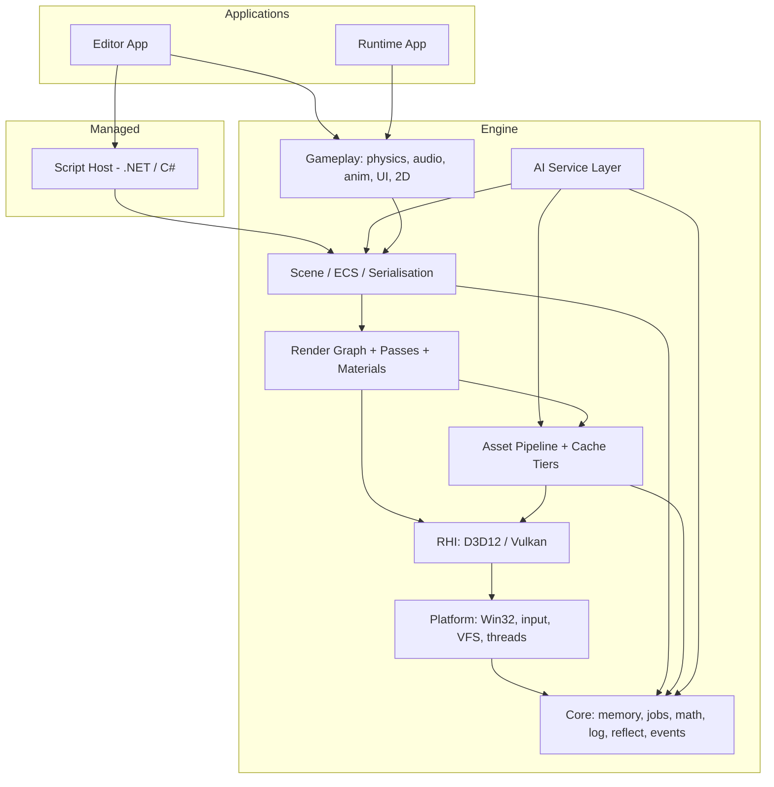
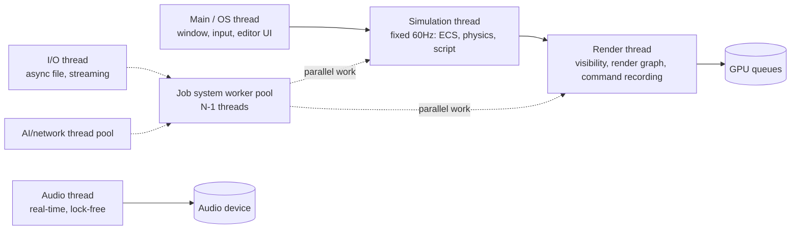
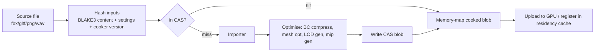
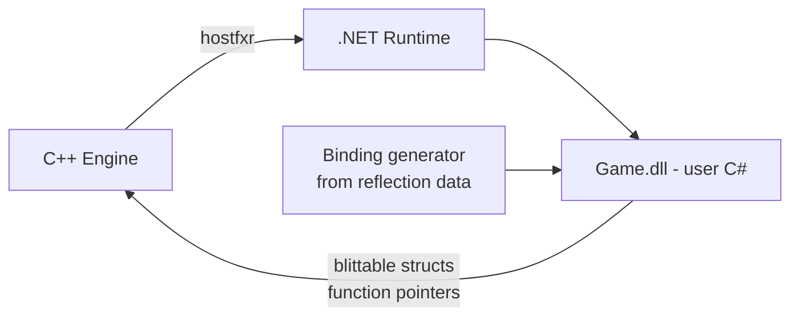
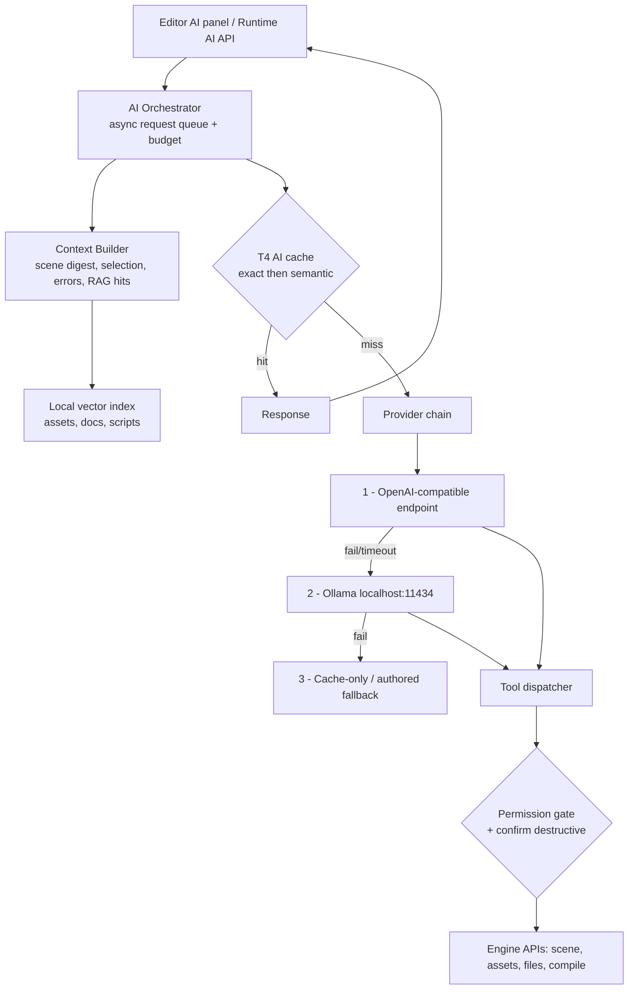
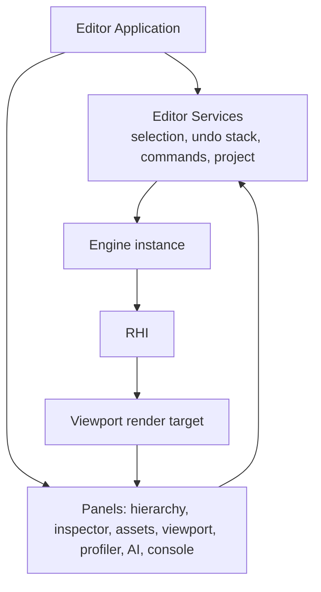

# Architecture — Velos Engine

| Field | Value |
|---|---|
| Document | Architecture / Technical Design |
| Version | 0.1 (draft) |
| Status | For review — decisions marked ⚠️ are open |
| Last updated | 2026-09-06 |

---

## 1. Architectural principles

1. **Data-oriented before object-oriented.** Layout for the cache line, then write the API.
2. **The CPU schedules; the GPU computes.** Per-object per-frame work belongs in compute shaders.
3. **Layers point downward only.** Enforced mechanically in CI.
4. **Everything is budgeted.** Memory, VRAM, frame time, cache size, AI tokens — all have ceilings
   and all are visible.
5. **Every GPU fast path has a CPU reference path.** Used for validation, and as the fallback on
   `Potato` tier and broken drivers.
6. **Content-addressed everything.** If we can hash the inputs, we can cache the outputs.
7. **The editor is a client.** The engine never knows the editor exists.
8. **Fail visible, not fatal.** Missing asset → magenta placeholder. Bad shader → last good PSO.
   Dead AI provider → cached or authored fallback.

---

## 2. Layer map



**Dependency rule:** a module may depend only on modules strictly below it. `core` depends on
nothing but the C++ standard library. A CI script parses includes and fails on violations
(`NFR-MAINT-006`).

---

## 3. Threading model



Rules:

- **One frame of latency** between simulation and render. Simulation writes into a triple-buffered
  *render packet* (visible-object list, transforms, light list, camera); the render thread reads the
  previous packet. No locks, no shared mutable state.
- The **job system** is the only place threads are created. Subsystems submit jobs, never spawn.
- The **audio thread** is real-time: no allocation, no locks, no logging. Communicates via SPSC
  ring buffers.
- **AI and I/O never touch engine state directly.** They post results onto a command queue drained
  on the simulation thread.
- Systems declare component access; the ECS scheduler builds a per-frame dependency DAG and runs
  non-conflicting systems in parallel automatically.

---

## 4. Frame pipeline

```
   Frame N (main)      Frame N (sim)          Frame N-1 (render)         GPU N-2
 ┌────────────────┐  ┌────────────────────┐  ┌────────────────────────┐ ┌────────┐
 │ pump OS msgs   │  │ input snapshot     │  │ read render packet     │ │ execute│
 │ editor UI      │  │ script Update      │  │ frustum/occlusion cull │ │ command│
 │ build ImGui    │─▶│ fixed step:        │─▶│ build render graph     │▶│ lists  │
 │ present sync   │  │   physics x N      │  │ compile: barriers,     │ │        │
 │                │  │   FixedUpdate      │  │   aliasing, pass cull  │ │        │
 │                │  │ animation sample   │  │ record command lists   │ │        │
 │                │  │ transform update   │  │   (parallel jobs)      │ │        │
 │                │  │ produce packet     │  │ submit + present       │ │        │
 └────────────────┘  └────────────────────┘  └────────────────────────┘ └────────┘
```

Fixed timestep = 1/60 s with accumulator and max-catch-up clamp (avoids the spiral of death).
Rendering interpolates transforms between the last two fixed states.

---

## 5. Core layer

### 5.1 Memory
| Allocator | Use |
|---|---|
| `LinearAllocator` (frame scratch) | Per-frame temporaries; reset, never freed individually |
| `StackAllocator` | Scoped nested temporaries |
| `PoolAllocator<T>` | Fixed-size objects (entities, components metadata, handles) |
| `TLSFAllocator` | General-purpose heap for long-lived data |
| `VirtualMemoryArena` | Reserve big address ranges, commit on demand (ECS chunks, streaming buffers) |

All allocators are tagged. `MemoryTracker` keeps per-tag live bytes, peak, and allocation count.
Debug builds add guard pages and leak reporting.

### 5.2 Job system
Work-stealing deques, one per worker. API:
```cpp
JobHandle a = jobs.Dispatch("cull", [&]{ ... });
JobHandle b = jobs.ParallelFor("skin", count, 256, [&](u32 i){ ... }, /*deps*/ a);
jobs.Wait(b);
```
No job may block on I/O; blocking work goes to the I/O thread pool.

### 5.3 Reflection
Macro-annotated, code-generated at build time by a small tool that parses headers:
```cpp
VSTRUCT()
struct Transform {
    VFIELD(Range(-1e6, 1e6)) float3 position;
    VFIELD()                 quat   rotation;
    VFIELD()                 float3 scale;
};
```
Generates: type descriptors, field offsets/types, serialiser, inspector metadata, C# binding stubs.
**One annotation gives you serialisation, the inspector, undo/redo, and script access.**

---

## 6. RHI design

A thin, explicit, handle-based API. No virtual calls on the hot path — the backend is chosen at
link time via a compile-time policy (or a single v-table indirection at device level).

```cpp
struct BufferHandle  { u32 index; u32 gen; };
struct TextureHandle { u32 index; u32 gen; };

BufferHandle  CreateBuffer(const BufferDesc&);
TextureHandle CreateTexture(const TextureDesc&);
PipelineHandle CreateGraphicsPipeline(const GraphicsPipelineDesc&);

CommandList& Begin(QueueType);
cmd.SetPipeline(pso);
cmd.BindDescriptorTable(0, table);      // bindless: just an index
cmd.DrawIndexedIndirect(argsBuffer, offset, maxCount, countBuffer);
Submit(cmd, waitFences, signalFence);
```

Key design points:

- **Bindless-first.** All textures live in one giant descriptor heap; materials store `u32` indices
  in a GPU structured buffer. Draw calls become "here is a material index". This is what makes
  GPU-driven rendering possible and slashes CPU descriptor work. Fallback path for Tier-1 hardware
  binds classic descriptor tables.
- **Explicit resource states** are computed by the render graph, not by the user.
- **Transient allocator**: render targets and intermediate buffers are sub-allocated from a small
  number of large heaps and aliased based on render-graph lifetimes. On a 2 GB card this is the
  difference between fitting and not.
- **Upload ring buffer** per frame-in-flight for dynamic constants and vertex data.
- **Conformance suite**: ~200 tests every backend must pass, plus golden images. Vulkan lands
  against a green suite or it does not land.

⚠️ **OD-03:** D3D12 first (as specified) vs starting with D3D11 for faster bring-up.

---

## 7. Render graph

Frame construction is declarative:

```cpp
graph.AddPass("depth-prepass", [&](Builder& b){
    b.Write(depth, Attachment::DepthWrite);
    b.Read(instanceBuffer);
}, [=](CommandList& cmd, const Resources& r){
    DrawIndirect(cmd, r.Get(instanceBuffer));
});
```

The compiler then:
1. Builds a DAG from resource read/write declarations.
2. Culls passes with no path to a used output.
3. Computes resource lifetimes → transient memory aliasing.
4. Inserts barriers/transitions and split barriers.
5. Assigns passes to graphics/compute/copy queues and inserts cross-queue fences.
6. Emits a parallel recording plan (passes recorded on job threads into secondary command lists).

Benefits we actually need: automatic barrier correctness (the #1 source of D3D12 bugs), memory
aliasing (VRAM budget), async compute overlap (free perf on AMD/NV), and a visualiser that makes
the frame explainable.

---

## 8. Rendering architecture

### 8.1 Why clustered forward+
| Option | Bandwidth | MSAA | Many lights | iGPU verdict |
|---|---|---|---|---|
| Forward (classic) | Low | Yes | Poor | Not enough lights |
| Deferred | **High** (fat G-buffer) | Painful | Great | ✗ bandwidth-starved iGPUs choke |
| Tiled/clustered forward+ | Low | Yes | Great | ✅ **chosen** |
| Visibility buffer | Low | Hard | Great | Too complex for v1 |

Clustered forward+ gives many lights *without* a G-buffer. On integrated graphics, memory bandwidth
is the binding constraint — not ALU. This decision follows directly from the low-end pillar.

### 8.2 Frame graph (3D, `Medium` tier)


### 8.3 Two-phase GPU occlusion culling
1. Draw last frame's visible set into depth (they were visible, likely still are).
2. Build a hierarchical Z-buffer (HZB) mip chain in compute.
3. Test *all* objects' bounding spheres against the HZB in compute → produce indirect draw args and
   a visible-instance list.
4. Draw the newly-appeared objects, update the visible set for next frame.

Zero CPU readback, zero latency stall. On `Low`/`Potato` this is replaced by SIMD CPU frustum
culling over a BVH (Intel iGPU indirect-draw throughput is poor — measured, not assumed).

### 8.4 Materials
Materials are **data**, not code paths: a `MaterialInstance` is a row in a GPU structured buffer
containing scalar parameters plus bindless texture indices. A `MaterialTemplate` maps to a shader
permutation. Result: thousands of material instances, a handful of PSOs, and instancing that
actually batches.

The node-based material editor (M20) generates HLSL fragments compiled into a new permutation —
it does not create a new engine code path.

### 8.5 Lighting detail
- **Direct:** GGX specular + Lambert/Burley diffuse, energy-conserving multi-scatter term.
- **Clusters:** 16×9×24 froxels, exponential Z distribution, compute-assigned light lists,
  light count per cluster capped by tier.
- **Shadows:** CSM with 2 (Low) → 4 (High) cascades, stable fit, slope-scaled depth bias, PCF 3×3
  (Low) → PCSS (High). Spot lights use a shared shadow atlas with per-light resolution driven by
  screen size; point lights use cube faces in the same atlas. Static shadow caching: cascades that
  contain only static geometry are re-rendered only when the camera moves past a threshold — a
  large win on weak GPUs.
- **Indirect:** IBL for distant/ambient (prefiltered GGX cubemap + irradiance SH, computed on GPU
  at import). Static GI via ⚠️ **OD-06**: lightmaps (cheapest at runtime, slow to bake) vs
  irradiance volumes/probe grid (dynamic objects handled naturally, cheaper to author).
- **Volumetrics:** froxel-based volumetric fog reusing the cluster grid — `High`+ only.

### 8.6 2D pipeline
Shares the RHI, render graph, materials and ECS. A sprite is an instance in a GPU buffer
(position, UV rect, colour, atlas index); one draw call per atlas+blend-state, sorted by layer then
depth. Tilemaps render as a single instanced quad grid with an index texture, evaluated in the
pixel shader — millions of tiles, one draw call. 2D lighting reuses the cluster grid in a flat
configuration.

---

## 9. GPU-first compute strategy

| Workload | GPU implementation | CPU fallback |
|---|---|---|
| Transform hierarchy | Level-by-level compute passes over a flattened hierarchy buffer | Job-parallel SIMD walk |
| Frustum + occlusion culling | Compute over instance bounds → indirect args | SIMD BVH traversal |
| Skinning | Compute writing a skinned vertex buffer, reused by depth/shadow/main | SIMD CPU skinning |
| Particles | Compute simulation + indirect draw, GPU sort for blended | Small CPU emitter budget |
| Light clustering | Compute froxel assignment | N/A (feature disabled on `Potato`) |
| Post-processing | Compute chain, half-res where allowed | N/A |
| Blend-shape / morph | Compute | CPU |
| Pathfinding grid / flow field | Compute (post-1.0) | A* on CPU |

**Persistent GPU state.** Instance transforms, material rows, light data and mesh metadata live in
GPU buffers updated *incrementally* — the CPU uploads only the deltas each frame (typically a few
KB), never a full rebuild. This is the single biggest CPU-time saving in the design.

---

## 10. Asset pipeline & the caching architecture

### 10.1 Pipeline


The cooked format is designed for **zero-parse loading**: header + memory-mappable blocks laid out
exactly as the GPU wants them. Loading a mesh is `mmap` + `CopyBufferRegion`.

### 10.2 The four cache tiers

| Tier | Contents | Key | Location | Budget (default) | Eviction |
|---|---|---|---|---|---|
| **T1 Asset CAS** | Cooked meshes, textures, audio, anims | `BLAKE3(bytes + settings + version)` | `project://.velos/cas` | 10 GB | Cost-aware LRU-K |
| **T2 Shader/PSO** | DXIL/SPIR-V + serialised PSOs | `hash(src + includes + defines + compiler + target)` | `%LOCALAPPDATA%/Velos/shaders` (shared across projects) | 2 GB | LRU + version purge |
| **T3 GPU residency** | Live VRAM: texture mips, mesh LODs, buffers | Asset GUID + LOD/mip level | VRAM | tier-dependent (e.g. 1.4 GB on a 2 GB card) | Predictive cost-aware |
| **T4 AI** | Prompt → response, embeddings | `hash(model + prompt + context digest + params)` + embedding vector | `project://.velos/ai` | 500 MB | TTL + LRU |

### 10.3 What makes it "smart"
1. **Cost-aware eviction.** Score = `f(recency, frequency, rebuild_cost, size)`. A BC7 2K texture
   that takes 800 ms to recompress outranks a mesh that takes 5 ms. Plain LRU evicts exactly the
   wrong things.
2. **Predictive prefetch.** The residency cache receives camera velocity and the spatial BVH; it
   streams in what is about to enter the frustum, and records a per-scene access trace so the second
   playthrough prefetches from history.
3. **Graceful degradation, never a stall.** A residency miss renders the lowest resident mip/LOD
   this frame and queues the upload — it *never* blocks. Visual quality dips for a few frames
   instead of the frame time spiking. This is what "works on low-end" actually means.
4. **Hierarchical keys.** Changing an import setting invalidates one asset. Bumping the cooker
   version invalidates a class of assets. Nothing else moves.
5. **Correctness tooling from day one.** `--no-cache`, `--verify-cache` (recompute and compare
   every hit), and a cache-stats panel. Stale-cache bugs are the most expensive bugs in an engine;
   we build the detector before the cache.
6. **Async everything.** All cache fills happen on the I/O pool and copy queue.

---

## 11. ECS & scene

Archetype storage: entities with an identical component set share 16 KB chunks of tightly packed
SoA arrays.

```
Archetype [Transform, MeshRenderer, RigidBody]
 └── Chunk (16 KB)
      ├── Entity[]     [e0 e1 e2 ...]
      ├── Transform[]  [t0 t1 t2 ...]   ← contiguous, SIMD-friendly
      ├── MeshRenderer[]
      └── RigidBody[]
```

- Adding/removing a component moves the entity between archetypes (structural change), batched to
  the end of the frame.
- Queries iterate matching archetypes' chunks linearly — the hardware prefetcher does the rest.
- Per-chunk change version enables "only upload transforms that moved" to the GPU.
- Systems declare `Read<T>` / `Write<T>`; the scheduler auto-parallelises.

**Hierarchy** is a separate structure (parent, first-child, next-sibling indices) kept in
depth-sorted order so world matrices can be computed in one linear pass — on CPU for small scenes,
in a compute pass for large ones.

---

## 12. Scripting architecture



- **Interop rule:** no marshalling, no P/Invoke overhead on hot paths. Engine data is exposed as
  blittable structs and `Span<T>` views over native memory; calls go through
  `[UnmanagedCallersOnly]` function pointers.
- **Hot reload:** the game assembly loads into a collectible `AssemblyLoadContext`. On rebuild:
  serialise component state → unload context → load new assembly → deserialise state.
- **Safety:** every script callback is wrapped; an exception logs a managed stack trace and
  disables that component instead of killing the process.

⚠️ **OD-04:** C# (.NET 8) vs a lighter embedded language for v1. C# is far more capable and
familiar; it costs ~40 MB RSS, a hosting dependency, and GC discipline.

---

## 13. AI layer architecture



### 13.1 Provider abstraction
```cpp
struct IAIProvider {
    virtual bool        IsAvailable() const = 0;
    virtual AIFuture    Chat(const ChatRequest&, StreamCallback) = 0;
    virtual AIFuture    Embed(std::span<const std::string>) = 0;
    virtual ModelList   Models() const = 0;
    virtual Capabilities Caps() const = 0;   // tools? streaming? vision? ctx length
};
```
Implementations: `OpenAICompatibleProvider` (covers OpenAI, Azure, Groq, OpenRouter, LM Studio,
llama.cpp server, vLLM) and `OllamaProvider` (native `/api/chat`, `/api/embeddings`, `/api/tags`,
plus model pull/progress). Configuration is data; adding a provider means adding a config entry.

### 13.2 Fallback chain
Ordered list with per-entry timeout, retry policy and circuit breaker. On failure the orchestrator
falls through automatically. **Every feature must be usable with Ollama alone** (`FR-AI-017`) —
that is a hard architectural constraint, not a nice-to-have, and it forces prompts to work with
7B-class models.

### 13.3 Tool calling
The model is given a typed tool schema generated from engine reflection:
`scene.query`, `entity.create`, `component.set`, `asset.search`, `file.read`, `file.write`,
`script.compile`, `shader.compile`. Every tool declares a permission and a destructiveness flag.
Writes are confined to the project root, routed through the undo system, and destructive calls
require confirmation (`NFR-SEC-002/003`).

### 13.4 Prompt-injection defence
Model output is **data**. It is never executed, never used to build a shell command, and file paths
from the model are canonicalised and re-checked against the project root before use
(`NFR-SEC-005`). Asset content and web content included in context are fenced and labelled
untrusted.

### 13.5 Runtime AI
For NPC dialogue/behaviour: a bounded request queue, a per-frame time slice for response
processing, rate limiting per NPC, and mandatory authored fallback content. Games must ship playable
with AI unavailable.

---

## 14. Editor architecture



- Editor state lives in **services**, UI panels are thin views. If the UI toolkit is ever replaced
  (⚠️ **OD-01**), the services survive.
- Every mutation goes through a **Command** object (`Do`/`Undo`), giving undo/redo, AI-driven edits
  and scripted edits the same path for free.
- **Play-in-editor** snapshots the scene to the binary serialiser, runs, and restores on stop —
  guaranteeing an exact revert.
- The viewport is just an engine render target sampled by the UI. Multiple viewports = multiple
  cameras, no special casing.

⚠️ **OD-01:** Dear ImGui in-engine (proposed) vs a C# WinUI 3 / Avalonia shell hosting the engine
swapchain. ImGui: immediate iteration, zero interop, ugly-but-functional, proven for engine tools.
WinUI: native Windows look, better text/accessibility, but adds interop complexity, an input-routing
seam, and a second UI framework to maintain.

---

## 15. Build system & repository

- **CMake ≥ 3.28** with presets; MSVC 2022 primary, clang-cl secondary (better diagnostics + ASan).
- **Unity/jumbo builds** and precompiled headers for compile speed; `ccache`/`sccache` in CI.
- Dependencies vendored in `/third_party` or fetched by pinned commit hash — never a floating
  version.
- **CI (GitHub Actions, Windows runner):** build Debug+Release → unit tests → layering check →
  shader compile-all → golden images (WARP) → benchmark → artifact upload.
- **Git:** trunk-based with short feature branches, Conventional Commits, annotated tag per
  milestone, Git LFS for binaries > 5 MB.

### Proposed third-party set
| Need | Choice | Licence |
|---|---|---|
| Physics | Jolt Physics | MIT |
| Shader compile | DirectXShaderCompiler | LLVM/MIT |
| Mesh optimisation | meshoptimizer | MIT |
| Texture compression | ISPC Texture Compressor / bc7enc | MIT |
| glTF import | cgltf | MIT |
| Image I/O | stb_image, tinyexr | Public domain / BSD |
| Audio backend | miniaudio | MIT/public domain |
| Editor UI | Dear ImGui + ImGuizmo + implot | MIT |
| JSON | simdjson / nlohmann | Apache / MIT |
| Hashing | BLAKE3 | CC0/Apache |
| HTTP/TLS | cpp-httplib + WinHTTP, or libcurl | MIT |
| Tests | doctest or Catch2 | MIT/BSL |
| Vector index | usearch or hand-rolled HNSW | Apache |

All permissive licences — no GPL, no commercial encumbrance.

---

## 16. Error handling & diagnostics

| Failure | Behaviour |
|---|---|
| Missing asset | Magenta checker texture / unit-cube mesh + one error log, never a crash |
| Shader compile error | Keep last good PSO, red-highlight in console with file:line |
| PSO cache miss mid-frame | Draw with a fallback PSO, compile async, swap in next frame |
| VRAM pressure | Residency cache evicts to lower mips/LODs; log a budget warning |
| Device removed | Recreate device + resources; editor session survives |
| Script exception | Log managed stack trace, disable the component, keep running |
| AI provider down | Circuit-break, fall through the chain, surface a non-modal notice |
| Corrupt cache entry | Detect by hash, delete, rebuild transparently |

---

## 17. Testing strategy

| Level | Scope | Runs |
|---|---|---|
| Unit | Math, allocators, ECS, hashing, cache policies, serialisation | Every commit |
| RHI conformance | ~200 backend behaviour tests | Every commit (WARP), nightly on real GPUs |
| Golden image | PBR, shadows, tonemap, 2D, post — perceptual diff | Every commit |
| Integration | Import→cook→load→render; hot reload; AI fallback chain (mocked + live Ollama) | Every commit / nightly |
| Benchmark | Fixed camera path, frame-time percentiles → JSON, regression gate at 10% | Every commit |
| Fuzz | Importers, `.vpak`, scene deserialiser | Nightly |
| Soak | 8 h editor, 4 h runtime | Weekly / pre-release |

---

## 18. Open architectural decisions

Full list and context in [adr/README.md](adr/README.md). The ones that block early milestones:

| ID | Decision | Blocks |
|---|---|---|
| OD-01 | Editor UI: Dear ImGui vs C# WinUI 3 / Avalonia shell | M7 |
| OD-03 | Graphics API: D3D12-first vs D3D11-first then D3D12 | M2 |
| OD-04 | Scripting: C# .NET host vs Lua/AngelScript for v1 | M12 |
| OD-05 | Bindless-first vs classic binding for the baseline path | M2 |
| OD-06 | Static GI: lightmaps vs irradiance probe volumes | M19 |
| OD-07 | Baseline hardware we physically test on | M2 |
| OD-08 | 2D as a mode of the 3D pipeline vs a separate lean pipeline | M15 |
