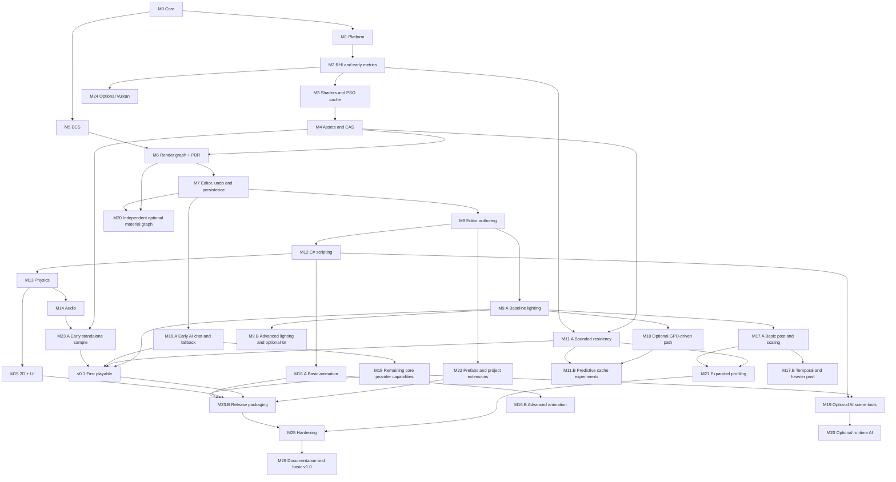

# Milestones - Velos Engine

| Field | Value |
|---|---|
| Document | Delivery roadmap |
| Version | 0.2 (draft) |
| Last updated | 2026-09-06 |

**How to read this:** milestone IDs are stable work packages, not a mandatory serial implementation
order. Start a package only when its dependencies and decisions are satisfied. A completed package
has recorded acceptance evidence and a `vM<n>` tag. Advanced packages can remain unstarted while a
basic release ships. No implementation milestone is complete at the current documentation stage.

**Commit convention:** Conventional Commits (`feat(rhi): ...`, `fix(cache): ...`,
`docs(arch): ...`, `perf(render): ...`, `test(ecs): ...`, `chore(build): ...`).
Commit each coherent, validated increment; do not wait for an entire large subsystem. Milestone
close means an annotated tag, release note and demo/test evidence. Partial gates use suffixes such
as `vM18-A` and `vM23-A`; planning uses `planning-v0.2`, never a misleading `vM0` completion tag.
Use the configured/user-approved author, stage only relevant files, and do not publish remotely or
rewrite previous commits without approval. CI, LFS and release-note automation are planned M0 work,
not features of this documentation-only repository yet.

All numeric exit targets below are provisional. SRS section 5 owns hardware profiles and test
conditions; replace guessed numbers with approved workload gates after bring-up. Dates and duration
estimates depend on developer capacity, experience and hardware availability, which are still open.

## Release route and partial gates

| Gate | Required path | What can wait |
|---|---|---|
| Editor preview | M0-M8, including M5 snapshots and M7 undo/project persistence | Advanced render paths, gameplay and AI tools |
| v0.1 first playable 3D | Preview, M9.A, M11.A, M12-M14, M18.A and M23.A | GPU-driven overhaul, advanced lighting, animation graphs and material graphs |
| Basic v1.0 3D/2D | v0.1, M15, M16.A, M17.A, remaining core M18, M21-M23, M25-M26 | M10, M19-M20, M24 and advanced suffix-B work unless explicitly selected |

- **M9.A / M9.B:** simple forward lights and one directional shadow / clustering, larger shadow
  budgets and optional baked GI. M9.A does not wait for GPU-driven culling.
- **M11.A / M11.B:** correct bounded caches, coarse residency and async fallback / predictive
  prefetch and cost-aware optimization. M11.A builds on M2-M4, not M10.
- **M16.A / M16.B:** clip playback/blending and baseline GPU skinning / graph editor, IK and
  advanced blending. **M17.A / M17.B:** FXAA, exposure and spatial scaling / temporal effects and AO.
- **M18.A:** provider settings, streaming chat, context preview, cancellation, exact cache,
  protected credentials and Ollama fallback after M7. It has no C# scripting or RAG dependency.
  Remaining core M18 adds capability-tested adapters/accounting; semantic reuse is optional.
- **M23.A:** an early native runtime and simple cooked sample distribution after scripting,
  physics and basic audio. **M23.B:** full archives, dependency stripping and reproducible packages.

Before starting a package, split its deliverables into small testable tasks and accept any blocking
ADR. Before closing it, record changed requirement IDs, tests/measurements, known limitations,
sample revision and a focused commit. Failed gates stay open; skipped advanced work is marked
deferred, never counted as implemented.

---

## Phase overview

| Phase | Milestones | Outcome |
|---|---|---|
| **I - Foundation** | M0 - M3 | It builds, it opens a window, it draws with a hot-reloading shader pipeline |
| **II - First light** | M4 - M8 | Assets, ECS, a PBR renderer, and an editor you can actually use |
| **III - The engine proper** | M9 - M14 | Lighting, GPU-driven rendering, smart caching, scripting, physics, audio |
| **IV - Breadth** | M15 - M17 | 2D, UI, animation, post-processing |
| **V - Intelligence** | M18-M20 | Basic AI transport/panel is pulled forward to M18.A; tools, runtime AI and material graphs are later optional work |
| **VI - Production** | M21-M26 | Expand existing profiling/persistence, finish packaging, harden and release; Vulkan is optional |

---

# Phase I - Foundation

## M0 - Project foundation & core library
**Goal:** a repository that builds cleanly and a core layer everything else stands on.

**Deliverables**
- Git repo, `.gitignore`, LFS config, branch policy, Conventional Commits, PR template.
- CMake presets (Debug / RelWithDebInfo / Release), MSVC + clang-cl, warnings-as-errors.
- GitHub Actions CI: configure -> build -> test -> layering check -> artifact.
- `core/`: tagged allocation, frame scratch arena and memory counters; extra allocator types only
  after profiling demonstrates a need.
- Integrate a proven task scheduler with dependencies and `ParallelFor`, with a bounded thread budget.
- Integrate a tested SIMD math library and add engine coordinate/packing tests.
- Logging (lock-free, categorised, ring buffer, file + console sinks).
- Hashed string IDs, `Result<T,E>`, typed event bus, handle/generation containers.
- Stable type/field metadata registration; binding generation follows at M12 rather than requiring
  a custom C++ parser before a window exists.
- Scoped CPU profiler with Chrome-trace export.
- Test harness (doctest) + benchmark harness skeleton.

**Exit criteria**
- CI green on a clean clone with pinned toolchain/dependencies; record cold/warm build times.
- Engine-owned math adapters, allocation, task integration and metadata code at >= 80% coverage.
- Task benchmark records 1/2/4/8-worker behavior where available, including single-core settings;
  no assumption of linear scaling for arbitrary jobs.
- Layering checker fails the build on a deliberately introduced violation.

**Requirements:** FR-CORE-001...010 - **Tag:** `vM0`

---

## M1 - Platform layer
**Goal:** a window, input, files, and a crash handler.

**Deliverables**
- Win32 window: creation, resize, DPI awareness, borderless fullscreen, multi-monitor.
- Input: keyboard, raw mouse, XInput gamepads; action-mapping abstraction.
- Virtual filesystem with `engine://`, `project://`, `cache://` mounts.
- Async I/O with prioritised, cancellable requests.
- Directory watcher for hot reload.
- Native dialogs, clipboard, drag-and-drop.
- Crash handler -> minidump + log tail + system info.
- High-resolution timers, thread naming/affinity.

**Exit criteria**
- Sample app opens a window, logs all input events, survives resize/alt-tab/DPI change.
- Deliberate crash produces a minidump that resolves to the correct source line.
- Watcher fires within 200 ms of an external file change.

**Requirements:** FR-PLAT-001...007 - **Tag:** `vM1`

---

## M2 - RHI + D3D12 backend bring-up
**Goal:** *the triangle.* And the abstraction that will carry every frame after it.

**Deliverables**
- RHI interface: device, adapter enumeration, swapchain, command lists, queues, buffers, textures,
  samplers, pipelines, descriptor management, fences, queries.
- D3D12 backend: tested FL 11_0+ and SM 6.0 driver support, bounded descriptor tables, per-frame
  upload rings and fence-safe handles. Query indexed/bindless capabilities separately.
- Debug layer + GPU validation + object naming (Debug only).
- GPU capability detection and reporting (vendor, VRAM budget, binding tier, wave ops).
- CPU/GPU timing, allocation/draw counters and an unattended JSON benchmark from bring-up;
  single graphics queue initially. Device-loss detection preserves CPU-side recovery information.
- RHI conformance test suite v1 (~80 tests) running on WARP in CI.

**Exit criteria**
- Textured, transformed triangle at 1080p on both a discrete GPU and an Intel iGPU.
- Zero D3D12 debug-layer warnings across the sample suite.
- Conformance suite green on WARP in CI.
- Documented capability report from at least two physical GPUs.
- Freeze SRS hardware profiles, reference workload and provisional budgets before accepting FPS
  claims. WARP can verify correctness but cannot substitute for this hardware evidence.

**Requirements:** FR-RHI-001,002,004009; FR-PLAT-008; FR-SCALE-005,007 - **Blocked by:** OD-03, OD-05, OD-07 - **Tag:** `vM2`

---

## M3 - Shader system & pipeline caching
**Goal:** shaders that compile, permute, cache and hot-reload.

**Deliverables**
- HLSL SM 6.0 authoring, DXC integration, shared HLSL/C++ header for structs and constants.
- Include resolution with dependency tracking for correct invalidation.
- Permutation system with declared features and explicit whitelists.
- **Cache tier T2:** bytecode cache + D3D12 pipeline library, keyed by full input hash,
  shared across projects, warmed asynchronously at startup.
- Driver-specific PSO blobs have separate adapter/driver/layout keys; pipeline-library support is
  checked and normal PSO creation remains available. Ship portable pipeline descriptions later.
- Layout-compatible fallback or last-good PSO on a miss; skip optional draws when no compatible
  fallback exists. Cache creation does not block the render thread.
- Budgeted admissions, integrity checks, atomic publication and no-cache/verify controls from
  this first cache tier, not postponed until M11.
- Hot reload on file change with incremental permutation recompile.
- Rich error reporting (file, line, source excerpt) that never black-screens.

**Exit criteria**
- Edit a shader -> visible change in < 1 s.
- Second launch skips 100% of shader compilation (verified cache-hit counter).
- Introducing a syntax error keeps the app rendering with the last good shader.
- `--verify-cache` reports zero mismatches over 200 permutations.

**Requirements:** FR-SHADER-001...006, FR-CACHE-001 (T2) - **Tag:** `vM3`

---

# Phase II - First light

## M4 - Asset pipeline & content-addressed cache
**Goal:** real content in, GPU-ready data out, and never do the same work twice.

**Deliverables**
- Importers: glTF 2.0/GLB, OBJ, PNG/JPG/TGA/HDR/DDS/KTX2, WAV/OGG, TTF.
- Versioned cooked format with validated headers, sizes and alignment; map compatible blocks and
  decode compressed ones before upload.
- **Cache tier T1:** BLAKE3 keys include source and transitive dependency hashes, canonical settings,
  importer/tool versions and target format; safe atomic fills and bounded metadata/storage.
- Asset database: GUID <-> path <-> dependencies, with reverse-dependency queries.
- Texture pipeline: mip generation, BC1/3/5/6H/7 compression, sRGB handling.
- Mesh pipeline: vertex-cache / overdraw / fetch optimisation, attribute quantisation, LOD
  generation via simplification, bounds and tangent generation.
- Parallel import across the job system; hot reload on source change.

**Exit criteria**
- Import Sponza (or similar) -> cook -> load -> memory-mapped in under the NFR budget.
- Re-import with unchanged inputs: 100% cache hits, < 1 s total.
- Rename/move an asset file: all references intact.
- Corrupt an asset file deliberately: error + placeholder, no crash.
- Change a referenced external glTF buffer/texture: only dependent outputs rebuild. Test duplicate
  concurrent imports, interrupted writes, changed tool versions and a full cache disk.

**Requirements:** FR-ASSET-001...008, 010, 012 - **Tag:** `vM4`

---

## M5 - ECS, scene & simulation loop
**Goal:** entities, components, systems, and a fixed timestep.

**Deliverables**
- Integrate EnTT (proposed, OD-15) with dense queries, generation-checked runtime handles, stable
  persistent UUIDs and a structural-change command buffer; no custom archetype store required.
- Query system with include/exclude/optional filters and explicit dirty/version tracking.
- System scheduler with declared `Read<T>`/`Write<T>` and automatic parallelisation.
- Transform hierarchy with dirty propagation and a linear depth-sorted world-matrix pass.
- Fixed-timestep loop (60 Hz) with accumulator, clamping and render interpolation.
- Immutable render snapshots with bounded ownership; inline rendering first, a dedicated render
  thread only if measured useful. GPU frame resources are separately protected by fences.
- Minimal versioned scene serialization: stable entity IDs, text save/load and in-memory snapshots
  for play-mode restoration. M22 extends this with migrations, prefabs and scene streaming.

**Exit criteria**
- 100 000 entities with transforms update in < 2 ms on 4 cores.
- Two systems with disjoint component access provably run in parallel (profiler evidence).
- Engine-owned ECS integration tests include stale handles, structural changes, hierarchy cycles
  and main-thread ownership; do not count third-party implementation coverage as project coverage.
- Save/load preserves entity IDs, hierarchy and component values; snapshot/restore reproduces the
  same canonical scene data, excluding transient runtime handles.

**Requirements:** FR-SCENE-001...005, 008 - **Blocked by:** OD-15 - **Tag:** `vM5`

---

## M6 - Render graph & forward PBR renderer
**Goal:** a lit, textured 3D scene.

**Deliverables**
- Render graph: DAG build, pass culling, automatic barriers, transient aliasing, queue assignment,
  parallel command recording.
- Start with one queue; defer multi-queue/parallel recording until useful. Persistent histories
  and imported outputs have explicit lifetime rules and are not blindly aliased.
- Simple forward pass with metal/roughness PBR (GGX + multi-scatter), matching glTF reference.
- Material template/instance system backed by GPU structured buffers + bindless textures.
- Static mesh rendering with automatic instancing by mesh+material.
- IBL: GPU-side prefiltered specular cubemap + irradiance SH generated at import.
- Depth prepass, sky pass, sorted transparent pass.
- Basic HDR tonemapping and display color conversion, before the later M17 post-processing work.
- Camera system (perspective/ortho, jittering hook for TAA).

**Exit criteria**
- Sponza renders with correct PBR - golden-image match against a reference within threshold.
- Render graph visualiser (text dump) shows correct barriers and aliased transient memory.
- Zero D3D12 validation errors.
- Record CPU/GPU timings and working set separately on SRS profiles A/B; compare optional depth
  prepass enabled/disabled. Do not claim equivalent performance for iGPU and discrete machines.

**Requirements:** FR-REND-001, 002, 004, 007, 008, 011, 013; FR-RHI-009,010 - **Tag:** `vM6`

---

## M7 - Editor shell
**Goal:** a docked editor window with a live viewport.

**Deliverables**
- Editor application separate from the runtime; engine linked as a library.
- Dockable panel system with persisted layouts (ImGui docking, pending OD-01).
- Viewport panel rendering an engine render target, with a fly camera.
- Console panel: filtering, search, severity colours, click-to-source.
- Debug renderer: lines, wireframe, AABBs, world text, grid.
- Render view modes: albedo, normal, roughness, overdraw, wireframe.
- Editor services: selection, project context and a working command/undo stack for entity,
  hierarchy and component edits. M22 extends coverage to prefabs and asset settings.
- Minimal create/open project flow, scene save/load and autosave using M5 serialization.
- Basic CPU/GPU, allocation, draw and cache counters visible in an editor panel.

**Exit criteria**
- Editor cold start < 3 s.
- Layout persists across sessions; panels dock/undock/tear out cleanly.
- Viewport resizes without leaks or device errors (10 000 resize stress test).
- Create a project, edit a component, undo/redo, save and reopen with the same scene values.

**Requirements:** FR-EDIT-001, 007, 009, 011, 012, 013; FR-REND-015; FR-SCALE-005 - **Blocked by:** OD-01 - **Tag:** `vM7`

---

## M8 - Editor v1 - authoring
**Goal:** you can build a scene with the mouse.

**Prerequisites:** M5 scene serialization and snapshots; M7 commands and project save/load.

**Deliverables**
- Scene hierarchy: multi-select, drag-reparent, search, rename, duplicate, delete.
- Reflection-driven inspector - a new component needs zero UI code.
- Transform gizmos (translate/rotate/scale), local/world toggle, grid + angle snapping.
- GPU object picking, selection outlines, focus-on-selection.
- Asset browser: thumbnails, folder tree, search, tags, drag-and-drop, per-asset import settings.
- Play / pause / step in editor with exact state restore on stop.
- Background task system with progress and cancellation; UI never blocks > 100 ms.

**Exit criteria**
- Build a 50-object lit scene entirely through the UI, save, reload - identical result.
- Play, modify and stop restores canonical serialized scene state, including stable IDs and
  hierarchy; transient GPU, physics and script handles are reconstructed, not compared bytewise.
- Importing 1 000 assets keeps the editor at >= 30 FPS throughout.

**Requirements:** FR-EDIT-002...006, 014 - **Tag:** `vM8` -  **First public-showable build**

---

# Phase III - The engine proper

## M9 - Lighting, shadows & scalability tiers
**Goal:** many lights, real shadows, and the tier system that keeps low-end honest.

**M9.A baseline:** bounded simple-forward light lists, one budgeted PCF directional shadow,
IBL from M6 and data-driven low-end settings. Other items below are M9.B extensions, not v0.1 gates.

**Deliverables**
- Clustered forward+ : 16x9x24 froxels, compute light assignment, per-tier light caps.
- Directional, point, spot lights (+ area lights if budget allows).
- CSM (2-4 cascades, stable fit, slope-scaled bias, PCF -> PCSS by tier).
- Shadow atlas for spot/point with screen-size-driven resolution.
- Static shadow caching with invalidation for light/projection, caster transforms/geometry,
  materials, atlas moves and streaming revisions; camera distance alone is insufficient.
- LOD selection by screen coverage with dithered cross-fade.
- Spatial BVH for culling and queries, incrementally refit.
- **Tier system:** `Potato`/`Low`/`Medium`/`High`/`Ultra` as data; auto-detect via device ID +
  VRAM + startup micro-benchmark.
- Bandwidth work for iGPUs: packed vertex formats, half precision, depth-prepass overdraw control.
- Lighting/environment editor panel.
- Optional offline baked GI, after OD-06: lightmap/probe authoring, dynamic-object sampling and
  dependency-keyed bake invalidation. This lighting work belongs here, not inside AI tooling.

**Exit criteria**
- M9.A meets the approved SRS A/B workload gates. M9.B compares clustered versus simple forward
  on low/high light counts and records shadow update/render cost separately.
- Every tier renders the reference scene with no corruption and a documented perf/quality table.
- Shadow acne / peter-panning within a documented tolerance across all cascade counts.
- Test off-screen casters, moving/skinned casters, camera cuts, cluster overflow and cache
  invalidation; deferred GI requires its own bake/reload and artifact-correctness evidence.

**Requirements:** FR-REND-003, 005, 006, 009,019; FR-SCALE-001,002,004,006; FR-SCENE-009; FR-EDIT-015
**Blocked by:** OD-07; OD-06 for optional GI - **Tag:** `vM9`

---

## M10 - GPU-driven rendering & compute framework
**Goal:** move the per-object work onto the GPU.

**Scope:** advanced, measurement-gated work; not a prerequisite for v0.1 or basic v1.0.

**Deliverables**
- Compute pass framework in the render graph, with async-compute scheduling.
- Persistent GPU scene buffers (instances, materials, lights, mesh metadata) with incremental
  delta uploads.
- Optional GPU render-transform hierarchy evaluation while gameplay and physics remain
  CPU-authoritative; no mandatory readback for normal simulation.
- Two-phase GPU occlusion culling: HZB build + compute cull -> indirect draw args.
- Indirect draw / multi-draw-indirect path; CPU SIMD culling fallback for `Low`/`Potato`.
- GPU particle system: compute simulation, indirect draw, GPU sort for blended particles.
- CPU/math reference checks for appropriate kernels; rendering-only effects fall back to simpler
  GPU paths or disable cleanly, not a full software renderer.

**Exit criteria**
- 50 000 objects at >= 60 FPS on the reference GPU with CPU main thread <= 2 ms.
- Visibility is conservative against a no-occlusion reference, with tolerances for numeric math;
  no missing visible geometry across camera cuts, near-plane intersections or moving bounds.
- Async compute is retained only if measured end-to-end frame time improves; capture overlap and
  bandwidth/contention as evidence, not an assumption of free performance.
- `Low` tier CPU fallback path measured and documented against the GPU path on baseline hardware.

**Requirements:** FR-REND-010, 016; FR-SCENE-004 (GPU) - **Tag:** `vM10` -  **The "GPU-first" claim is now true**

---

## M11 - Smart caching subsystem
**Goal:** the headline caching feature, complete and provable.

**M11.A baseline:** M2-M4 caches consolidated with GPU admission, coarse residency/LOD fallback,
fence-safe eviction and async loading. It does not depend on M10. Cost-aware eviction and prediction
are M11.B experiments with trace-replay evidence; T4 uses the same contracts when introduced at M18.

**Deliverables**
- Shared contracts for budgets, statistics, versioning and atomic disk persistence; T3 GPU
  residency is reconstructed, not persisted as live GPU allocations.
- Cost-aware eviction policy (recency x frequency x rebuild cost x size), tuned per tier.
- **Cache tier T3 - GPU residency:** texture-mip and mesh-LOD streaming under a VRAM budget.
- Predictive prefetch from camera velocity + spatial BVH + recorded per-scene access traces.
- Async streaming on the copy queue with priority by screen coverage; never blocks a frame.
- Cache tooling: stats panel, `--no-cache`, `--verify-cache`, `--clear-cache`, corruption
  auto-recovery.
- Nonblocking resident-handle lookups on frame-critical threads; disk I/O is asynchronous, not
  claimed lock-free. Keep pinned/in-flight resources counted until their fences complete.

**Exit criteria**
- A versioned scene whose cooked working set exceeds the imposed GPU budget renders with lower
  resident detail/placeholders, no synchronous miss loads and measured frame-time tails.
- Cache hit rate >= 95% on the second run of a benchmark scene.
- `--verify-cache` over the full sample library: zero mismatches.
- Measured cold vs warm project-open times meet NFR-PERF-006.
- Test shrinking DXGI budgets, GPU resource generations, cache corruption, disk full, cancel and
  multi-process fills. No source assets are removed and no in-flight descriptors are recycled.

**Requirements:** FR-CACHE-002...009; FR-ASSET-009 - **Tag:** `vM11` -  **Second pillar proven**

---

## M12 - C# scripting layer
**Goal:** gameplay code, hot-reloaded.

**Deliverables**
- .NET runtime hosting via `hostfxr` with a collectible `AssemblyLoadContext`.
- Pin a supported LTS SDK/runtime (currently .NET 10 proposed) and verify supported OS/deployment.
- Binding generator producing C# APIs from engine reflection data.
- `ScriptComponent` lifecycle: `Awake`/`Start`/`Update`/`FixedUpdate`/`LateUpdate`/`OnDestroy`.
- Versioned C ABI and batched blittable data; callback-scoped spans do not escape. Use unmanaged
  entry points in the correct call direction and measure actual overhead.
- Hot reload preserving serialisable state, < 3 s.
- Script fields in the inspector with `[Range]`, `[Tooltip]`, `[Header]` attributes.
- Exception isolation, managed stack traces, coroutines and timers.
- Project template + `dotnet` build integration from the editor.
- Versioned game-save API separate from editor scenes, with atomic writes and load validation.

**Exit criteria**
- Write a rotating-cube script, hot reload three times, state preserved each time.
- Batched interop benchmark records call cost and managed allocation on the selected runtime;
  native bindings introduce no per-call hot-path allocation, without promising arbitrary scripts
  are allocation-free or a universal 20 ns property access.
- A thrown script exception disables only that component; the editor keeps running.
- A leaked callback/task prevents unload safely and requests controlled restart; old handles
  cannot access a reloaded assembly. Test missing/renamed fields and incompatible schemas.

**Requirements:** FR-SCRIPT-001...008; FR-SCENE-010 - **Blocked by:** OD-04 - **Tag:** `vM12`

---

## M13 - Physics
**Goal:** things fall, collide and can be walked around.

**Deliverables**
- Jolt integration on the fixed timestep, multithreaded through the engine job system.
- Body types (static/kinematic/dynamic); box, sphere, capsule, cylinder, convex hull, compound,
  triangle-mesh colliders; convex decomposition at import.
- Collision layers/masks, triggers, contact and trigger events surfaced to script.
- Raycasts, shape casts, overlap queries from native and C#.
- Character controller with slope/step/ground handling.
- Joints: fixed, hinge, slider, distance, cone.
- Physics debug visualiser and an editor physics settings panel.

**Exit criteria**
- 1 000 dynamic bodies simulate at >= 60 FPS with physics <= 3 ms.
- Replay test: identical pinned build, solver settings, hardware and inputs over 10,000 steps;
  document the determinism/tolerance contract rather than promising cross-platform lockstep.
- Character controller passes a stairs/slope/ledge obstacle-course test scene.

**Requirements:** FR-PHYS-001...007, 009 - **Tag:** `vM13`

---

## M14 - Audio
**Goal:** it makes noise, in the right place.

**Deliverables**
- Audio engine on a dedicated real-time thread (miniaudio/WASAPI), lock-free command queue.
- 2D and 3D positional playback: attenuation curves, doppler, spatialisation.
- Mixer with named buses, per-bus volume/pitch, low-pass and reverb send.
- Streaming for long clips, full decode for short, under a memory budget.
- Script API: play/stop/fade, one-shots, parameter control.
- Optional physics-raycast occlusion.

**Exit criteria**
- 64 concurrent 3D sources with no dropouts; audio thread never allocates (verified).
- Latency <= 30 ms; no audible glitches during a 30-minute soak with scene loading.

**Requirements:** FR-AUDIO-001...005 - **Tag:** `vM14`

---

# Phase IV - Breadth

## M15 - 2D pipeline & UI system
**Goal:** 2D games are first-class, and games have menus.

**Deliverables**
- Sprite renderer: GPU instance buffer, atlas batching, layer + depth sorting, 9-slice.
- Sprite atlas packing at import; sprite-sheet frame animation.
- Chunked, culled tilemaps batched by atlas, layer and blend state while preserving alpha order.
- Orthographic camera and pixel-perfect mode; optional 2D lighting does not require 3D allocations.
- Box2D integration proposed for 2D physics, distinct from 3D Jolt components and solver state.
- Game UI: canvases (screen + world space), anchors, layout groups, SDF text, images, buttons,
  sliders, input fields; batched draw; input routing to script; resolution scaling.

**Exit criteria**
- A playable 2D platformer sample: tilemap, sprite animation, 2D physics, HUD, menus.
- A large tilemap has work proportional to visible chunks, with draw counts and frame time
  measured on A/B. Do not require a one-draw result across multiple layers or atlases.
- Pure 2D allocates no 3D shadow/cluster resources; UI batching preserves clip, blend and text order.

**Requirements:** FR-REND-014; FR-UI-001...004; FR-PHYS-008; FR-ANIM-009 - **Blocked by:** OD-08 -
**Tag:** `vM15`

---

## M16 - Skeletal animation
**Goal:** characters move.

**M16.A baseline:** clip playback, simple blending, events and vertex-shader skinning.
M16.B adds graph authoring, advanced blend spaces/layers, IK and measured compute skinning.

**Deliverables**
- Clip import, sampling, looping, playback rate; animation compression with a quality setting.
- Blending: linear, 1D/2D blend spaces, layers, additive with bone masks.
- State machine with conditions, transitions and blend times + an editor graph.
- GPU vertex-shader skinning first; optional compute output reused by depth/shadow/main when it
  beats the baseline including buffer bandwidth and synchronization. CPU reference for validation.
- Root motion extraction and application.
- Animation events/notifies dispatched to script.
- Two-bone IK and look-at.

**Exit criteria**
- 200 animated characters at >= 60 FPS on the reference GPU with skinning <= 1.5 ms GPU.
- Locomotion blend tree (idle/walk/run + turn) authored in the editor with no code.
- Golden-image validation of skinned poses against a reference.

**Requirements:** FR-ANIM-001...008 - **Tag:** `vM16`

---

## M17 - Post-processing & upscaling
**Goal:** it looks good, and it looks good *cheaply*.

**M17.A baseline:** extend M6 tonemapping with manual exposure, FXAA and optional spatial scaling.
M17.B adds history-dependent and heavier effects only after profiling and motion-vector support.

**Deliverables**
- HDR pipeline with auto/manual exposure (compute histogram), ACES/AgX tonemapping.
- Bloom (progressive down/upsample), colour grading via 3D LUT, vignette, chromatic aberration,
  film grain, motion blur (optional).
- Anti-aliasing: FXAA (Low) and TAA with proper reprojection, disocclusion handling and jitter.
- Optional temporal upscaling with per-viewport motion/depth/exposure history, disocclusion
  rejection and resets on camera cuts/resize; not default-on merely because the GPU is low-end.
- Dynamic resolution scaler targeting a frame-time budget.
- Optional GTAO before opaque ambient-light evaluation, using depth/normals; not applied as a
  late multiply over transparency and UI.
- Post-process volume components with blending, editable in the editor.

**Exit criteria**
- 1080p output from 720p internal at `Low` looks acceptable in a documented A/B comparison.
- TAA: evaluated with a documented ghosting/detail-loss tolerance on standard motion tests.
- Full post stack <= 2.5 ms GPU on baseline hardware at `Low`.
- Dynamic resolution holds the target frame time within +/-10% during a stress fly-through.

**Requirements:** FR-REND-011, 012, 017; FR-SCALE-003 - **Tag:** `vM17`

---

# Phase V - Intelligence

## M18 - AI service layer core
**Goal:** the AI foundation - provider-agnostic, cached, offline-capable.

**M18.A early gate:** after M7, deliver settings, basic chat/context preview, streaming, cancel,
exact caching, credentials and cloud-to-local fallback. No M12/M19 dependency is required.
Embedding/semantic features are capability-dependent extensions, not prerequisites for chat.

**Deliverables**
- `IAIProvider` abstraction: chat, streaming, embeddings, tool calling, capability reporting.
- `OpenAICompatibleProvider` for verified Chat Completions endpoints and SSE; provider-specific
  Azure/auth/routing or Responses support requires a tested adapter, not just a new URL.
- `OllamaProvider`: native `/api/chat`, `/api/generate`, `/api/embed`, `/api/tags`, NDJSON streaming
  and user-approved model pull; show absent/incompatible model states explicitly.
- Ordered fallback chain with timeouts, retry + exponential backoff, and circuit breakers.
- **Cache tier T4:** exact read-only response cache, scoped by project, endpoint, model/context/
  tool-schema/parameters and version; TTL, bounded size and provenance. Semantic suggestions are
  opt-in and never replay tools or code changes.
- Fully async orchestrator with a request queue and streaming token delivery to the UI.
- Credential storage via Windows DPAPI/Credential Manager; keys never logged or serialised.
- Token/cost accounting per session.
- Provider configuration UI and a connection tester.
- One-request low-end default, bounded queues/context/output/response bytes, pause local inference
  during play by default and benchmark any opt-in coexistence. Late/stale results cannot edit state.

**Exit criteria**
- Deterministic mocked provider contract tests pass; real providers are evaluated for schema/task
  success, not identical generated text. Record model, quantization, context and hardware.
- Kill the network mid-request -> automatic failover to Ollama with no UI stall.
- Kill Ollama too -> cache-only mode with a clear user-facing state, no crash.
- Cached response latency <= 50 ms; semantic cache hit rate measured on a repeat-question suite.
- Test malformed/truncated streams, cancel, auth/rate-limit errors, missing tools/model and
  late callbacks. No automatic replay of executed actions or hidden switch from local-only to cloud.
- Security review: redacted logs/project data, protected credentials, no default full-memory dumps,
  and explicit warnings for externally captured process dumps. All non-AI editing works offline.

**Requirements:** FR-AI-001...009,011,016,017,019,020 - **Tag:** `vM18` - **Early partial tag:** `vM18-A`

---

## M19 - AI editor copilot
**Goal:** AI that does real work in the editor, not chat theatre.

**Scope:** advanced opt-in features. Requires M18.A transport, M7 transactional commands and M5
scene revisions; script tools additionally require M12. Basic editor chat already shipped at M18.A.

**Deliverables**
- Context builder: open scene digest, selection, recent errors, project settings, relevant code.
- Local vector index (assets, docs, scripts) for retrieval-augmented context.
- Tool layer: `scene.query`, `entity.create`, `component.set`, `asset.search`, `file.read/write`,
  `script.compile`, `shader.compile` - each permissioned, project-root sandboxed, undoable.
- Permission model with a confirmation gate for destructive actions.
- AI assistant panel: conversation history, streaming, context preview ("here is exactly what is
  being sent"), diff-and-apply for generated code.
- AI-assisted asset tagging and natural-language asset search.
- Script generation with an automatic compile-and-fix loop.
- Shader/material assistance with compile validation.
- Transactional apply with scene-revision checks, final-path/reparse-point validation and bounded
  tool/compile-fix loops; generated code is reviewed before execution.

**Exit criteria**
- "Create a scene with a floor, three lit crates and an orbiting camera" produces a working scene
  via tool calls, fully undoable in one action.
- Generated scripts compile on the first or second attempt in >= 80% of a 20-prompt test set.
- Natural-language asset search returns correct results on a 1 000-asset library.
- Evaluate the accepted workflow suite on a fitting, capability-compatible local model; record
  limitations and resource use rather than guaranteeing a 7B model fits the baseline machine.
- Prompt-injection test suite (malicious asset names, hostile file contents) - no escapes.

**Requirements:** FR-AI-010...013,018,020; NFR-SEC-002,003,005 - **Tag:** `vM19`

---

## M20 - Runtime AI & material editor
**Goal:** AI inside shipped games; artists get a node graph.

**Scope:** two independent optional tasks: runtime AI depends on M12/M18, while the material graph
depends on M6/M7 shader/material services. Neither blocks basic packaging or v1.0.

**Deliverables**
- Runtime AI service for scripts: NPC dialogue, behaviour decisions, with a bounded queue,
  per-frame CPU budget and per-agent rate limiting.
- Mandatory authored fallback (scripted dialogue / behaviour trees) when no provider is available.
- Character/agent definitions with persona, memory window and constrained output schemas.
- Shared developer API keys never ship; use user-provided credentials or an authenticated game
  backend. Inference is out of the frame loop; authored behavior always remains available.
- Node-based material editor: graph -> generated HLSL -> permutation, with live preview,
  custom nodes and instance parameters.

**Exit criteria**
- Measure a bounded NPC conversation workload while rendering on explicitly selected hardware;
  frame-critical response handling stays within budget and timeouts use authored content.
- Provider disabled -> NPCs fall back to authored content with no visible failure.
- An artist-authored material graph renders identically to the equivalent hand-written shader
  (golden image).

**Requirements:** FR-AI-014, 015; FR-EDIT-008 - **Tag:** `vM20`

---

# Phase VI - Production

## M21 - Profiling, diagnostics & optimisation pass
**Goal:** make everything measurable, then make it fast.

**Prerequisites:** M2 counters/timestamps and unattended harness, M7 basic profiler UI, and the
selected release's subsystems. This milestone expands existing instrumentation, not introduces it.

**Deliverables**
- Profiler panel: CPU frame timeline (all threads), per-pass GPU timings, memory by tag, cache
  statistics, draw/triangle/state-change counters.
- Render-graph visualiser: passes, resources, barriers, aliasing, queue assignment.
- Frame capture/replay for offline analysis; Chrome-trace and Tracy export.
- Headless benchmark mode with a fixed camera path emitting JSON frame-time statistics.
- Physical-runner performance regression gate (> 10%, repeated/noise-controlled comparisons);
  hosted CI and WARP stay correctness gates. Mark hardware results unverified when no runner exists.
- Device-removed detection and recovery.
- Dedicated optimisation sprint against the measured baseline-hardware profile.

**Exit criteria**
- All approved release-scope performance targets met on actual SRS profiles; record cold/warm,
  native/internal resolution, RAM/VRAM and AI-off/coexistence cases. Stretch targets are not blockers.
- Profiler overhead < 2% when enabled.
- Zero heap allocations on the steady-state render/simulation hot path (test-verified).
- 99th-percentile frame time <= 1.5x median over a 5-minute run.

**Requirements:** FR-EDIT-009, 010; FR-RHI-008, 009; FR-SCALE-005, 007 - **Tag:** `vM21`

---

## M22 - Serialisation, prefabs & project system
**Goal:** projects you can version-control and organise.

**Prerequisites:** M5 save/load/snapshots and M7 project/undo/autosave already work. This package
extends them; M8 play-mode restore and M19 approved edits never wait for M22 to exist.

**Deliverables**
- Reflection-driven serialisation: human-readable text (VCS-friendly, stable ordering) + fast
  binary, with schema versioning and migration hooks.
- Prefabs with nesting and per-instance overrides.
- Additive scene loading/unloading and streamed scene sections.
- Extend command-based undo/redo to all selected prefab/asset operations with documented history
  limits; verify transactional rollback and stale-reference handling.
- Project system: create/open, project settings, templates, recent projects.
- Auto-save + crash recovery.

**Exit criteria**
- A scene edited by two people merges in Git with comprehensible conflicts.
- 100-step undo/redo across mixed operations returns to the exact original state.
- Nested prefab override semantics pass the full behaviour test matrix.
- Kill the editor mid-edit -> recovery restores work to within 5 minutes.

**Requirements:** FR-SCENE-005...007,010; FR-EDIT-007, 012, 013 - **Tag:** `vM22`

---

## M23 - Build & packaging
**Goal:** ship a `.exe`.

**M23.A early gate:** after the basic M12-M14 gameplay path, distribute a standalone sample using
validated cooked files and a manifest, with selected native/.NET dependencies. This proves the
engine/editor boundary early. M23.B performs full release cooking/archive work after M22.

**Deliverables**
- Standalone runtime executable with no editor code linked.
- Cook pipeline: declared dependency closure (including dynamic loads), validated asset cooking,
  used shader precompilation, portable pipeline descriptions and `.vpak` archives. Hardware/driver
  PSOs are created/warmed on the user's machine, not assumed portable offline artifacts.
- Build configurations: Debug, Development (console + profiler + hot reload, no editor), Shipping.
- Reproducible builds; build settings UI in the editor.
- Optional installer generation.

**Exit criteria**
- Sample runs on the approved supported Windows profile without an engine, SDK or globally
  installed .NET runtime; bundle selected dependencies. Use physical GPUs for performance evidence.
- Candidate package <= 250 MB excluding game assets but including redistributables; first frame
  <= 3 s on the approved workload. AI service/model weights remain separate optional prerequisites.
- Pinned identical inputs produce byte-identical unsigned packages excluding signatures and
  per-machine runtime/driver caches. Check notices, missing/dynamic assets and no embedded secrets.

**Requirements:** FR-BUILD-001...005; FR-ASSET-011; FR-SHADER-007; NFR-SEC-009 - **Tag:** `vM23` - **Early partial tag:** `vM23-A`
 **Feature complete for 1.0**

---

## M24 - Vulkan backend *(optional for 1.0)*
**Goal:** portability insurance and RHI validation.

**Deliverables**
- Vulkan 1.3 backend: checked descriptor indexing, dynamic rendering, timeline semaphores, VMA.
- SPIR-V compilation path in the shader system.
- Full RHI conformance suite + golden images green on Vulkan.

**Exit criteria**
- Every sample renders identically on both backends (perceptual diff within threshold).
- Documented performance comparison D3D12 vs Vulkan on the same hardware.

**Requirements:** FR-RHI-003 - **Tag:** `vM24`

---

## M25 - Hardening & stabilisation
**Goal:** stop it breaking.

**Deliverables**
- Fuzzing of importers, `.vpak` reader and scene deserialiser; fix everything found.
- 8-hour editor and 4-hour runtime soak tests; fix all leaks and growth.
- Sanitizer runs supported by the selected Windows compiler (ASan first); GPU validation nightly.
- Dependency CVE scan and pinning audit.
- Full error-message pass: every user-facing error states what, why and next action.
- Accessibility and UX pass on the editor; command palette.
- Bug-bash on real user projects.

**Exit criteria**
- All `NFR-REL-*` and `NFR-SEC-*` requirements verified.
- Zero known crash bugs; zero known data-loss bugs.
- Fuzzers run 24 h with no new findings.

**Tag:** `vM25`

---

## M26 - Documentation, samples & 1.0 release
**Goal:** other people can use it.

**Deliverables**
- Generated API reference (native + C#).
- Getting-started guide, 6+ tutorials (3D scene, 2D platformer, scripting, materials, AI copilot,
  packaging). Deferred AI-tool tutorials are not a basic-release dependency.
- Architecture documentation refreshed to match reality; ADR log finalised.
- Samples: small 3D gameplay demo, 2D platformer, rendering/budget showcase and basic AI chat;
  NPC/tool demonstrations are included only if their optional packages were approved and completed.
- Website/README, changelog, licence, contribution guide.
- Release build and optional signed installer/remote release, subject to license choice,
  distribution approval and signing credentials supplied outside the repository.

**Exit criteria**
- All PRD section 8 v1.0 success criteria met.
- A new user completes the getting-started tutorial in < 30 minutes without help.
- Every sample builds and runs from a clean clone.

**Tag:** `v1.0.0`

---

## Post-1.0 backlog

Networking/replication - console platforms - mobile - ray-traced effects - virtualised geometry -
visual scripting for gameplay - terrain system - foliage/vegetation - navmesh + AI pathfinding -
cinematics/timeline - localisation - asset store integration - Linux/macOS via the Vulkan backend -
remote/shared cache - collaborative multi-user editing.

---

## Milestone dependency graph

