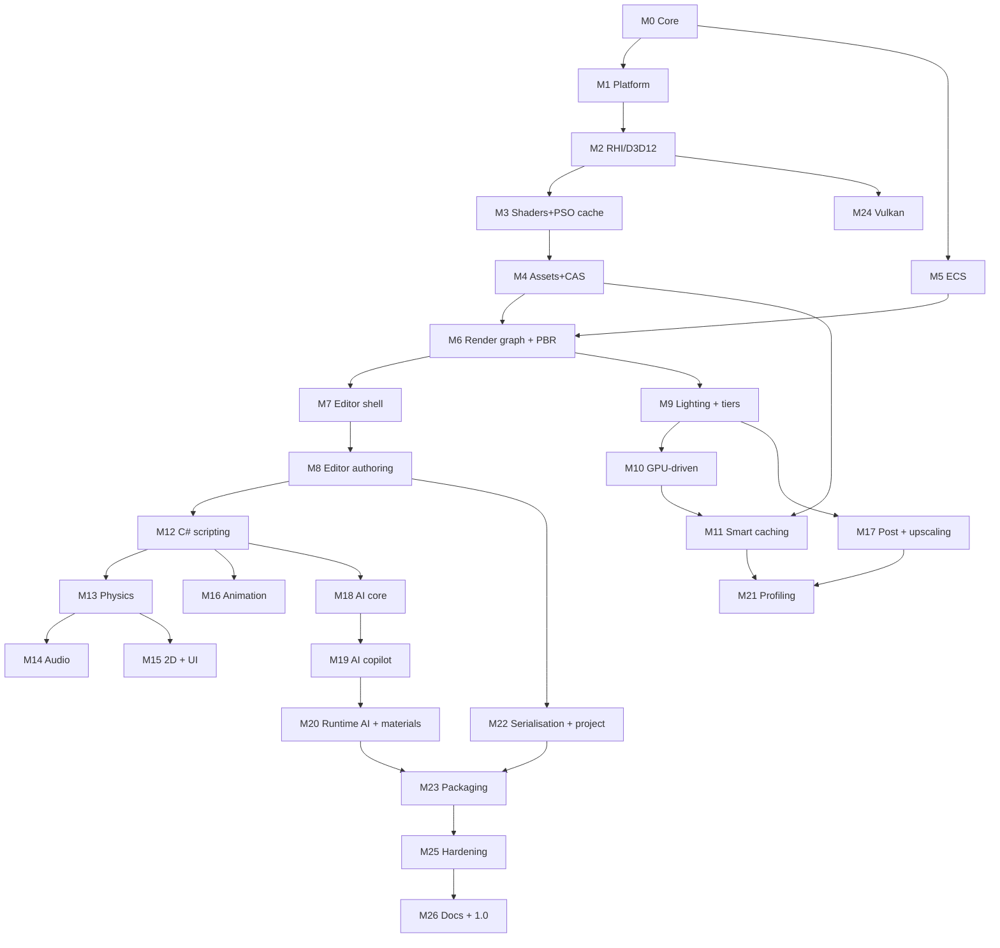

# Milestones — Velos Engine

| Field | Value |
|---|---|
| Document | Delivery roadmap |
| Version | 0.1 (draft) |
| Last updated | 2026-09-06 |

**How to read this:** each milestone is independently demonstrable. A milestone is *done* only when
every exit criterion passes; then we tag `vM<n>` and record a demo. No milestone starts before the
previous one closes — this is the primary defence against scope explosion (`R1`).

**Commit convention:** Conventional Commits (`feat(rhi): ...`, `fix(cache): ...`,
`docs(arch): ...`, `perf(render): ...`, `test(ecs): ...`, `chore(build): ...`).
Milestone close = annotated tag + `CHANGELOG.md` entry + demo artifact.

---

## Phase overview

| Phase | Milestones | Outcome |
|---|---|---|
| **I — Foundation** | M0 – M3 | It builds, it opens a window, it draws with a hot-reloading shader pipeline |
| **II — First light** | M4 – M8 | Assets, ECS, a PBR renderer, and an editor you can actually use |
| **III — The engine proper** | M9 – M14 | Lighting, GPU-driven rendering, smart caching, scripting, physics, audio |
| **IV — Breadth** | M15 – M17 | 2D, UI, animation, post-processing |
| **V — Intelligence** | M18 – M20 | The AI layer, editor copilot, runtime AI, material editor |
| **VI — Production** | M21 – M26 | Profiling, serialisation, packaging, Vulkan, hardening, 1.0 |

---

# Phase I — Foundation

## M0 · Project foundation & core library
**Goal:** a repository that builds cleanly and a core layer everything else stands on.

**Deliverables**
- Git repo, `.gitignore`, LFS config, branch policy, Conventional Commits, PR template.
- CMake presets (Debug / RelWithDebInfo / Release), MSVC + clang-cl, warnings-as-errors.
- GitHub Actions CI: configure → build → test → layering check → artifact.
- `core/`: tagged allocators (linear, stack, pool, TLSF, virtual arena) + memory tracker.
- Work-stealing job system with dependencies and `ParallelFor`.
- SIMD math library (vec/mat/quat/AABB/frustum/transform) + full unit tests.
- Logging (lock-free, categorised, ring buffer, file + console sinks).
- Hashed string IDs, `Result<T,E>`, typed event bus, handle/generation containers.
- Compile-time reflection macros + code-generator tool.
- Scoped CPU profiler with Chrome-trace export.
- Test harness (doctest) + benchmark harness skeleton.

**Exit criteria**
- CI green on a clean clone in < 5 min.
- Math + allocators + job system + reflection at ≥ 90% coverage.
- Job system scales near-linearly to 8 threads on a synthetic workload.
- Layering checker fails the build on a deliberately introduced violation.

**Requirements:** FR-CORE-001…010 · **Tag:** `vM0`

---

## M1 · Platform layer
**Goal:** a window, input, files, and a crash handler.

**Deliverables**
- Win32 window: creation, resize, DPI awareness, borderless fullscreen, multi-monitor.
- Input: keyboard, raw mouse, XInput gamepads; action-mapping abstraction.
- Virtual filesystem with `engine://`, `project://`, `cache://` mounts.
- Async I/O with prioritised, cancellable requests.
- Directory watcher for hot reload.
- Native dialogs, clipboard, drag-and-drop.
- Crash handler → minidump + log tail + system info.
- High-resolution timers, thread naming/affinity.

**Exit criteria**
- Sample app opens a window, logs all input events, survives resize/alt-tab/DPI change.
- Deliberate crash produces a minidump that resolves to the correct source line.
- Watcher fires within 200 ms of an external file change.

**Requirements:** FR-PLAT-001…007 · **Tag:** `vM1`

---

## M2 · RHI + D3D12 backend bring-up
**Goal:** *the triangle.* And the abstraction that will carry every frame after it.

**Deliverables**
- RHI interface: device, adapter enumeration, swapchain, command lists, queues, buffers, textures,
  samplers, pipelines, descriptor management, fences, queries.
- D3D12 backend: FL 11_0+, triple buffering, descriptor heaps, bindless path + bound fallback,
  per-frame upload ring, transient heap allocator.
- Debug layer + GPU validation + object naming (Debug only).
- GPU capability detection and reporting (vendor, VRAM budget, binding tier, wave ops).
- RHI conformance test suite v1 (~80 tests) running on WARP in CI.

**Exit criteria**
- Textured, transformed triangle at 1080p on both a discrete GPU and an Intel iGPU.
- Zero D3D12 debug-layer warnings across the sample suite.
- Conformance suite green on WARP in CI.
- Documented capability report from at least two physical GPUs.

**Requirements:** FR-RHI-001…007, FR-PLAT-008 · **Blocked by:** OD-03, OD-05 · **Tag:** `vM2`

---

## M3 · Shader system & pipeline caching
**Goal:** shaders that compile, permute, cache and hot-reload.

**Deliverables**
- HLSL SM 6.0 authoring, DXC integration, shared HLSL/C++ header for structs and constants.
- Include resolution with dependency tracking for correct invalidation.
- Permutation system with declared features and explicit whitelists.
- **Cache tier T2:** bytecode cache + D3D12 pipeline library, keyed by full input hash,
  shared across projects, warmed asynchronously at startup.
- Fallback PSO on cache miss — never a render-thread stall.
- Hot reload on file change with incremental permutation recompile.
- Rich error reporting (file, line, source excerpt) that never black-screens.

**Exit criteria**
- Edit a shader → visible change in < 1 s.
- Second launch skips 100% of shader compilation (verified cache-hit counter).
- Introducing a syntax error keeps the app rendering with the last good shader.
- `--verify-cache` reports zero mismatches over 200 permutations.

**Requirements:** FR-SHADER-001…006, FR-CACHE-001 (T2) · **Tag:** `vM3`

---

# Phase II — First light

## M4 · Asset pipeline & content-addressed cache
**Goal:** real content in, GPU-ready data out, and never do the same work twice.

**Deliverables**
- Importers: glTF 2.0/GLB, OBJ, PNG/JPG/TGA/HDR/DDS/KTX2, WAV/OGG, TTF.
- Cooked binary format designed for zero-parse, memory-mapped loading.
- **Cache tier T1:** BLAKE3 content-addressed store keyed by bytes + settings + cooker version.
- Asset database: GUID ↔ path ↔ dependencies, with reverse-dependency queries.
- Texture pipeline: mip generation, BC1/3/5/6H/7 compression, sRGB handling.
- Mesh pipeline: vertex-cache / overdraw / fetch optimisation, attribute quantisation, LOD
  generation via simplification, bounds and tangent generation.
- Parallel import across the job system; hot reload on source change.

**Exit criteria**
- Import Sponza (or similar) → cook → load → memory-mapped in under the NFR budget.
- Re-import with unchanged inputs: 100% cache hits, < 1 s total.
- Rename/move an asset file: all references intact.
- Corrupt an asset file deliberately: error + placeholder, no crash.

**Requirements:** FR-ASSET-001…008, 010, 012 · **Tag:** `vM4`

---

## M5 · ECS, scene & simulation loop
**Goal:** entities, components, systems, and a fixed timestep.

**Deliverables**
- Archetype ECS: 16 KB chunks, SoA storage, stable handles, structural-change command buffer.
- Query system with include/exclude/optional filters and per-chunk change versions.
- System scheduler with declared `Read<T>`/`Write<T>` and automatic parallelisation.
- Transform hierarchy with dirty propagation and a linear depth-sorted world-matrix pass.
- Fixed-timestep loop (60 Hz) with accumulator, clamping and render interpolation.
- Triple-buffered render packet handoff between simulation and render threads.

**Exit criteria**
- 100 000 entities with transforms update in < 2 ms on 4 cores.
- Two systems with disjoint component access provably run in parallel (profiler evidence).
- ECS test suite ≥ 90% coverage including structural-change edge cases.

**Requirements:** FR-SCENE-001…004, 008 · **Tag:** `vM5`

---

## M6 · Render graph & forward PBR renderer
**Goal:** a lit, textured 3D scene.

**Deliverables**
- Render graph: DAG build, pass culling, automatic barriers, transient aliasing, queue assignment,
  parallel command recording.
- Simple forward pass with metal/roughness PBR (GGX + multi-scatter), matching glTF reference.
- Material template/instance system backed by GPU structured buffers + bindless textures.
- Static mesh rendering with automatic instancing by mesh+material.
- IBL: GPU-side prefiltered specular cubemap + irradiance SH generated at import.
- Depth prepass, sky pass, sorted transparent pass.
- Camera system (perspective/ortho, jittering hook for TAA).

**Exit criteria**
- Sponza renders with correct PBR — golden-image match against a reference within threshold.
- Render graph visualiser (text dump) shows correct barriers and aliased transient memory.
- Zero D3D12 validation errors.
- ≥ 60 FPS at 1080p unlit-tier on baseline hardware.

**Requirements:** FR-REND-001, 002, 004, 007, 008, 013; FR-RHI-010 · **Tag:** `vM6`

---

## M7 · Editor shell
**Goal:** a docked editor window with a live viewport.

**Deliverables**
- Editor application separate from the runtime; engine linked as a library.
- Dockable panel system with persisted layouts (ImGui docking, pending OD-01).
- Viewport panel rendering an engine render target, with a fly camera.
- Console panel: filtering, search, severity colours, click-to-source.
- Debug renderer: lines, wireframe, AABBs, world text, grid.
- Render view modes: albedo, normal, roughness, overdraw, wireframe.
- Editor services skeleton: selection, command/undo stack, project context.

**Exit criteria**
- Editor cold start < 3 s.
- Layout persists across sessions; panels dock/undock/tear out cleanly.
- Viewport resizes without leaks or device errors (10 000 resize stress test).

**Requirements:** FR-EDIT-001, 011; FR-REND-015 · **Blocked by:** OD-01 · **Tag:** `vM7`

---

## M8 · Editor v1 — authoring
**Goal:** you can build a scene with the mouse.

**Deliverables**
- Scene hierarchy: multi-select, drag-reparent, search, rename, duplicate, delete.
- Reflection-driven inspector — a new component needs zero UI code.
- Transform gizmos (translate/rotate/scale), local/world toggle, grid + angle snapping.
- GPU object picking, selection outlines, focus-on-selection.
- Asset browser: thumbnails, folder tree, search, tags, drag-and-drop, per-asset import settings.
- Play / pause / step in editor with exact state restore on stop.
- Background task system with progress and cancellation; UI never blocks > 100 ms.

**Exit criteria**
- Build a 50-object lit scene entirely through the UI, save, reload — identical result.
- Play → modify → stop restores the pre-play scene byte-for-byte.
- Importing 1 000 assets keeps the editor at ≥ 30 FPS throughout.

**Requirements:** FR-EDIT-002…006, 014 · **Tag:** `vM8` · 🎯 **First public-showable build**

---

# Phase III — The engine proper

## M9 · Lighting, shadows & scalability tiers
**Goal:** many lights, real shadows, and the tier system that keeps low-end honest.

**Deliverables**
- Clustered forward+ : 16×9×24 froxels, compute light assignment, per-tier light caps.
- Directional, point, spot lights (+ area lights if budget allows).
- CSM (2–4 cascades, stable fit, slope-scaled bias, PCF → PCSS by tier).
- Shadow atlas for spot/point with screen-size-driven resolution.
- Static shadow caching for mostly-static cascades.
- LOD selection by screen coverage with dithered cross-fade.
- Spatial BVH for culling and queries, incrementally refit.
- **Tier system:** `Potato`/`Low`/`Medium`/`High`/`Ultra` as data; auto-detect via device ID +
  VRAM + startup micro-benchmark.
- Bandwidth work for iGPUs: packed vertex formats, half precision, depth-prepass overdraw control.
- Lighting/environment editor panel.

**Exit criteria**
- 100 dynamic lights at ≥ 60 FPS @ 1080p on the reference GPU; ≥ 60 FPS with 16 lights at `Low`
  on baseline hardware.
- Every tier renders the reference scene with no corruption and a documented perf/quality table.
- Shadow acne / peter-panning within a documented tolerance across all cascade counts.

**Requirements:** FR-REND-003, 005, 006, 009; FR-SCALE-001…006; FR-SCENE-009; FR-EDIT-015 ·
**Blocked by:** OD-07 · **Tag:** `vM9`

---

## M10 · GPU-driven rendering & compute framework
**Goal:** move the per-object work onto the GPU.

**Deliverables**
- Compute pass framework in the render graph, with async-compute scheduling.
- Persistent GPU scene buffers (instances, materials, lights, mesh metadata) with incremental
  delta uploads.
- GPU transform hierarchy evaluation.
- Two-phase GPU occlusion culling: HZB build + compute cull → indirect draw args.
- Indirect draw / multi-draw-indirect path; CPU SIMD culling fallback for `Low`/`Potato`.
- GPU particle system: compute simulation, indirect draw, GPU sort for blended particles.
- CPU reference implementations of every GPU pass, used as validation oracles.

**Exit criteria**
- 50 000 objects at ≥ 60 FPS on the reference GPU with CPU main thread ≤ 2 ms.
- GPU cull results match the CPU oracle exactly on the test scenes.
- Async compute overlap visible in a GPU capture.
- `Low` tier CPU fallback path measured and documented against the GPU path on baseline hardware.

**Requirements:** FR-REND-010, 016; FR-SCENE-004 (GPU) · **Tag:** `vM10` · 🎯 **The "GPU-first" claim is now true**

---

## M11 · Smart caching subsystem
**Goal:** the headline caching feature, complete and provable.

**Deliverables**
- Unified cache framework: budgets, statistics, versioning, persistence for all four tiers.
- Cost-aware eviction policy (recency × frequency × rebuild cost × size), tuned per tier.
- **Cache tier T3 — GPU residency:** texture-mip and mesh-LOD streaming under a VRAM budget.
- Predictive prefetch from camera velocity + spatial BVH + recorded per-scene access traces.
- Async streaming on the copy queue with priority by screen coverage; never blocks a frame.
- Cache tooling: stats panel, `--no-cache`, `--verify-cache`, `--clear-cache`, corruption
  auto-recovery.
- Lock-free read path on cache hits.

**Exit criteria**
- A scene with 8 GB of source textures renders within a 1.4 GB VRAM budget with no stalls; quality
  degrades gracefully and recovers.
- Cache hit rate ≥ 95% on the second run of a benchmark scene.
- `--verify-cache` over the full sample library: zero mismatches.
- Measured cold vs warm project-open times meet NFR-PERF-006.

**Requirements:** FR-CACHE-002…009; FR-ASSET-009 · **Tag:** `vM11` · 🎯 **Second pillar proven**

---

## M12 · C# scripting layer
**Goal:** gameplay code, hot-reloaded.

**Deliverables**
- .NET runtime hosting via `hostfxr` with a collectible `AssemblyLoadContext`.
- Binding generator producing C# APIs from engine reflection data.
- `ScriptComponent` lifecycle: `Awake`/`Start`/`Update`/`FixedUpdate`/`LateUpdate`/`OnDestroy`.
- Zero-allocation interop: blittable structs, `Span<T>` over native memory,
  `[UnmanagedCallersOnly]` entry points.
- Hot reload preserving serialisable state, < 3 s.
- Script fields in the inspector with `[Range]`, `[Tooltip]`, `[Header]` attributes.
- Exception isolation, managed stack traces, coroutines and timers.
- Project template + `dotnet` build integration from the editor.

**Exit criteria**
- Write a rotating-cube script, hot reload three times, state preserved each time.
- Interop micro-benchmark: < 20 ns per property access, zero managed allocations in `Update`.
- A thrown script exception disables only that component; the editor keeps running.

**Requirements:** FR-SCRIPT-001…008 · **Blocked by:** OD-04 · **Tag:** `vM12`

---

## M13 · Physics
**Goal:** things fall, collide and can be walked around.

**Deliverables**
- Jolt integration on the fixed timestep, multithreaded through the engine job system.
- Body types (static/kinematic/dynamic); box, sphere, capsule, cylinder, convex hull, compound,
  triangle-mesh colliders; convex decomposition at import.
- Collision layers/masks, triggers, contact and trigger events surfaced to script.
- Raycasts, shape casts, overlap queries from native and C#.
- Character controller with slope/step/ground handling.
- Joints: fixed, hinge, slider, distance, cone.
- Physics debug visualiser and an editor physics settings panel.

**Exit criteria**
- 1 000 dynamic bodies simulate at ≥ 60 FPS with physics ≤ 3 ms.
- Determinism test: identical inputs → bit-identical state over 10 000 steps.
- Character controller passes a stairs/slope/ledge obstacle-course test scene.

**Requirements:** FR-PHYS-001…007, 009 · **Tag:** `vM13`

---

## M14 · Audio
**Goal:** it makes noise, in the right place.

**Deliverables**
- Audio engine on a dedicated real-time thread (miniaudio/WASAPI), lock-free command queue.
- 2D and 3D positional playback: attenuation curves, doppler, spatialisation.
- Mixer with named buses, per-bus volume/pitch, low-pass and reverb send.
- Streaming for long clips, full decode for short, under a memory budget.
- Script API: play/stop/fade, one-shots, parameter control.
- Optional physics-raycast occlusion.

**Exit criteria**
- 64 concurrent 3D sources with no dropouts; audio thread never allocates (verified).
- Latency ≤ 30 ms; no audible glitches during a 30-minute soak with scene loading.

**Requirements:** FR-AUDIO-001…005 · **Tag:** `vM14`

---

# Phase IV — Breadth

## M15 · 2D pipeline & UI system
**Goal:** 2D games are first-class, and games have menus.

**Deliverables**
- Sprite renderer: GPU instance buffer, atlas batching, layer + depth sorting, 9-slice.
- Sprite atlas packing at import; sprite-sheet frame animation.
- Tilemap renderer: index-texture-driven, single draw call, chunked streaming.
- Orthographic camera, pixel-perfect mode, 2D lighting via the flat cluster grid.
- 2D physics via Jolt with locked Z axis and rotations.
- Game UI: canvases (screen + world space), anchors, layout groups, SDF text, images, buttons,
  sliders, input fields; batched draw; input routing to script; resolution scaling.

**Exit criteria**
- A playable 2D platformer sample: tilemap, sprite animation, 2D physics, HUD, menus.
- A 512×512 tilemap renders in one draw call at ≥ 200 FPS on baseline hardware.
- Full UI screen batches into ≤ 5 draw calls.

**Requirements:** FR-REND-014; FR-UI-001…004; FR-PHYS-008; FR-ANIM-009 · **Blocked by:** OD-08 ·
**Tag:** `vM15`

---

## M16 · Skeletal animation
**Goal:** characters move.

**Deliverables**
- Clip import, sampling, looping, playback rate; animation compression with a quality setting.
- Blending: linear, 1D/2D blend spaces, layers, additive with bone masks.
- State machine with conditions, transitions and blend times + an editor graph.
- GPU compute skinning writing a skinned vertex buffer reused across depth/shadow/main passes;
  CPU path for `Potato`.
- Root motion extraction and application.
- Animation events/notifies dispatched to script.
- Two-bone IK and look-at.

**Exit criteria**
- 200 animated characters at ≥ 60 FPS on the reference GPU with skinning ≤ 1.5 ms GPU.
- Locomotion blend tree (idle/walk/run + turn) authored in the editor with no code.
- Golden-image validation of skinned poses against a reference.

**Requirements:** FR-ANIM-001…008 · **Tag:** `vM16`

---

## M17 · Post-processing & upscaling
**Goal:** it looks good, and it looks good *cheaply*.

**Deliverables**
- HDR pipeline with auto/manual exposure (compute histogram), ACES/AgX tonemapping.
- Bloom (progressive down/upsample), colour grading via 3D LUT, vignette, chromatic aberration,
  film grain, motion blur (optional).
- Anti-aliasing: FXAA (Low) and TAA with proper reprojection, disocclusion handling and jitter.
- Temporal upscaling from a reduced render resolution — default-on for `Low`/`Potato`.
- Dynamic resolution scaler targeting a frame-time budget.
- GTAO with a cheap half-resolution variant.
- Post-process volume components with blending, editable in the editor.

**Exit criteria**
- 1080p output from 720p internal at `Low` looks acceptable in a documented A/B comparison.
- TAA: no visible ghosting on the standard motion test scenes.
- Full post stack ≤ 2.5 ms GPU on baseline hardware at `Low`.
- Dynamic resolution holds the target frame time within ±10% during a stress fly-through.

**Requirements:** FR-REND-011, 012, 017; FR-SCALE-003 · **Tag:** `vM17`

---

# Phase V — Intelligence

## M18 · AI service layer core
**Goal:** the AI foundation — provider-agnostic, cached, offline-capable.

**Deliverables**
- `IAIProvider` abstraction: chat, streaming, embeddings, tool calling, capability reporting.
- `OpenAICompatibleProvider` (OpenAI, Azure, Groq, OpenRouter, LM Studio, llama.cpp, vLLM…).
- `OllamaProvider`: native `/api/chat`, `/api/generate`, `/api/embeddings`, `/api/tags`, model
  pull with progress.
- Ordered fallback chain with timeouts, retry + exponential backoff, and circuit breakers.
- **Cache tier T4:** exact-hash response cache + semantic near-match cache via embeddings, with
  TTL and size budget.
- Fully async orchestrator with a request queue and streaming token delivery to the UI.
- Credential storage via Windows DPAPI/Credential Manager; keys never logged or serialised.
- Token/cost accounting per session.
- Provider configuration UI and a connection tester.

**Exit criteria**
- Identical results through OpenAI-compatible and Ollama providers on a fixed prompt suite.
- Kill the network mid-request → automatic failover to Ollama with no UI stall.
- Kill Ollama too → cache-only mode with a clear user-facing state, no crash.
- Cached response latency ≤ 50 ms; semantic cache hit rate measured on a repeat-question suite.
- Security review: no key material in logs, dumps, project files or telemetry.

**Requirements:** FR-AI-001…009, 016, 017 · **Tag:** `vM18` · 🎯 **Fourth pillar online**

---

## M19 · AI editor copilot
**Goal:** AI that does real work in the editor, not chat theatre.

**Deliverables**
- Context builder: open scene digest, selection, recent errors, project settings, relevant code.
- Local vector index (assets, docs, scripts) for retrieval-augmented context.
- Tool layer: `scene.query`, `entity.create`, `component.set`, `asset.search`, `file.read/write`,
  `script.compile`, `shader.compile` — each permissioned, project-root sandboxed, undoable.
- Permission model with a confirmation gate for destructive actions.
- AI assistant panel: conversation history, streaming, context preview ("here is exactly what is
  being sent"), diff-and-apply for generated code.
- AI-assisted asset tagging and natural-language asset search.
- Script generation with an automatic compile-and-fix loop.
- Shader/material assistance with compile validation.
- Static GI bake (lightmaps or probe volumes per OD-06) — grouped here as the remaining
  lighting work.

**Exit criteria**
- "Create a scene with a floor, three lit crates and an orbiting camera" produces a working scene
  via tool calls, fully undoable in one action.
- Generated scripts compile on the first or second attempt in ≥ 80% of a 20-prompt test set.
- Natural-language asset search returns correct results on a 1 000-asset library.
- All of the above works with only a local 7B Ollama model.
- Prompt-injection test suite (malicious asset names, hostile file contents) — no escapes.

**Requirements:** FR-AI-010…013, 018; FR-REND-019 · **Blocked by:** OD-06 · **Tag:** `vM19`

---

## M20 · Runtime AI & material editor
**Goal:** AI inside shipped games; artists get a node graph.

**Deliverables**
- Runtime AI service for scripts: NPC dialogue, behaviour decisions, with a bounded queue,
  per-frame CPU budget and per-agent rate limiting.
- Mandatory authored fallback (scripted dialogue / behaviour trees) when no provider is available.
- Character/agent definitions with persona, memory window and constrained output schemas.
- Node-based material editor: graph → generated HLSL → permutation, with live preview,
  custom nodes and instance parameters.

**Exit criteria**
- A sample scene with 5 AI NPCs holding conversations while the game holds 60 FPS.
- Provider disabled → NPCs fall back to authored content with no visible failure.
- An artist-authored material graph renders identically to the equivalent hand-written shader
  (golden image).

**Requirements:** FR-AI-014, 015; FR-EDIT-008 · **Tag:** `vM20`

---

# Phase VI — Production

## M21 · Profiling, diagnostics & optimisation pass
**Goal:** make everything measurable, then make it fast.

**Deliverables**
- Profiler panel: CPU frame timeline (all threads), per-pass GPU timings, memory by tag, cache
  statistics, draw/triangle/state-change counters.
- Render-graph visualiser: passes, resources, barriers, aliasing, queue assignment.
- Frame capture/replay for offline analysis; Chrome-trace and Tracy export.
- Headless benchmark mode with a fixed camera path emitting JSON frame-time statistics.
- CI performance regression gate (fail at > 10%).
- Device-removed detection and recovery.
- Dedicated optimisation sprint against the measured baseline-hardware profile.

**Exit criteria**
- All `NFR-PERF-*` targets met and recorded on baseline and reference hardware.
- Profiler overhead < 2% when enabled.
- Zero heap allocations on the steady-state render/simulation hot path (test-verified).
- 99th-percentile frame time ≤ 1.5× median over a 5-minute run.

**Requirements:** FR-EDIT-009, 010; FR-RHI-008, 009; FR-SCALE-005, 007 · **Tag:** `vM21`

---

## M22 · Serialisation, prefabs & project system
**Goal:** projects you can version-control and organise.

**Deliverables**
- Reflection-driven serialisation: human-readable text (VCS-friendly, stable ordering) + fast
  binary, with schema versioning and migration hooks.
- Prefabs with nesting and per-instance overrides.
- Additive scene loading/unloading and streamed scene sections.
- Full command-based undo/redo across scene and asset-setting mutations.
- Project system: create/open, project settings, templates, recent projects.
- Auto-save + crash recovery.

**Exit criteria**
- A scene edited by two people merges in Git with comprehensible conflicts.
- 100-step undo/redo across mixed operations returns to the exact original state.
- Nested prefab override semantics pass the full behaviour test matrix.
- Kill the editor mid-edit → recovery restores work to within 5 minutes.

**Requirements:** FR-SCENE-005…007; FR-EDIT-007, 012, 013 · **Tag:** `vM22`

---

## M23 · Build & packaging
**Goal:** ship a `.exe`.

**Deliverables**
- Standalone runtime executable with no editor code linked.
- Cook pipeline: asset cook, dependency-graph-driven stripping of unreferenced assets, offline
  shader permutation + PSO precompilation, `.vpak` archives with per-chunk compression.
- Build configurations: Debug, Development (console + profiler + hot reload, no editor), Shipping.
- Reproducible builds; build settings UI in the editor.
- Optional installer generation.

**Exit criteria**
- Sample game packages and runs on a clean Windows 10 VM with no runtime installed (beyond a
  bundled .NET).
- Package ≤ 150 MB excluding user content; start-to-first-frame ≤ 3 s on baseline hardware.
- Identical inputs produce byte-identical packages twice in a row.

**Requirements:** FR-BUILD-001…005; FR-ASSET-011; FR-SHADER-007 · **Tag:** `vM23`
🎯 **Feature complete for 1.0**

---

## M24 · Vulkan backend *(optional for 1.0)*
**Goal:** portability insurance and RHI validation.

**Deliverables**
- Vulkan 1.2+ backend: descriptor indexing, dynamic rendering, timeline semaphores, VMA.
- SPIR-V compilation path in the shader system.
- Full RHI conformance suite + golden images green on Vulkan.

**Exit criteria**
- Every sample renders identically on both backends (perceptual diff within threshold).
- Documented performance comparison D3D12 vs Vulkan on the same hardware.

**Requirements:** FR-RHI-003 · **Tag:** `vM24`

---

## M25 · Hardening & stabilisation
**Goal:** stop it breaking.

**Deliverables**
- Fuzzing of importers, `.vpak` reader and scene deserialiser; fix everything found.
- 8-hour editor and 4-hour runtime soak tests; fix all leaks and growth.
- ASan/UBSan nightly runs; GPU validation nightly.
- Dependency CVE scan and pinning audit.
- Full error-message pass: every user-facing error states what, why and next action.
- Accessibility and UX pass on the editor; command palette.
- Bug-bash on real user projects.

**Exit criteria**
- All `NFR-REL-*` and `NFR-SEC-*` requirements verified.
- Zero known crash bugs; zero known data-loss bugs.
- Fuzzers run 24 h with no new findings.

**Tag:** `vM25`

---

## M26 · Documentation, samples & 1.0 release
**Goal:** other people can use it.

**Deliverables**
- Generated API reference (native + C#).
- Getting-started guide, 6+ tutorials (3D scene, 2D platformer, scripting, materials, AI copilot,
  packaging).
- Architecture documentation refreshed to match reality; ADR log finalised.
- Samples: 3D third-person demo game, 2D platformer, rendering feature showcase, AI NPC demo,
  performance stress scene.
- Website/README, changelog, licence, contribution guide.
- Release build, signed installer, GitHub release.

**Exit criteria**
- All PRD §8 v1.0 success criteria met.
- A new user completes the getting-started tutorial in < 30 minutes without help.
- Every sample builds and runs from a clean clone.

**Tag:** `v1.0.0` 🎉

---

## Post-1.0 backlog

Networking/replication · console platforms · mobile · ray-traced effects · virtualised geometry ·
visual scripting for gameplay · terrain system · foliage/vegetation · navmesh + AI pathfinding ·
cinematics/timeline · localisation · asset store integration · Linux/macOS via the Vulkan backend ·
remote/shared cache · collaborative multi-user editing.

---

## Milestone dependency graph

