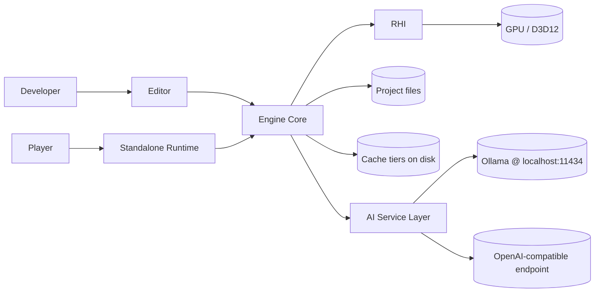

# Software Requirements Specification - Velos Engine

| Field | Value |
|---|---|
| Document | SRS |
| Version | 0.2 (draft) |
| Status | Proposed requirements; hardware and release scope await approval |
| Conforms to | IEEE 830-style, adapted |
| Last updated | 2026-09-07 |

**Requirement keywords:** *shall* = required when its release scope is accepted, *should* =
recommended, *may* = optional. IDs are stable. Milestone columns identify work packages, not
claims that they are implemented. PRD section 4.3 defines the proposed release gates; an advanced
package does not become a basic-v1.0 requirement merely because its detailed behavior says shall.

---

## 1. Scope

This document specifies the functional and non-functional requirements for **Velos Engine**, a
Windows-native, GPU-first 3D/2D game engine with an integrated editor, C# scripting, multi-tier
caching, and an AI assistance layer. Product context, goals and non-goals are in [PRD.md](PRD.md).

The basic release includes authoring, simulation, rendering, persistence, packaging and AI chat.
M10, M19, M20 and M24 are advanced/optional. Within shared milestones, clustered/many-light
rendering and baked GI, predictive caching, animation graphs/IK, temporal upscaling/GTAO and
semantic AI caching are deferred unless explicitly selected. Baseline versions are identified
in [MILESTONES.md](MILESTONES.md). The native preview implements a subset, recorded in
[../README.md](../README.md); the acceptance performance targets in this SRS remain unverified,
even though small-scene development-machine timings and runtime checks have been collected.

Graphics checkpoint `v0.1.0-preview.2` (2026-09-07) implements partial slices of the existing IDs:

| Requirement area | Implemented subset | Remaining contract |
|---|---|---|
| FR-REND-003 / FR-REND-005 / FR-REND-006 | Sixteen point/spot lights, first directional sun, PCF map; optional DXR hard sun shadows | Area lights, local-light shadows, cascades/atlases and broader budgets |
| FR-REND-008 / FR-REND-009 / FR-REND-013 | Material-compatible instancing, two generated screen-size LODs, sorted transparency | Skinning, dithered transitions and correct floating-point HDR compositing |
| FR-ASSET-001 / FR-ASSET-007 / FR-ASSET-008 | Separate image-map import, linear-light mips, BC1/3/5, vertex-cache/fetch optimization and simplified index LODs | Full format list/material import, BC6H/7, GPU compression, quantization and meshlets |
| FR-SCALE-004 / FR-SCALE-005 / FR-SCALE-007 | DXR capability/budget fallback, draw/LOD/memory counters, fixed stress-scene JSON distributions | Declarative quality tiers, complete profiler and frozen hardware acceptance |
| FR-CACHE-005 / FR-ASSET-009 | Separate bounded mesh/texture/DXR admission and disk caches | Mip/LOD residency eviction, async streaming and unified pressure management |

The baseline shader path remains SM 6.0; the optional ray-query pixel variant requires explicitly
queried DXR 1.1 and SM 6.5 on a physical adapter. It supplies directional hard shadows, not GI or
reflections. All 214 requirement IDs remain unchanged; partial implementation is not full acceptance.

## 2. System context

## 3. Definitions

| Term | Meaning |
|---|---|
| **RHI** | Render Hardware Interface - the abstract GPU API layer |
| **PSO** | Pipeline State Object |
| **Render graph** | Declarative frame description; passes + resources with automatic barriers/aliasing |
| **Archetype** | An ECS storage chunk holding all entities sharing an identical component set |
| **Tier** | A scalability preset: `Potato`, `Low`, `Medium`, `High`, `Ultra` |
| **Cooked asset** | An imported asset converted to GPU/engine-ready binary form |
| **CAS** | Content-addressed storage - files keyed by hash of their contents |
| **Baseline HW** | Separate provisional iGPU and discrete-GPU profiles in section 5; actual CPU, RAM, OS and driver must be selected in OD-07 |

---

## 4. Functional requirements

### 4.1 Core foundation (`FR-CORE`)

| ID | Requirement | Milestone |
|---|---|---|
| FR-CORE-001 | The engine **shall** provide tagged allocations and frame scratch arenas; reuse proven allocators and add pools only for measured hot paths, rather than requiring a custom general-purpose heap. | M0 |
| FR-CORE-002 | The engine **shall** track all allocations by tag (subsystem) and expose live totals to the profiler. | M0 |
| FR-CORE-003 | The engine **shall** provide task dependencies and parallel-for through a proven job library; worker count is configurable, valid on single-core/unknown-count hosts, and accounts for audio, I/O and AI threads. | M0 |
| FR-CORE-004 | The engine **shall** use a tested SIMD math library for vectors, matrices, quaternions, bounds and transforms; select instruction paths from CPU capabilities and retain a supported baseline. | M0 |
| FR-CORE-005 | The engine **shall** provide structured, level-filtered, category-tagged logging with a ring buffer, file sink and editor console sink; logging **shall** be lock-free on the producer side. | M0 |
| FR-CORE-006 | The engine **shall** provide one type/field metadata registry for serialization, inspectors and bindings, initially explicit registration; code generation is added when justified without changing persisted type IDs. | M0 / M12 |
| FR-CORE-007 | The engine **shall** provide a typed event bus with immediate and deferred (queued) dispatch. | M0 |
| FR-CORE-008 | The engine **shall** provide string interning / hashed string IDs (`FNV1a64`) for all runtime name lookups. | M0 |
| FR-CORE-009 | The engine **shall** provide a `Result<T,Error>`-style error type; exceptions **shall not** be used for control flow in engine code. | M0 |
| FR-CORE-010 | The engine **shall** provide a hierarchical, thread-aware CPU profiler with scoped zones exportable to Chrome trace / Tracy format. | M0 |

### 4.2 Platform layer (`FR-PLAT`)

| ID | Requirement | Milestone |
|---|---|---|
| FR-PLAT-001 | The engine **shall** create and manage Win32 windows (resize, DPI awareness, fullscreen/borderless, multi-monitor). | M1 |
| FR-PLAT-002 | The engine **shall** support keyboard, mouse (incl. raw input), and XInput gamepads with an abstraction over device state and events. | M1 |
| FR-PLAT-003 | The engine **shall** provide a virtual filesystem with mount points (`engine://`, `project://`, `cache://`) and case-insensitive normalised paths. | M1 |
| FR-PLAT-004 | The engine **shall** provide asynchronous file I/O with prioritised requests and cancellation. | M1 |
| FR-PLAT-005 | The engine **shall** provide filesystem watching for hot reload of shaders, assets and scripts. | M1 |
| FR-PLAT-006 | The engine **shall** provide native file/folder dialogs, clipboard, and drag-and-drop into the editor. | M1 |
| FR-PLAT-007 | The engine **shall** produce a crash handler writing a minidump plus the last N log lines and current frame state. | M1 |
| FR-PLAT-008 | The engine **shall** query and report GPU vendor/device/driver version, VRAM budget, and feature support at startup. | M2 |

### 4.3 Render Hardware Interface (`FR-RHI`)

| ID | Requirement | Milestone |
|---|---|---|
| FR-RHI-001 | The engine **shall** define a backend-agnostic RHI covering: device, swapchain, command lists, buffers, textures, samplers, pipelines, root/descriptor bindings, queries, and fences. | M2 |
| FR-RHI-002 | The proposed D3D12 backend **shall** require a working D3D12 driver, FL 11_0 or higher and explicitly queried SM 6.0 support; unsupported adapters receive an actionable diagnostic. FL 11_0 alone does not establish compatibility. | M2 |
| FR-RHI-003 | The RHI **may** add a Vulkan 1.3 backend passing the same conformance suite after the Windows path is stable. | M24 |
| FR-RHI-004 | The RHI **shall** implement bounded descriptor tables as the baseline; indexed/bindless paths require separately checked binding tier, descriptor limits and shader features. Indirect drawing does not itself require bindless. | M2 / M10 |
| FR-RHI-005 | The RHI **shall** start with graphics-queue submission, including compute dispatch; copy and async-compute overlap are enabled only when measured beneficial, with explicit queue fences. | M2 / M10 |
| FR-RHI-006 | The RHI **shall** support double and triple buffering with per-frame resource ring buffers and GPU fence synchronisation. | M2 |
| FR-RHI-007 | The RHI **shall** enable the debug layer, GPU validation, and object naming in Debug builds only. | M2 |
| FR-RHI-008 | The RHI **shall** detect device removal, preserve CPU-side authored scene data and attempt reconstruction; if recovery fails, save recoverable work and request restart. | M2 / M21 |
| FR-RHI-009 | The RHI **shall** expose nonblocking GPU timestamp measurements from bring-up, with per-pass labels once the render graph exists; M21 adds the full visualizer. | M2 / M6 / M21 |
| FR-RHI-010 | The RHI **shall** provide a transient resource allocator with memory aliasing driven by render-graph lifetimes. | M6 |

### 4.4 Shaders & pipeline caching (`FR-SHADER`)

| ID | Requirement | Milestone |
|---|---|---|
| FR-SHADER-001 | Shaders **shall** be authored in HLSL (SM 6.0) and compiled with DXC to DXIL (and SPIR-V for the Vulkan backend). | M3 |
| FR-SHADER-002 | The engine **shall** support a shader permutation system with named boolean/enum features and explicit permutation whitelisting to prevent combinatorial explosion. | M3 |
| FR-SHADER-003 | Compiled shader bytecode **shall** be cached on disk keyed by `hash(source + includes + defines + compiler version + target)`. | M3 |
| FR-SHADER-004 | PSO blobs **shall** be keyed by pipeline description, shader hashes, adapter/driver and cache version; unsupported pipeline-library persistence falls back to normal PSO creation. Warm asynchronously; use only layout-compatible fallback PSOs, last-good state or skip an optional draw. Never reuse an arbitrary incompatible PSO. | M3 |
| FR-SHADER-005 | The engine **shall** hot-reload shaders on file change, recompiling only affected permutations, with visible results in **< 1 s**. | M3 |
| FR-SHADER-006 | Shader compile errors **shall** be reported in the editor console with file, line, and the offending source line, and **shall not** crash or black-screen the renderer. | M3 |
| FR-SHADER-007 | The engine **should** support offline bulk shader precompilation as a build step for packaged builds. | M23 |

### 4.5 Render graph & rendering (`FR-REND`)

| ID | Requirement | Milestone |
|---|---|---|
| FR-REND-001 | The renderer **shall** be organised as a render graph: passes declare resource reads/writes; the graph computes execution order, barriers, and transient memory aliasing automatically. | M6 |
| FR-REND-002 | The render graph **shall** cull passes whose outputs are unused. | M6 |
| FR-REND-003 | The renderer **shall** provide a bounded simple-forward light list; clustered forward+ light assignment is the proposed extension for measured many-light workloads. | M9 |
| FR-REND-004 | The renderer **shall** implement a metal/roughness PBR model (GGX, Smith, multi-scatter compensation) matching the glTF 2.0 specification. | M6 |
| FR-REND-005 | The renderer **shall** support directional, point, spot and area(disc/rect, *should*) lights, with per-tier limits on the number of shadow-casting lights. | M9 |
| FR-REND-006 | Baseline shadows **shall** use a budgeted directional map with PCF; cascades, spot/point shadow atlases and PCSS are advanced settings with independent update and memory budgets. | M9 |
| FR-REND-007 | The renderer **shall** support image-based lighting from HDR environment maps (prefiltered specular + irradiance SH), computed on GPU at import. | M6 |
| FR-REND-008 | The renderer **shall** support static, skinned and instanced meshes with automatic instance batching by material+mesh. | M6 / M16 |
| FR-REND-009 | The renderer **shall** support mesh LODs with screen-coverage-based selection and optional dithered cross-fade. | M9 |
| FR-REND-010 | The optional GPU-driven path **shall** perform conservative frustum/HZB culling and bounded indirect argument generation. Retain CPU frustum culling; choose paths by measured workload, not a universal vendor rule. | M10 |
| FR-REND-011 | The renderer **shall** provide basic HDR tonemapping at M6 and FXAA/manual exposure by M17; bloom, LUT grading and TAA are separately budgeted extensions. | M6 / M17 |
| FR-REND-012 | The renderer **shall** support explicit internal/output resolution and spatial scaling; temporal upscaling is optional, requires motion/depth history and is not assumed cheaper on low-end GPUs. | M17 |
| FR-REND-013 | The renderer **shall** support transparent/blended materials with a sorted forward pass and optional order-independent approximation (*may*). | M6 |
| FR-REND-014 | The renderer **shall** support a 2D pipeline: batched sprites, sprite atlases, tilemaps, 9-slice, and an orthographic camera, sharing the RHI and render graph. | M15 |
| FR-REND-015 | The renderer **shall** provide a debug renderer: lines, wireframes, AABBs, text, and view modes (albedo, normals, roughness, overdraw, light complexity, LOD, cluster heatmap). | M7 |
| FR-REND-016 | The renderer **shall** support GPU particle systems simulated in compute with indirect rendering. | M10 |
| FR-REND-017 | The renderer **should** support screen-space ambient occlusion (GTAO) with a cheap half-res variant for low tiers. | M17 |
| FR-REND-018 | The renderer **should** support screen-space reflections on `High`+ only. | Post-1.0 |
| FR-REND-019 | The renderer **may** add offline baked lightmaps or baked irradiance probes after OD-06; IBL supplies the initial ambient path. Bake dependencies, dynamic-object sampling and invalidation must be specified before implementation. | M9 |

### 4.6 Scalability & low-end optimisation (`FR-SCALE`)

| ID | Requirement | Milestone |
|---|---|---|
| FR-SCALE-001 | The engine **shall** define five tiers - `Potato`, `Low`, `Medium`, `High`, `Ultra` - each a declarative set of feature toggles and numeric budgets stored in data, not code. | M9 |
| FR-SCALE-002 | The engine **shall** auto-detect a starting tier from GPU device ID, VRAM, and a short startup benchmark. | M9 |
| FR-SCALE-003 | The engine **shall** support an optional dynamic resolution scaler that maintains a target frame time within a configured min/max scale range. | M17 |
| FR-SCALE-004 | Every GPU-only feature **shall** have a defined behaviour when disabled by tier - never a hard failure or visual corruption. | M9 |
| FR-SCALE-005 | The engine **shall** expose CPU/GPU time, draw counts and resource budgets from M2, integrate counters into the editor at M7 and expand the profiler at M21. | M2 / M7 / M21 |
| FR-SCALE-006 | The engine **shall** minimise bandwidth on integrated GPUs: no fat G-buffer, packed vertex formats, BC-compressed textures, half-precision where safe, and depth-prepass-driven overdraw reduction. | M9 |
| FR-SCALE-007 | The engine **shall** provide an unattended benchmark with fixed scene/camera inputs and JSON timings from M2, extended per subsystem. GPU tests still require an adapter; WARP is for correctness, not low-end performance acceptance. | M2 / M21 |

### 4.7 Asset pipeline (`FR-ASSET`)

| ID | Requirement | Milestone |
|---|---|---|
| FR-ASSET-001 | The engine **shall** import: glTF 2.0/GLB, FBX (*should*), OBJ, PNG/JPG/TGA/HDR/DDS/KTX2, WAV/OGG, TTF, and plain-text/JSON data. | M4 |
| FR-ASSET-002 | Cooked assets **shall** use versioned, validated binary headers and aligned data blocks; compatible uncompressed blocks may be memory-mapped. Decompression and GPU upload/row alignment costs remain explicit. | M4 |
| FR-ASSET-003 | Cooked cache keys **shall** hash source content, all transitive dependencies, canonical import settings, importer/tool versions and target format/profile. Changing an external glTF buffer or referenced texture invalidates affected outputs. | M4 |
| FR-ASSET-004 | A warm in-memory cache-index lookup **should** cost < 1 ms once content digests are known. File reading, hashing and integrity verification are measured separately and are not claimed constant-time. | M4 |
| FR-ASSET-005 | The engine **shall** maintain a persistent asset database of GUID -> path -> dependencies, supporting reverse dependency queries ("what uses this texture?"). | M4 |
| FR-ASSET-006 | Assets **shall** be referenced by stable GUID; moving or renaming a file **shall not** break references. | M4 |
| FR-ASSET-007 | The engine **shall** compress textures to BC1/BC3/BC5/BC6H/BC7 at import with mip generation, using GPU-accelerated compression where available. | M4 |
| FR-ASSET-008 | The engine **shall** optimise meshes at import: vertex cache optimisation, overdraw optimisation, vertex fetch optimisation, meshlet generation (*should*), quantised vertex attributes, and automatic LOD generation via simplification. | M4 / M9 |
| FR-ASSET-009 | The engine **shall** support asynchronous streaming of textures and meshes with priority derived from screen coverage and distance. | M11 |
| FR-ASSET-010 | The engine **shall** hot-reload assets when their source files change while the editor is running. | M4 |
| FR-ASSET-011 | The engine **shall** package a project into a small number of sealed archive files (`.vpak`) with optional per-chunk compression for shipping. | M23 |
| FR-ASSET-012 | The import pipeline **shall** parallelize across assets under CPU, memory and queue limits, reserving resources for interactive editing and providing cancellation. | M4 |

### 4.8 Smart caching (`FR-CACHE`)

| ID | Requirement | Milestone |
|---|---|---|
| FR-CACHE-001 | The engine **shall** implement four cache tiers: (T1) cooked asset CAS, (T2) shader/PSO cache, (T3) GPU residency cache, (T4) AI response cache. | M4 / M3 / M11 / M18 |
| FR-CACHE-002 | Every tier **shall** reserve capacity before admission, account for temporary writes/uploads and pinned/in-flight data, and defer or reject work that cannot fit. If the OS reduces GPU budget, stop new admissions and reclaim safely as fences complete, reporting unavoidable transient over-budget usage. | M3 / M4 / M11 / M18 |
| FR-CACHE-003 | Baseline eviction **shall** be a deterministic budgeted LRU; a cost-aware extension combines recency, frequency, rebuild cost and size only after replay traces demonstrate benefit. | M11 |
| FR-CACHE-004 | Every entry **shall** carry a schema/version key and integrity check; fills use atomic publication, duplicate-work suppression and crash-safe metadata. Corrupt entries rebuild without deleting source assets. | M3 / M4 / M11 / M18 |
| FR-CACHE-005 | The GPU residency cache **shall** stream mip levels and mesh LODs in/out to keep VRAM within budget, degrading detail rather than stuttering or OOM-ing. | M11 |
| FR-CACHE-006 | The engine **should** predictively prefetch assets using spatial locality (what is about to enter the camera frustum) and recorded session history. | M11 |
| FR-CACHE-007 | Cache statistics and no-cache/verify/clear controls **shall** accompany each disk tier from its introduction; clears respect active readers. M11 consolidates reporting and validates disk-full, corruption and version-change behavior. | M3 / M4 / M11 / M18 |
| FR-CACHE-008 | Caches **should** be shareable across machines/CI via a directory or HTTP-backed remote cache. | Post-1.0 |
| FR-CACHE-009 | Render/simulation cache access **shall** use nonblocking resident-handle lookups; disk reads, metadata writes and refills run asynchronously with bounded synchronization. No claim of lock-free disk I/O is made. | M11 |

### 4.9 Scene, ECS and gameplay (`FR-SCENE`)

| ID | Requirement | Milestone |
|---|---|---|
| FR-SCENE-001 | The engine **shall** integrate an existing data-oriented ECS with dense queries and generation-checked runtime handles; persistent entity UUIDs are separate from storage indices. EnTT is proposed, subject to OD-15. | M5 |
| FR-SCENE-002 | The ECS **shall** support queries with include/exclude/optional component filters and change-detection ("what moved this frame?"). | M5 |
| FR-SCENE-003 | Systems **shall** declare component read/write access so the scheduler can execute non-conflicting systems in parallel automatically. | M5 |
| FR-SCENE-004 | Transform hierarchies **shall** reject cycles and propagate dirty state; authoritative simulation transforms stay on CPU. Optional GPU render-transform evaluation consumes versioned snapshots without mandatory per-frame CPU readback. | M5 / M10 |
| FR-SCENE-005 | Scenes **shall** have stable-ID text save/load and canonical play-mode snapshots at M5, sharing type metadata with binary cooking; schema migrations and full shipping formats extend this at M22. | M5 / M22 |
| FR-SCENE-006 | The engine **shall** support prefabs with nested prefabs and per-instance property overrides. | M22 |
| FR-SCENE-007 | The engine **shall** support additive scene loading/unloading and streaming of scene sections. | M22 |
| FR-SCENE-008 | The engine **shall** provide a fixed-timestep simulation loop (default 60 Hz) decoupled from rendering, with interpolation for rendering between fixed steps. | M5 |
| FR-SCENE-009 | The engine **shall** provide a BVH or grid for scene queries and culling with incremental refit; the physics library retains ownership of its own broadphase. | M9 |
| FR-SCENE-010 | Games **shall** expose explicit versioned save data distinct from authored scenes, with atomic writes, load validation and safe defaults for missing fields. | M12 / M22 |

### 4.10 Scripting (`FR-SCRIPT`)

| ID | Requirement | Milestone |
|---|---|---|
| FR-SCRIPT-001 | The proposed C# host **shall** use a supported .NET LTS runtime, currently .NET 10, with pinned SDK/runtime versions and a managed gameplay assembly. | M12 |
| FR-SCRIPT-002 | The engine **shall** auto-generate C# bindings for reflected engine types, components and APIs. | M12 |
| FR-SCRIPT-003 | Script components **shall** receive lifecycle callbacks: `Awake`, `Start`, `Update`, `FixedUpdate`, `LateUpdate`, `OnDestroy`, plus physics and collision callbacks. | M12 |
| FR-SCRIPT-004 | Assembly reload **shall** quiesce callbacks/jobs, release managed handles/delegates and reconstruct serializable state. The small-project target is < 3 s; unsupported schema changes or an unload failure require a clear controlled restart, not unsafe pointer reuse. | M12 |
| FR-SCRIPT-005 | Public script fields **shall** appear in the editor inspector via reflection, with attribute-driven ranges/tooltips/headers. | M12 |
| FR-SCRIPT-006 | Hot-path interop **shall** use batched blittable data and a versioned C ABI without per-call managed allocation. Borrowed spans/pointers are valid only during explicitly scoped callbacks and never survive reload or structural ECS changes. | M12 |
| FR-SCRIPT-007 | Script exceptions **shall** be caught, logged with a managed stack trace, and **shall not** take down the engine; the offending component is disabled. | M12 |
| FR-SCRIPT-008 | The engine **shall** support coroutines/async and frame-scheduled timers from script. | M12 |

### 4.11 Physics (`FR-PHYS`)

| ID | Requirement | Milestone |
|---|---|---|
| FR-PHYS-001 | The engine **shall** integrate a 3D rigid-body physics engine with static, kinematic and dynamic bodies. | M13 |
| FR-PHYS-002 | The engine **shall** support box, sphere, capsule, cylinder, convex hull, compound and triangle-mesh colliders, with automatic convex decomposition at import (*should*). | M13 |
| FR-PHYS-003 | The engine **shall** support triggers, collision layers/masks, and contact/trigger events surfaced to script. | M13 |
| FR-PHYS-004 | The engine **shall** provide raycasts, shape casts and overlap queries from native and script. | M13 |
| FR-PHYS-005 | The engine **shall** provide a character controller with slope, step and ground detection. | M13 |
| FR-PHYS-006 | The engine **shall** provide joints/constraints: fixed, hinge, slider, distance, cone. | M13 |
| FR-PHYS-007 | Physics **shall** run on the fixed timestep through the configured task budget. Replay determinism is tested on identical builds, solver settings, hardware and input; cross-platform or networking lockstep determinism is not promised. | M13 |
| FR-PHYS-008 | The engine **shall** support 2D rigid bodies, contacts, triggers and queries through a proven 2D solver, with Box2D proposed; the 2D and 3D solvers have distinct components and no automatic cross-solver collisions. | M15 |
| FR-PHYS-009 | The engine **shall** provide a physics debug visualiser (colliders, contacts, sleeping state). | M13 |

### 4.12 Animation (`FR-ANIM`)

| ID | Requirement | Milestone |
|---|---|---|
| FR-ANIM-001 | The engine **shall** import and play skeletal animation clips with configurable looping and playback rate. | M16 |
| FR-ANIM-002 | The engine **shall** support animation blending: linear blends, 1D/2D blend spaces, layers, and additive layers with bone masks. | M16 |
| FR-ANIM-003 | The engine **shall** support a state machine with transitions, conditions and blend times, editable in the editor. | M16 |
| FR-ANIM-004 | Skinning **shall** support a baseline GPU vertex-shader path; compute skinning with reusable output is enabled only when its bandwidth and synchronization cost improves the measured workload. CPU skinning is a small-workload/reference option. | M16 |
| FR-ANIM-005 | The engine **shall** support animation compression (quantised keys, curve fitting) with a quality setting. | M16 |
| FR-ANIM-006 | The engine **shall** support root motion extraction and application. | M16 |
| FR-ANIM-007 | The engine **shall** support animation events/notifies dispatched to script. | M16 |
| FR-ANIM-008 | The engine **should** support inverse kinematics (two-bone IK, look-at). | M16 |
| FR-ANIM-009 | The engine **shall** support sprite-sheet frame animation for 2D. | M15 |

### 4.13 Audio (`FR-AUDIO`)

| ID | Requirement | Milestone |
|---|---|---|
| FR-AUDIO-001 | The engine **shall** play 2D and 3D positional audio with distance attenuation, doppler and configurable rolloff. | M14 |
| FR-AUDIO-002 | The engine **shall** provide a mixer with named buses, volume/pitch, and per-bus effects (low-pass, reverb send). | M14 |
| FR-AUDIO-003 | The engine **shall** stream long audio files and fully decode short ones, with a memory budget. | M14 |
| FR-AUDIO-004 | The engine **shall** run audio on a dedicated thread with no allocation and no locks on the mixing path. | M14 |
| FR-AUDIO-005 | The engine **should** support audio occlusion via physics raycasts. | M14 |

### 4.14 UI system (`FR-UI`)

| ID | Requirement | Milestone |
|---|---|---|
| FR-UI-001 | The engine **shall** provide an in-game UI system: canvases, anchors, layout groups, text (SDF fonts), images, buttons, sliders, input fields. | M15 |
| FR-UI-002 | Game UI **shall** support both screen-space and world-space canvases. | M15 |
| FR-UI-003 | Game UI **shall** batch into a minimal number of draw calls and support input events routed to script. | M15 |
| FR-UI-004 | The engine **should** support UI scaling and multiple aspect ratios without re-authoring. | M15 |

### 4.15 Editor (`FR-EDIT`)

| ID | Requirement | Milestone |
|---|---|---|
| FR-EDIT-001 | The editor **shall** provide dockable, persistent, user-arrangeable panels with saved layouts. | M7 |
| FR-EDIT-002 | The editor **shall** provide a scene hierarchy with multi-select, drag-reparent, search and filtering. | M8 |
| FR-EDIT-003 | The editor **shall** provide a reflection-driven inspector for native and script components, with no hand-written UI required for a new component. | M8 |
| FR-EDIT-004 | The editor **shall** provide a viewport with a fly camera, translate/rotate/scale gizmos, local/world space toggle, snapping, and object picking. | M8 |
| FR-EDIT-005 | The editor **shall** provide an asset browser with thumbnails, search, tags, drag-and-drop into scene/inspector, and import settings per asset. | M8 |
| FR-EDIT-006 | The editor **shall** support play / pause / step in-editor, restoring the pre-play scene state exactly on stop. | M8 |
| FR-EDIT-007 | The editor **shall** route scene edits through undoable commands from M7 and extend coverage to prefab/asset settings at M22; history has a visible configurable memory/disk budget and groups related operations into transactions. | M7 / M22 |
| FR-EDIT-008 | The editor **shall** provide a node-based material editor generating HLSL, with live preview. | M20 |
| FR-EDIT-009 | The editor **shall** display basic CPU/GPU/memory/cache counters at M7, expanding to a frame timeline and per-pass views at M21. | M7 / M21 |
| FR-EDIT-010 | The editor **shall** provide a render-graph visualiser showing passes, resources, barriers and aliasing. | M21 |
| FR-EDIT-011 | The editor **shall** provide a console with filtering, search, and click-to-navigate to source. | M7 |
| FR-EDIT-012 | The editor **shall** provide minimal project create/open and scene save/load at M7; M22 adds full settings/templates and packaging integration. | M7 / M22 |
| FR-EDIT-013 | The editor **shall** provide periodic autosave and recovery from M7, expanded and stress-tested at M22. | M7 / M22 |
| FR-EDIT-014 | The editor **shall** never block the UI thread for more than 100 ms; long operations run as cancellable background tasks with progress. | M8 |
| FR-EDIT-015 | The editor **shall** provide a lighting/environment panel (sky, ambient, fog, exposure, shadow settings, bake controls). | M9 |

### 4.16 AI layer (`FR-AI`)

| ID | Requirement | Milestone |
|---|---|---|
| FR-AI-001 | The engine **shall** define a provider interface for chat/streaming and explicit capability reporting; embeddings, tools, vision and structured output are optional capabilities checked before use. | M18 |
| FR-AI-002 | The engine **shall** support the OpenAI-compatible Chat Completions contract with configurable base URL, model, credential reference and headers, plus SSE streaming. Compatibility is verified per endpoint; Azure-specific routing/auth and the Responses API require appropriate adapters rather than an assumption that any API is identical. | M18 |
| FR-AI-003 | The native Ollama adapter **shall** support `/api/chat` with NDJSON streaming, `/api/generate`, `/api/embed` and `/api/tags`, defaulting to `http://localhost:11434`; model download requires explicit user approval. | M18 |
| FR-AI-004 | The engine **shall** support a consented fallback order with timeouts, bounded retry/backoff and circuit breakers: selected endpoint, compatible local Ollama, applicable read-only cache, then AI unavailable. Failover labels the provider change, does not combine partial answers and never silently replays executed tools. | M18 |
| FR-AI-005 | Exact response caching **shall** include project scope, endpoint/provider, model revision when known, full messages, context/scene revision, tool schema, generation parameters and cache version. Entries have TTL, integrity checks and provenance; unknown model revisions permit explicit invalidation. | M18 |
| FR-AI-006 | Semantic caching **may** suggest read-only answers within the same project/model/context/security scope. It is off by default and never automatically reuses commands, code patches or tool results that mutate state. | M18 |
| FR-AI-007 | AI requests **shall** be fully asynchronous; no AI call may block the render, simulation or UI thread. | M18 |
| FR-AI-008 | The engine **shall** stream response chunks through bounded incremental SSE/NDJSON parsers, tolerate arbitrary UTF-8 and tool-argument boundaries, and report malformed or truncated streams without applying partial actions. | M18 |
| FR-AI-009 | API keys **shall** be stored via Windows DPAPI/Credential Manager, never in project files or version control, and **shall never** be written to logs. | M18 |
| FR-AI-010 | The engine **shall** provide an engine-tool layer callable by the model: query scene graph, read/write component values, create/delete entities, search assets, read/write project files, compile scripts - each gated by explicit user-configurable permissions and an approval prompt for destructive actions. | M19 |
| FR-AI-011 | M18.A **shall** provide a basic chat panel, endpoint settings, explicit context preview and bounded history; M19 adds project retrieval and scene tools. | M18 / M19 |
| FR-AI-012 | The engine **should** provide AI-assisted asset tagging and natural-language asset search over embedded asset metadata. | M19 |
| FR-AI-013 | The engine **should** provide AI-assisted script generation and shader/material assistance with automatic compile-and-fix loops. | M19 |
| FR-AI-014 | The engine **shall** expose a runtime AI service to game scripts (NPC dialogue, behaviour decisions) with a hard per-frame CPU budget, request rate limiting and a queue. | M20 |
| FR-AI-015 | Runtime AI **shall** degrade to authored fallback content (scripted dialogue/behaviour trees) when no provider is reachable. | M20 |
| FR-AI-016 | The engine **shall** show provider-reported token usage or clearly labeled estimates and optional configured cost estimates; unknown pricing/usage is shown as unknown, not fabricated. | M18 |
| FR-AI-017 | Core assistance **shall** work without cloud access when a compatible local Ollama model is already installed and fits available resources. Missing models/capabilities produce explicit fallback; all non-AI authoring and gameplay remain usable without any provider. | M18 |
| FR-AI-018 | The engine **shall** provide a local vector index over project assets and documentation for retrieval-augmented context. | M19 |
| FR-AI-019 | AI **shall** have bounded context/output, response bytes, queue length, concurrent requests and retry/tool-loop counts. Low-end defaults are one request and no local inference during play; enabled coexistence must be benchmarked for frame time, RAM and GPU pressure. | M18 / M20 |
| FR-AI-020 | Requests **shall** be cancellable and carry project/scene revision IDs; late or stale results cannot mutate a changed or closed project without fresh validation and approval. | M18 / M19 |

### 4.17 Build & packaging (`FR-BUILD`)

| ID | Requirement | Milestone |
|---|---|---|
| FR-BUILD-001 | M23.A **shall** deliver an early standalone runtime loading a cooked sample without editor code; M23.B adds full distributable packaging. | M23 |
| FR-BUILD-002 | Packaging **shall** cook the declared dependency closure, including explicitly listed dynamic loads, precompile used shader variants and ship portable pipeline descriptions. Driver-specific PSOs are warmed/cached on the target machine, not distributed as universally portable binaries; M23.B adds `.vpak` archives. | M23 |
| FR-BUILD-003 | The provisional package target is <= 250 MB excluding game assets but including selected redistributables and .NET when used; first frame target is <= 3 s on the approved profile. Ollama and model weights are separate optional prerequisites, not hidden package contents. | M23 |
| FR-BUILD-004 | Identical pinned sources, toolchain, dependencies, settings and cooked inputs **shall** produce byte-identical unsigned packages, excluding signing timestamps and machine-specific runtime/driver caches. | M23 |
| FR-BUILD-005 | The engine **should** support a development build with the console, profiler and hot reload enabled but the editor excluded. | M23 |

---

## 5. Non-functional requirements

### 5.0 Provisional hardware and measurement contract

These are candidate acceptance targets, not measurements or guarantees. OD-07 must identify actual
machines and approve the targets after M2 bring-up. Record CPU, power/thermal mode, RAM capacity
and channels, driver, OS build, GPU features and storage; UHD 620 and GTX 1050 are not equivalent.

| Profile | Candidate machine | Internal / output resolution | Proposed frame gate | AI policy |
|---|---|---|---|---|
| A: integrated | UHD 620 class, 8 GB shared system RAM, supported D3D12/SM6 driver | 1280x720 / 1280x720 | P95 <= 33.3 ms, approximately 30 FPS | Off during gameplay; a fitting small model or CPU inference tested separately |
| B: entry discrete | GTX 1050 2 GB class, 8 GB system RAM | 1920x1080 / 1920x1080 | P95 <= 16.7 ms, approximately 60 FPS | Off for base rendering benchmark; coexistence separately measured |
| C: stretch | RTX 3060 class, 16 GB system RAM | 2560x1440 / 2560x1440 | 144 FPS aspiration, not a basic-release gate | Model/quantization/context explicitly recorded |

The reference scene is a versioned asset set with at most 150,000 visible triangles, eight direct
lights, one shadowed directional light and about 40 opaque draw batches. Record shadow resolution,
AA, transparency/overdraw, texture working set and all enabled effects. Start with a 60-second
warm-up and three five-minute fixed-camera runs in Release with VSync/caps disabled for timing.
Report median/P95/P99 CPU and GPU times, missed frames, cold/warm caches and peak native/managed/
GPU memory. Startup/import tests run separately, and caches/OS file-cache conditions are stated.

All numeric performance, size and latency targets elsewhere in these drafts are provisional
until the corresponding workload and machine are frozen. M21 consolidates evidence collected
from M2 onward; it is not the first time performance is measured.

### 5.1 Performance (`NFR-PERF`)

| ID | Requirement |
|---|---|
| NFR-PERF-001 | The approved reference workload **shall** meet profile A's 720p/30 and profile B's 1080p/60 P95 frame gates separately, with native resolution unless explicitly reported otherwise. |
| NFR-PERF-002 | Profile C's 1440p/144 FPS figure is a stretch target, not a gate for the low-end basic release. |
| NFR-PERF-003 | Candidate main-thread CPU budgets are <= 6 ms on A and <= 4 ms on B for the pinned scene; optimize whichever measured critical path limits the frame rather than requiring the GPU always be the bottleneck. |
| NFR-PERF-004 | 99th-percentile frame time **shall** be <= 1.5x the median (no stutter spikes) over a 5-minute run. |
| NFR-PERF-005 | Editor cold start <= 3 s; warm start <= 1.5 s. |
| NFR-PERF-006 | Opening a pre-cooked 5,000-entry project targets <= 10 s with a cold OS file cache and <= 3 s warm. First import/cooking is a separate workload, not hidden in this budget. |
| NFR-PERF-007 | Small-fixture targets: one shader permutation reload <= 1 s, one script rebuild/reload <= 3 s, one resident 2K texture replacement <= 500 ms excluding offline compression. Record end-to-end cold import separately. |
| NFR-PERF-008 | The pinned steady-state native render/simulation workload targets zero heap allocations after warm-up; project loading, structural edits and managed-script allocations are measured separately. |
| NFR-PERF-009 | Asset import of a 100 MB glTF scene <= 30 s cold on baseline HW; <= 1 s warm (cache hit). |
| NFR-PERF-010 | Warm exact-cache lookup/display for a <= 4 KB response targets P95 <= 50 ms. Local inference reports load time, first token and tokens/second for the actual model/quantization/context; no universal two-second or 7B-model guarantee applies to A/B. |

### 5.2 Resource limits (`NFR-RES`)

| ID | Requirement |
|---|---|
| NFR-RES-001 | The empty native runtime targets <= 200 MB working set, excluding game assets; report the hosted .NET runtime, managed heap, editor and external AI process separately and include them in total machine pressure. |
| NFR-RES-002 | GPU allocations **shall** follow queried DXGI budgets with headroom for the OS and other processes, counting assets, descriptors, targets, uploads and transients. A 2 GB card does not give the engine 2 GB to spend; integrated GPUs require shared-memory accounting. |
| NFR-RES-003 | Engine binary (runtime, release) <= 25 MB. |
| NFR-RES-004 | Managed disk caches **shall** share an aggregate user-configured 10 GB default including temporary entries; T1/T2/T4 limits are subdivisions, not extra allowances. Cache metadata coordinates concurrent editor processes. |
| NFR-RES-005 | The proposed primary OS is supported Windows 11 x64 with the RHI's tested D3D12/SM6 requirements. Windows 10 22H2 compatibility, support/ESU status and .NET constraints require an explicit OD-07 decision; old Windows builds are not implicitly supported. |

### 5.3 Reliability (`NFR-REL`)

| ID | Requirement |
|---|---|
| NFR-REL-001 | 8-hour editor soak test: zero crashes, zero deadlocks, memory growth < 5%. |
| NFR-REL-002 | 4-hour runtime soak test: zero crashes, no VRAM growth. |
| NFR-REL-003 | The editor **shall** auto-save every 5 minutes and recover unsaved work after a crash. |
| NFR-REL-004 | GPU device removal **shall** be recovered from without data loss where the driver permits. |
| NFR-REL-005 | Malformed or corrupt assets **shall** produce an error and a visible placeholder, never a crash. |
| NFR-REL-006 | Network failure of an AI provider **shall** never stall or crash the editor. |

### 5.4 Security & privacy (`NFR-SEC`)

| ID | Requirement |
|---|---|
| NFR-SEC-001 | Credentials **shall** use DPAPI/Credential Manager references, with redacted logs/telemetry and no project-file secrets. Automatic diagnostics exclude credential buffers and full-memory dumps; externally collected full dumps can contain process secrets and require explicit handling warnings. |
| NFR-SEC-002 | AI tools **shall** enforce project-root access through a trusted broker that checks canonical/final paths and rejects escaping junctions, symlinks and reparse points; string-prefix checks alone are insufficient. |
| NFR-SEC-003 | Destructive edits **shall** require preview/approval and transactional undo within the history budget. Process execution is separately allowlisted and approved; irreversible external effects are identified, not claimed undoable. |
| NFR-SEC-004 | Remote AI traffic **shall** use HTTPS with certificate validation. Plain HTTP is permitted only for explicitly configured loopback services such as local Ollama; redirects cannot bypass this policy or forward credentials to another origin. |
| NFR-SEC-005 | The engine **shall** treat all model output as untrusted data - never `eval`-ed, never executed without user review, and sanitised before use in file paths or shell commands (prompt-injection defence). |
| NFR-SEC-006 | Asset importers and `.vpak` readers **shall** validate all offsets/sizes and be fuzz-tested; a malicious asset must not achieve code execution. |
| NFR-SEC-007 | No telemetry **shall** be sent without opt-in; project contents are never uploaded except as explicit AI request context, and the user **shall** be able to see exactly what context is sent. |
| NFR-SEC-008 | Third-party dependencies **shall** be pinned by version and hash and scanned for known CVEs in CI. |
| NFR-SEC-009 | Packaged games **shall not** contain shared developer/provider API keys; cloud runtime AI uses player-supplied credentials or an authenticated game backend. Local models, provider terms, asset rights and license notices are checked before distribution. |

### 5.5 Maintainability & quality (`NFR-MAINT`)

| ID | Requirement |
|---|---|
| NFR-MAINT-001 | Code **shall** compile warning-free at `/W4` (MSVC) with warnings-as-errors in CI. |
| NFR-MAINT-002 | Core, math, ECS, caching and serialisation **shall** have >= 80% unit-test line coverage. |
| NFR-MAINT-003 | Rendering **shall** be covered by golden-image tests with a perceptual-difference threshold, run in CI on a software or reference adapter. |
| NFR-MAINT-004 | A > 10% performance regression gate **shall** use repeat runs on a pinned physical test runner with noise checks; hosted CI/WARP results cannot prove real-GPU performance. Until a runner exists, hardware gates remain explicitly unverified. |
| NFR-MAINT-005 | Debug builds **shall** run with ASan (where supported) and D3D12 GPU validation in a nightly job. |
| NFR-MAINT-006 | Build/include checks **shall** enforce the architecture DAG: scene data depends on core, not the renderer; extraction builds render snapshots; applications compose modules. Engine modules never depend on editor UI. |
| NFR-MAINT-007 | Every public engine API **shall** carry documentation comments; API reference is generated in CI. |
| NFR-MAINT-008 | Third-party code **shall** live only in `/third_party`, vendored or fetched by pinned hash. |

### 5.6 Usability (`NFR-USE`)

| ID | Requirement |
|---|---|
| NFR-USE-001 | A user familiar with Unity **should** author a basic scene without reading documentation. |
| NFR-USE-002 | Every error surfaced to the user **shall** state what failed, why, and the next action to take. |
| NFR-USE-003 | The editor **shall** support full keyboard-driven navigation of common operations and a command palette. |
| NFR-USE-004 | The editor **shall** remain responsive (>= 30 FPS UI) during import, bake and AI operations. |

### 5.7 Process (`NFR-PROC`)

| ID | Requirement |
|---|---|
| NFR-PROC-001 | Work **shall** use Git and Conventional Commits under a user-approved identity. Completed code milestones receive annotated `vM<n>` tags only after evidence passes; partial gates use suffixes and planning uses a separate `planning-v<version>` label. Never mark M0 implemented merely because documents exist. |
| NFR-PROC-002 | `main` **shall** always build and pass CI; feature work happens on branches. |
| NFR-PROC-003 | Each milestone **shall** produce a demo (video or runnable sample) proving its exit criteria. |
| NFR-PROC-004 | Architectural decisions **shall** be recorded as ADRs before implementation. |
| NFR-PROC-005 | Binary assets > 5 MB **shall** be stored in Git LFS. |

---

## 6. Requirement -> milestone traceability

| Milestone | Primary requirement groups |
|---|---|
| M0 Foundation | FR-CORE-001..010, NFR-MAINT-* |
| M1 Platform | FR-PLAT-001..007 |
| M2 RHI + D3D12 | FR-RHI-001,002,004..009 (initial diagnostics/timings); FR-PLAT-008; FR-SCALE-005,007 (initial counters/harness) |
| M3 Shaders & PSO cache | FR-SHADER-001..006 |
| M4 Asset pipeline | FR-ASSET-001..008, 010, 012; FR-CACHE-001 (T1) |
| M5 ECS & scene | FR-SCENE-001..005,008 |
| M6 Forward renderer | FR-REND-001,002,004,007,008,011 (basic tonemap),013; FR-RHI-009,010 |
| M7 Editor shell | FR-EDIT-001,007,009,011..013 (baseline); FR-REND-015; FR-SCALE-005 |
| M8 Editor v1 | FR-EDIT-002..006,014 |
| M9 Lighting & scalability | FR-REND-003,005,006,009,019 (optional bake); FR-SCALE-001,002,004,006; FR-SCENE-009; FR-EDIT-015 |
| M10 GPU-driven | FR-REND-010,016; FR-SCENE-004 (GPU) |
| M11 Caching | FR-CACHE-002..009; FR-ASSET-009 |
| M12 Scripting | FR-SCRIPT-001..008; FR-SCENE-010 (basic game saves) |
| M13 Physics | FR-PHYS-001..007,009 |
| M14 Audio | FR-AUDIO-001..005 |
| M15 2D & UI | FR-REND-014; FR-UI-001..004; FR-PHYS-008; FR-ANIM-009 |
| M16 Animation | FR-ANIM-001..008 |
| M17 Post & upscaling | FR-REND-011,012,017; FR-SCALE-003 |
| M18 AI core | FR-AI-001..009,011 (basic panel),016,017,019,020 |
| M19 AI editor | FR-AI-010..013,018,020; requires M7 commands and M12 for script tools |
| M20 AI runtime + material editor | FR-AI-014,015; FR-EDIT-008 |
| M21 Profiling | FR-EDIT-009,010; FR-RHI-008,009; FR-SCALE-005,007 |
| M22 Serialisation & project | FR-SCENE-005..007,010; FR-EDIT-007,012,013 (extensions of M5/M7) |
| M23 Packaging | FR-BUILD-001..005; FR-ASSET-011; FR-SHADER-007 |
| M24 Vulkan | FR-RHI-003 |
| M25-M26 Hardening & 1.0 | NFR-REL-*, NFR-PERF-*, docs, samples |

---

## 7. Acceptance verification methods

| Method | Applied to |
|---|---|
| Unit test | Core, math, ECS, caching, serialisation, asset hashing |
| Integration test | Import -> cook -> load -> render round trips; script hot reload; AI fallback chain |
| Golden image | Rendering correctness (PBR, shadows, tonemapping, 2D) |
| Benchmark harness | All `NFR-PERF-*` on baseline and reference hardware |
| Fuzzing | Asset importers, `.vpak` reader, scene deserialiser |
| Soak test | `NFR-REL-001`, `NFR-REL-002` |
| Manual scripted walkthrough | Editor usability, `G1` 15-minute test with a fresh user |

Minimum negative tests include: changed transitive asset dependency, duplicate concurrent cache
fill, corrupt entry, disk full, GPU budget shrink with in-flight resources, incompatible shader
capabilities, hierarchy cycles, failed managed unload, malformed/truncated AI streams, timeout,
cancellation, missing model, unsupported tools, stale scene revision and an escaping junction.
Provider contract tests use deterministic mocks; live models are scored on task success and valid
schemas, not identical prose across providers. Rendering comparisons use justified numeric/image
tolerances rather than bitwise floating-point equality.
