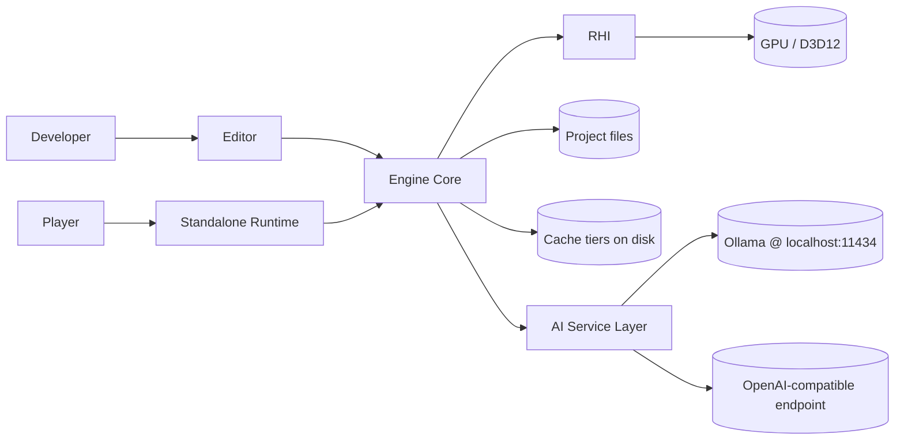

# Software Requirements Specification — Velos Engine

| Field | Value |
|---|---|
| Document | SRS |
| Version | 0.1 (draft) |
| Status | For review |
| Conforms to | IEEE 830-style, adapted |
| Last updated | 2026-09-06 |

**Requirement keywords:** *shall* = mandatory for v1.0, *should* = strongly desired,
*may* = optional/post-1.0. Every requirement has a stable ID and a target milestone.

---

## 1. Scope

This document specifies the functional and non-functional requirements for **Velos Engine**, a
Windows-native, GPU-first 3D/2D game engine with an integrated editor, C# scripting, multi-tier
caching, and an AI assistance layer. Product context, goals and non-goals are in [PRD.md](PRD.md).

## 2. System context

## 3. Definitions

| Term | Meaning |
|---|---|
| **RHI** | Render Hardware Interface — the abstract GPU API layer |
| **PSO** | Pipeline State Object |
| **Render graph** | Declarative frame description; passes + resources with automatic barriers/aliasing |
| **Archetype** | An ECS storage chunk holding all entities sharing an identical component set |
| **Tier** | A scalability preset: `Potato`, `Low`, `Medium`, `High`, `Ultra` |
| **Cooked asset** | An imported asset converted to GPU/engine-ready binary form |
| **CAS** | Content-addressed storage — files keyed by hash of their contents |
| **Baseline HW** | Intel UHD 620 (iGPU) and NVIDIA GTX 1050 2 GB, 8 GB RAM, 4-core CPU, SATA SSD |

---

## 4. Functional requirements

### 4.1 Core foundation (`FR-CORE`)

| ID | Requirement | Milestone |
|---|---|---|
| FR-CORE-001 | The engine **shall** provide custom allocators: linear/arena, stack, pool, and a per-frame scratch allocator reset every frame. | M0 |
| FR-CORE-002 | The engine **shall** track all allocations by tag (subsystem) and expose live totals to the profiler. | M0 |
| FR-CORE-003 | The engine **shall** provide a work-stealing job system with fibers-or-tasks, dependencies, and parallel-for, scaling to `hardware_concurrency - 1` workers. | M0 |
| FR-CORE-004 | The engine **shall** provide an SIMD-accelerated math library (vec2/3/4, mat3/4, quat, AABB, sphere, frustum, transform) with an SSE4.2 baseline and an AVX2 path. | M0 |
| FR-CORE-005 | The engine **shall** provide structured, level-filtered, category-tagged logging with a ring buffer, file sink and editor console sink; logging **shall** be lock-free on the producer side. | M0 |
| FR-CORE-006 | The engine **shall** provide a compile-time reflection system (macro/attribute driven) exposing type names, fields, attributes and metadata for serialisation and inspector generation. | M0 |
| FR-CORE-007 | The engine **shall** provide a typed event bus with immediate and deferred (queued) dispatch. | M0 |
| FR-CORE-008 | The engine **shall** provide string interning / hashed string IDs (`FNV1a64`) for all runtime name lookups. | M0 |
| FR-CORE-009 | The engine **shall** provide a `Result<T,Error>`-style error type; exceptions **shall not** be used for control flow in engine code. | M0 |
| FR-CORE-010 | The engine **shall** provide a hierarchical, thread-aware CPU profiler with scoped zones exportable to Chrome trace / Tracy format. | M0 |

### 4.2 Platform layer (`FR-PLAT`)

| ID | Requirement | Milestone |
|---|---|---|
| FR-PLAT-001 | The engine **shall** create and manage Win32 windows (resize, DPI awareness, fullscreen/borderless, multi-monitor). | M1 |
| FR-PLAT-002 | The engine **shall** support keyboard, mouse (incl. raw input), and XInput gamepads with an abstraction over device state and events. | M1 |
| FR-PLAT-003 | The engine **shall** provide a virtual filesystem with mount points (`engine://`, `project://`, `cache://`) and case-insensitive normalised paths. | M1 |
| FR-PLAT-004 | The engine **shall** provide asynchronous file I/O with prioritised requests and cancellation. | M1 |
| FR-PLAT-005 | The engine **shall** provide filesystem watching for hot reload of shaders, assets and scripts. | M1 |
| FR-PLAT-006 | The engine **shall** provide native file/folder dialogs, clipboard, and drag-and-drop into the editor. | M1 |
| FR-PLAT-007 | The engine **shall** produce a crash handler writing a minidump plus the last N log lines and current frame state. | M1 |
| FR-PLAT-008 | The engine **shall** query and report GPU vendor/device/driver version, VRAM budget, and feature support at startup. | M2 |

### 4.3 Render Hardware Interface (`FR-RHI`)

| ID | Requirement | Milestone |
|---|---|---|
| FR-RHI-001 | The engine **shall** define a backend-agnostic RHI covering: device, swapchain, command lists, buffers, textures, samplers, pipelines, root/descriptor bindings, queries, and fences. | M2 |
| FR-RHI-002 | The RHI **shall** have a Direct3D 12 backend supporting feature level 11_0 hardware and above. | M2 |
| FR-RHI-003 | The RHI **should** have a Vulkan 1.2+ backend passing the same conformance suite. | M24 |
| FR-RHI-004 | The RHI **shall** use bindless descriptors where supported, with a bound-descriptor fallback path for hardware/drivers lacking Resource Binding Tier 2+. | M2 |
| FR-RHI-005 | The RHI **shall** support graphics, async-compute and copy queues, with automatic fallback to a single queue where unsupported. | M2 |
| FR-RHI-006 | The RHI **shall** support double and triple buffering with per-frame resource ring buffers and GPU fence synchronisation. | M2 |
| FR-RHI-007 | The RHI **shall** enable the debug layer, GPU validation, and object naming in Debug builds only. | M2 |
| FR-RHI-008 | The RHI **shall** support device-removed detection and attempt a clean device reset without losing the editor session. | M21 |
| FR-RHI-009 | The RHI **shall** expose GPU timestamp queries per render-graph pass. | M21 |
| FR-RHI-010 | The RHI **shall** provide a transient resource allocator with memory aliasing driven by render-graph lifetimes. | M6 |

### 4.4 Shaders & pipeline caching (`FR-SHADER`)

| ID | Requirement | Milestone |
|---|---|---|
| FR-SHADER-001 | Shaders **shall** be authored in HLSL (SM 6.0) and compiled with DXC to DXIL (and SPIR-V for the Vulkan backend). | M3 |
| FR-SHADER-002 | The engine **shall** support a shader permutation system with named boolean/enum features and explicit permutation whitelisting to prevent combinatorial explosion. | M3 |
| FR-SHADER-003 | Compiled shader bytecode **shall** be cached on disk keyed by `hash(source + includes + defines + compiler version + target)`. | M3 |
| FR-SHADER-004 | PSOs **shall** be cached on disk (D3D12 pipeline library) and warmed asynchronously at startup; a PSO miss **shall not** stall the render thread (a fallback PSO is used for that frame). | M3 |
| FR-SHADER-005 | The engine **shall** hot-reload shaders on file change, recompiling only affected permutations, with visible results in **< 1 s**. | M3 |
| FR-SHADER-006 | Shader compile errors **shall** be reported in the editor console with file, line, and the offending source line, and **shall not** crash or black-screen the renderer. | M3 |
| FR-SHADER-007 | The engine **should** support offline bulk shader precompilation as a build step for packaged builds. | M23 |

### 4.5 Render graph & rendering (`FR-REND`)

| ID | Requirement | Milestone |
|---|---|---|
| FR-REND-001 | The renderer **shall** be organised as a render graph: passes declare resource reads/writes; the graph computes execution order, barriers, and transient memory aliasing automatically. | M6 |
| FR-REND-002 | The render graph **shall** cull passes whose outputs are unused. | M6 |
| FR-REND-003 | The renderer **shall** implement clustered forward+ shading (froxel light assignment via compute). | M9 |
| FR-REND-004 | The renderer **shall** implement a metal/roughness PBR model (GGX, Smith, multi-scatter compensation) matching the glTF 2.0 specification. | M6 |
| FR-REND-005 | The renderer **shall** support directional, point, spot and area(disc/rect, *should*) lights, with per-tier limits on the number of shadow-casting lights. | M9 |
| FR-REND-006 | The renderer **shall** implement cascaded shadow maps (2–4 cascades, tier-dependent) with PCF or PCSS filtering, plus cube shadows for points and 2D shadows for spots. | M9 |
| FR-REND-007 | The renderer **shall** support image-based lighting from HDR environment maps (prefiltered specular + irradiance SH), computed on GPU at import. | M6 |
| FR-REND-008 | The renderer **shall** support static, skinned and instanced meshes with automatic instance batching by material+mesh. | M6 / M16 |
| FR-REND-009 | The renderer **shall** support mesh LODs with screen-coverage-based selection and optional dithered cross-fade. | M9 |
| FR-REND-010 | The renderer **shall** perform frustum and two-phase depth-hierarchy occlusion culling on GPU, emitting indirect draw arguments, with a CPU culling fallback for `Low`/`Potato` tiers. | M10 |
| FR-REND-011 | The renderer **shall** provide a post-processing stack: HDR tonemapping (ACES/AgX), exposure (auto/manual), bloom, colour grading (LUT), vignette, and anti-aliasing (FXAA and TAA). | M17 |
| FR-REND-012 | The renderer **shall** support render-resolution scaling with temporal upscaling to the presentation resolution, enabled by default on `Low`/`Potato`. | M17 |
| FR-REND-013 | The renderer **shall** support transparent/blended materials with a sorted forward pass and optional order-independent approximation (*may*). | M6 |
| FR-REND-014 | The renderer **shall** support a 2D pipeline: batched sprites, sprite atlases, tilemaps, 9-slice, and an orthographic camera, sharing the RHI and render graph. | M15 |
| FR-REND-015 | The renderer **shall** provide a debug renderer: lines, wireframes, AABBs, text, and view modes (albedo, normals, roughness, overdraw, light complexity, LOD, cluster heatmap). | M7 |
| FR-REND-016 | The renderer **shall** support GPU particle systems simulated in compute with indirect rendering. | M10 |
| FR-REND-017 | The renderer **should** support screen-space ambient occlusion (GTAO) with a cheap half-res variant for low tiers. | M17 |
| FR-REND-018 | The renderer **should** support screen-space reflections on `High`+ only. | Post-1.0 |
| FR-REND-019 | The renderer **shall** support baked lightmaps or irradiance volumes for static GI (chosen in OD-06). | M19 |

### 4.6 Scalability & low-end optimisation (`FR-SCALE`)

| ID | Requirement | Milestone |
|---|---|---|
| FR-SCALE-001 | The engine **shall** define five tiers — `Potato`, `Low`, `Medium`, `High`, `Ultra` — each a declarative set of feature toggles and numeric budgets stored in data, not code. | M9 |
| FR-SCALE-002 | The engine **shall** auto-detect a starting tier from GPU device ID, VRAM, and a short startup benchmark. | M9 |
| FR-SCALE-003 | The engine **shall** support an optional dynamic resolution scaler that maintains a target frame time within a configured min/max scale range. | M17 |
| FR-SCALE-004 | Every GPU-only feature **shall** have a defined behaviour when disabled by tier — never a hard failure or visual corruption. | M9 |
| FR-SCALE-005 | The engine **shall** expose a per-frame budget report (CPU ms, GPU ms, draw calls, triangles, VRAM) and **shall** warn when a budget is exceeded. | M21 |
| FR-SCALE-006 | The engine **shall** minimise bandwidth on integrated GPUs: no fat G-buffer, packed vertex formats, BC-compressed textures, half-precision where safe, and depth-prepass-driven overdraw reduction. | M9 |
| FR-SCALE-007 | The engine **shall** ship a headless benchmark mode that replays a fixed camera path and emits frame-time statistics as JSON for CI regression tracking. | M21 |

### 4.7 Asset pipeline (`FR-ASSET`)

| ID | Requirement | Milestone |
|---|---|---|
| FR-ASSET-001 | The engine **shall** import: glTF 2.0/GLB, FBX (*should*), OBJ, PNG/JPG/TGA/HDR/DDS/KTX2, WAV/OGG, TTF, and plain-text/JSON data. | M4 |
| FR-ASSET-002 | Every imported asset **shall** be cooked to an engine-native binary format that can be memory-mapped and uploaded to the GPU with no per-load parsing. | M4 |
| FR-ASSET-003 | Cooked assets **shall** be stored in content-addressed storage keyed by `BLAKE3(source bytes + import settings + cooker version)`. | M4 |
| FR-ASSET-004 | Re-importing an asset with unchanged inputs **shall** be a cache hit costing < 1 ms and no CPU work beyond hashing. | M4 |
| FR-ASSET-005 | The engine **shall** maintain a persistent asset database of GUID → path → dependencies, supporting reverse dependency queries ("what uses this texture?"). | M4 |
| FR-ASSET-006 | Assets **shall** be referenced by stable GUID; moving or renaming a file **shall not** break references. | M4 |
| FR-ASSET-007 | The engine **shall** compress textures to BC1/BC3/BC5/BC6H/BC7 at import with mip generation, using GPU-accelerated compression where available. | M4 |
| FR-ASSET-008 | The engine **shall** optimise meshes at import: vertex cache optimisation, overdraw optimisation, vertex fetch optimisation, meshlet generation (*should*), quantised vertex attributes, and automatic LOD generation via simplification. | M4 / M9 |
| FR-ASSET-009 | The engine **shall** support asynchronous streaming of textures and meshes with priority derived from screen coverage and distance. | M11 |
| FR-ASSET-010 | The engine **shall** hot-reload assets when their source files change while the editor is running. | M4 |
| FR-ASSET-011 | The engine **shall** package a project into a small number of sealed archive files (`.vpak`) with optional per-chunk compression for shipping. | M23 |
| FR-ASSET-012 | The import pipeline **shall** be parallel across assets, saturating the job system. | M4 |

### 4.8 Smart caching (`FR-CACHE`)

| ID | Requirement | Milestone |
|---|---|---|
| FR-CACHE-001 | The engine **shall** implement four cache tiers: (T1) cooked asset CAS, (T2) shader/PSO cache, (T3) GPU residency cache, (T4) AI response cache. | M4 / M3 / M11 / M18 |
| FR-CACHE-002 | Every cache tier **shall** have a configurable byte budget and **shall** never exceed it; eviction is mandatory, not best-effort. | M11 |
| FR-CACHE-003 | Cache eviction **shall** use a cost-aware policy combining recency, frequency and rebuild cost (rebuilding a BC7 texture is expensive; evict it last). | M11 |
| FR-CACHE-004 | Every cache entry **shall** carry a version key; a version bump **shall** invalidate cleanly with no stale reads. | M11 |
| FR-CACHE-005 | The GPU residency cache **shall** stream mip levels and mesh LODs in/out to keep VRAM within budget, degrading detail rather than stuttering or OOM-ing. | M11 |
| FR-CACHE-006 | The engine **should** predictively prefetch assets using spatial locality (what is about to enter the camera frustum) and recorded session history. | M11 |
| FR-CACHE-007 | The engine **shall** expose cache statistics (hit rate, size, evictions, saved time) in the profiler and **shall** provide `--no-cache`, `--verify-cache` and `--clear-cache` modes. | M11 |
| FR-CACHE-008 | Caches **should** be shareable across machines/CI via a directory or HTTP-backed remote cache. | Post-1.0 |
| FR-CACHE-009 | Cache reads **shall** be lock-free on the hit path. | M11 |

### 4.9 Scene, ECS and gameplay (`FR-SCENE`)

| ID | Requirement | Milestone |
|---|---|---|
| FR-SCENE-001 | The engine **shall** implement an archetype-based ECS with dense component storage, stable entity handles (index + generation), and O(1) component access. | M5 |
| FR-SCENE-002 | The ECS **shall** support queries with include/exclude/optional component filters and change-detection ("what moved this frame?"). | M5 |
| FR-SCENE-003 | Systems **shall** declare component read/write access so the scheduler can execute non-conflicting systems in parallel automatically. | M5 |
| FR-SCENE-004 | The engine **shall** support a transform hierarchy (parent/child) with dirty-flag propagation and GPU-side world-matrix evaluation for large hierarchies. | M5 / M10 |
| FR-SCENE-005 | Scenes **shall** serialise to a human-readable text format for version control and to a fast binary format for shipping, both produced from the same reflection data. | M22 |
| FR-SCENE-006 | The engine **shall** support prefabs with nested prefabs and per-instance property overrides. | M22 |
| FR-SCENE-007 | The engine **shall** support additive scene loading/unloading and streaming of scene sections. | M22 |
| FR-SCENE-008 | The engine **shall** provide a fixed-timestep simulation loop (default 60 Hz) decoupled from rendering, with interpolation for rendering between fixed steps. | M5 |
| FR-SCENE-009 | The engine **shall** provide a spatial acceleration structure (BVH or grid) for queries, culling and physics broadphase, rebuilt incrementally. | M9 |

### 4.10 Scripting (`FR-SCRIPT`)

| ID | Requirement | Milestone |
|---|---|---|
| FR-SCRIPT-001 | The engine **shall** host the .NET runtime and load a managed gameplay assembly. | M12 |
| FR-SCRIPT-002 | The engine **shall** auto-generate C# bindings for reflected engine types, components and APIs. | M12 |
| FR-SCRIPT-003 | Script components **shall** receive lifecycle callbacks: `Awake`, `Start`, `Update`, `FixedUpdate`, `LateUpdate`, `OnDestroy`, plus physics and collision callbacks. | M12 |
| FR-SCRIPT-004 | The engine **shall** hot-reload the gameplay assembly on rebuild, preserving serialisable component state, within 3 s. | M12 |
| FR-SCRIPT-005 | Public script fields **shall** appear in the editor inspector via reflection, with attribute-driven ranges/tooltips/headers. | M12 |
| FR-SCRIPT-006 | The interop boundary **shall not** allocate managed memory per call on hot paths; native data **shall** be exposed via spans/pointers to blittable structs. | M12 |
| FR-SCRIPT-007 | Script exceptions **shall** be caught, logged with a managed stack trace, and **shall not** take down the engine; the offending component is disabled. | M12 |
| FR-SCRIPT-008 | The engine **shall** support coroutines/async and frame-scheduled timers from script. | M12 |

### 4.11 Physics (`FR-PHYS`)

| ID | Requirement | Milestone |
|---|---|---|
| FR-PHYS-001 | The engine **shall** integrate a 3D rigid-body physics engine with static, kinematic and dynamic bodies. | M13 |
| FR-PHYS-002 | The engine **shall** support box, sphere, capsule, cylinder, convex hull, compound and triangle-mesh colliders, with automatic convex decomposition at import (*should*). | M13 |
| FR-PHYS-003 | The engine **shall** support triggers, collision layers/masks, and contact/trigger events surfaced to script. | M13 |
| FR-PHYS-004 | The engine **shall** provide raycasts, shape casts and overlap queries from native and script. | M13 |
| FR-PHYS-005 | The engine **shall** provide a character controller with slope, step and ground detection. | M13 |
| FR-PHYS-006 | The engine **shall** provide joints/constraints: fixed, hinge, slider, distance, cone. | M13 |
| FR-PHYS-007 | Physics **shall** run on the fixed timestep, multithreaded via the engine job system, and **shall** be deterministic for a fixed input sequence on identical hardware. | M13 |
| FR-PHYS-008 | The engine **shall** support 2D physics via a constrained 3D solver (locked Z axis and rotations). | M15 |
| FR-PHYS-009 | The engine **shall** provide a physics debug visualiser (colliders, contacts, sleeping state). | M13 |

### 4.12 Animation (`FR-ANIM`)

| ID | Requirement | Milestone |
|---|---|---|
| FR-ANIM-001 | The engine **shall** import and play skeletal animation clips with configurable looping and playback rate. | M16 |
| FR-ANIM-002 | The engine **shall** support animation blending: linear blends, 1D/2D blend spaces, layers, and additive layers with bone masks. | M16 |
| FR-ANIM-003 | The engine **shall** support a state machine with transitions, conditions and blend times, editable in the editor. | M16 |
| FR-ANIM-004 | Skinning **shall** execute on GPU (compute), writing to a skinned-vertex buffer reusable by depth, shadow and main passes; a CPU path exists for `Potato`. | M16 |
| FR-ANIM-005 | The engine **shall** support animation compression (quantised keys, curve fitting) with a quality setting. | M16 |
| FR-ANIM-006 | The engine **shall** support root motion extraction and application. | M16 |
| FR-ANIM-007 | The engine **shall** support animation events/notifies dispatched to script. | M16 |
| FR-ANIM-008 | The engine **should** support inverse kinematics (two-bone IK, look-at). | M16 |
| FR-ANIM-009 | The engine **shall** support sprite-sheet frame animation for 2D. | M15 |

### 4.13 Audio (`FR-AUDIO`)

| ID | Requirement | Milestone |
|---|---|---|
| FR-AUDIO-001 | The engine **shall** play 2D and 3D positional audio with distance attenuation, doppler and configurable rolloff. | M14 |
| FR-AUDIO-002 | The engine **shall** provide a mixer with named buses, volume/pitch, and per-bus effects (low-pass, reverb send). | M14 |
| FR-AUDIO-003 | The engine **shall** stream long audio files and fully decode short ones, with a memory budget. | M14 |
| FR-AUDIO-004 | The engine **shall** run audio on a dedicated thread with no allocation and no locks on the mixing path. | M14 |
| FR-AUDIO-005 | The engine **should** support audio occlusion via physics raycasts. | M14 |

### 4.14 UI system (`FR-UI`)

| ID | Requirement | Milestone |
|---|---|---|
| FR-UI-001 | The engine **shall** provide an in-game UI system: canvases, anchors, layout groups, text (SDF fonts), images, buttons, sliders, input fields. | M15 |
| FR-UI-002 | Game UI **shall** support both screen-space and world-space canvases. | M15 |
| FR-UI-003 | Game UI **shall** batch into a minimal number of draw calls and support input events routed to script. | M15 |
| FR-UI-004 | The engine **should** support UI scaling and multiple aspect ratios without re-authoring. | M15 |

### 4.15 Editor (`FR-EDIT`)

| ID | Requirement | Milestone |
|---|---|---|
| FR-EDIT-001 | The editor **shall** provide dockable, persistent, user-arrangeable panels with saved layouts. | M7 |
| FR-EDIT-002 | The editor **shall** provide a scene hierarchy with multi-select, drag-reparent, search and filtering. | M8 |
| FR-EDIT-003 | The editor **shall** provide a reflection-driven inspector for native and script components, with no hand-written UI required for a new component. | M8 |
| FR-EDIT-004 | The editor **shall** provide a viewport with a fly camera, translate/rotate/scale gizmos, local/world space toggle, snapping, and object picking. | M8 |
| FR-EDIT-005 | The editor **shall** provide an asset browser with thumbnails, search, tags, drag-and-drop into scene/inspector, and import settings per asset. | M8 |
| FR-EDIT-006 | The editor **shall** support play / pause / step in-editor, restoring the pre-play scene state exactly on stop. | M8 |
| FR-EDIT-007 | The editor **shall** provide unlimited command-based undo/redo covering all scene and asset-setting mutations. | M22 |
| FR-EDIT-008 | The editor **shall** provide a node-based material editor generating HLSL, with live preview. | M20 |
| FR-EDIT-009 | The editor **shall** provide a profiler panel: CPU frame timeline, per-pass GPU timings, memory by tag, cache statistics, draw-call counters. | M21 |
| FR-EDIT-010 | The editor **shall** provide a render-graph visualiser showing passes, resources, barriers and aliasing. | M21 |
| FR-EDIT-011 | The editor **shall** provide a console with filtering, search, and click-to-navigate to source. | M7 |
| FR-EDIT-012 | The editor **shall** provide project management: create/open project, project settings, build/package. | M22 |
| FR-EDIT-013 | The editor **shall** auto-save and recover the scene after a crash. | M22 |
| FR-EDIT-014 | The editor **shall** never block the UI thread for more than 100 ms; long operations run as cancellable background tasks with progress. | M8 |
| FR-EDIT-015 | The editor **shall** provide a lighting/environment panel (sky, ambient, fog, exposure, shadow settings, bake controls). | M9 |

### 4.16 AI layer (`FR-AI`)

| ID | Requirement | Milestone |
|---|---|---|
| FR-AI-001 | The engine **shall** define a provider-agnostic AI interface supporting chat completion, streaming, embeddings, and tool/function calling. | M18 |
| FR-AI-002 | The engine **shall** implement an OpenAI-compatible HTTP provider configurable with base URL, model, API key and headers, thereby supporting OpenAI, Azure OpenAI, OpenRouter, Groq, LM Studio, llama.cpp server and any compatible endpoint. | M18 |
| FR-AI-003 | The engine **shall** implement a native Ollama provider (`/api/chat`, `/api/generate`, `/api/embeddings`, `/api/tags`) targeting `http://localhost:11434` by default. | M18 |
| FR-AI-004 | The engine **shall** support an ordered fallback chain of providers with per-provider timeout, retry with exponential backoff, and automatic failover to the next provider (cloud → local Ollama → cache-only → graceful "AI unavailable"). | M18 |
| FR-AI-005 | The engine **shall** cache AI responses keyed by `hash(provider-class + model + prompt + context digest + parameters)`, with configurable TTL and a size budget. | M18 |
| FR-AI-006 | The engine **should** support semantic caching: an embedding-similarity lookup that reuses a cached answer when a new prompt is sufficiently similar (configurable threshold). | M18 |
| FR-AI-007 | AI requests **shall** be fully asynchronous; no AI call may block the render, simulation or UI thread. | M18 |
| FR-AI-008 | The engine **shall** stream partial responses to the UI token-by-token. | M18 |
| FR-AI-009 | API keys **shall** be stored via Windows DPAPI/Credential Manager, never in project files or version control, and **shall never** be written to logs. | M18 |
| FR-AI-010 | The engine **shall** provide an engine-tool layer callable by the model: query scene graph, read/write component values, create/delete entities, search assets, read/write project files, compile scripts — each gated by explicit user-configurable permissions and an approval prompt for destructive actions. | M19 |
| FR-AI-011 | The editor **shall** provide an AI assistant panel with project-aware context (open scene, selection, recent errors) and conversation history. | M19 |
| FR-AI-012 | The engine **should** provide AI-assisted asset tagging and natural-language asset search over embedded asset metadata. | M19 |
| FR-AI-013 | The engine **should** provide AI-assisted script generation and shader/material assistance with automatic compile-and-fix loops. | M19 |
| FR-AI-014 | The engine **shall** expose a runtime AI service to game scripts (NPC dialogue, behaviour decisions) with a hard per-frame CPU budget, request rate limiting and a queue. | M20 |
| FR-AI-015 | Runtime AI **shall** degrade to authored fallback content (scripted dialogue/behaviour trees) when no provider is reachable. | M20 |
| FR-AI-016 | The engine **shall** log AI token usage and estimated cost per session, visible in the editor. | M18 |
| FR-AI-017 | All AI features **shall** be fully functional using only a local Ollama model. | M18 |
| FR-AI-018 | The engine **shall** provide a local vector index over project assets and documentation for retrieval-augmented context. | M19 |

### 4.17 Build & packaging (`FR-BUILD`)

| ID | Requirement | Milestone |
|---|---|---|
| FR-BUILD-001 | The engine **shall** produce a standalone runtime executable that loads a packaged project with no editor code linked in. | M23 |
| FR-BUILD-002 | Packaging **shall** cook all assets, precompile all shader permutations and PSOs, strip unreferenced assets, and emit `.vpak` archives. | M23 |
| FR-BUILD-003 | A packaged build of the sample game **shall** be ≤ 150 MB excluding user content, and **shall** start to first frame in ≤ 3 s on baseline hardware. | M23 |
| FR-BUILD-004 | The build **shall** be reproducible: identical inputs produce byte-identical outputs. | M23 |
| FR-BUILD-005 | The engine **should** support a development build with the console, profiler and hot reload enabled but the editor excluded. | M23 |

---

## 5. Non-functional requirements

### 5.1 Performance (`NFR-PERF`)

| ID | Requirement |
|---|---|
| NFR-PERF-001 | **Baseline target:** the reference 3D scene (≈ 150 k triangles visible, 8 dynamic lights, 1 shadowed directional light, 40 draw batches) **shall** run at ≥ 60 FPS at 1920×1080 on baseline HW at `Low` tier. |
| NFR-PERF-002 | **High target:** the same scene **shall** run at ≥ 144 FPS at 2560×1440 on an RTX 3060 class GPU at `High` tier. |
| NFR-PERF-003 | CPU main-thread frame time **shall** be ≤ 4 ms for the reference scene on baseline HW; the engine **shall not** be CPU-bound before it is GPU-bound. |
| NFR-PERF-004 | 99th-percentile frame time **shall** be ≤ 1.5× the median (no stutter spikes) over a 5-minute run. |
| NFR-PERF-005 | Editor cold start ≤ 3 s; warm start ≤ 1.5 s. |
| NFR-PERF-006 | Opening a 5 000-asset project ≤ 10 s cold, ≤ 3 s warm cache. |
| NFR-PERF-007 | Shader hot reload ≤ 1 s; C# hot reload ≤ 3 s; asset hot reload ≤ 500 ms for a 2 K texture. |
| NFR-PERF-008 | Zero heap allocations on the steady-state render and simulation hot paths (verified by an allocation-tracking test). |
| NFR-PERF-009 | Asset import of a 100 MB glTF scene ≤ 30 s cold on baseline HW; ≤ 1 s warm (cache hit). |
| NFR-PERF-010 | AI cached response latency ≤ 50 ms; local Ollama first-token latency ≤ 2 s for a 7 B model on baseline HW. |

### 5.2 Resource limits (`NFR-RES`)

| ID | Requirement |
|---|---|
| NFR-RES-001 | Runtime engine footprint (excluding game content) ≤ 200 MB system RAM. |
| NFR-RES-002 | The engine **shall** operate within a 2 GB VRAM budget at `Low` tier, including framebuffers. |
| NFR-RES-003 | Engine binary (runtime, release) ≤ 25 MB. |
| NFR-RES-004 | Disk caches **shall** respect a user-configured budget with a 10 GB default and **shall** self-evict. |
| NFR-RES-005 | The engine **shall** run on Windows 10 20H2 (build 19042) or later, x64, with a feature-level 11_0 GPU. |

### 5.3 Reliability (`NFR-REL`)

| ID | Requirement |
|---|---|
| NFR-REL-001 | 8-hour editor soak test: zero crashes, zero deadlocks, memory growth < 5%. |
| NFR-REL-002 | 4-hour runtime soak test: zero crashes, no VRAM growth. |
| NFR-REL-003 | The editor **shall** auto-save every 5 minutes and recover unsaved work after a crash. |
| NFR-REL-004 | GPU device removal **shall** be recovered from without data loss where the driver permits. |
| NFR-REL-005 | Malformed or corrupt assets **shall** produce an error and a visible placeholder, never a crash. |
| NFR-REL-006 | Network failure of an AI provider **shall** never stall or crash the editor. |

### 5.4 Security & privacy (`NFR-SEC`)

| ID | Requirement |
|---|---|
| NFR-SEC-001 | API keys **shall** be encrypted at rest via Windows DPAPI and **shall never** appear in logs, crash dumps, project files or telemetry. |
| NFR-SEC-002 | AI tool-calling **shall** operate under a least-privilege permission model, sandboxed to the project directory; writes outside the project root are denied. |
| NFR-SEC-003 | Destructive AI actions (delete, overwrite, run process) **shall** require explicit user confirmation and **shall** be undoable. |
| NFR-SEC-004 | All AI HTTP traffic **shall** use TLS with certificate validation; certificate validation **shall not** be disableable in release builds. |
| NFR-SEC-005 | The engine **shall** treat all model output as untrusted data — never `eval`-ed, never executed without user review, and sanitised before use in file paths or shell commands (prompt-injection defence). |
| NFR-SEC-006 | Asset importers and `.vpak` readers **shall** validate all offsets/sizes and be fuzz-tested; a malicious asset must not achieve code execution. |
| NFR-SEC-007 | No telemetry **shall** be sent without opt-in; project contents are never uploaded except as explicit AI request context, and the user **shall** be able to see exactly what context is sent. |
| NFR-SEC-008 | Third-party dependencies **shall** be pinned by version and hash and scanned for known CVEs in CI. |

### 5.5 Maintainability & quality (`NFR-MAINT`)

| ID | Requirement |
|---|---|
| NFR-MAINT-001 | Code **shall** compile warning-free at `/W4` (MSVC) with warnings-as-errors in CI. |
| NFR-MAINT-002 | Core, math, ECS, caching and serialisation **shall** have ≥ 80% unit-test line coverage. |
| NFR-MAINT-003 | Rendering **shall** be covered by golden-image tests with a perceptual-difference threshold, run in CI on a software or reference adapter. |
| NFR-MAINT-004 | Performance regression tests **shall** run in CI and fail the build on > 10% regression against the recorded baseline. |
| NFR-MAINT-005 | Debug builds **shall** run with ASan (where supported) and D3D12 GPU validation in a nightly job. |
| NFR-MAINT-006 | Layering **shall** be enforced by an automated dependency check: `core → platform → rhi → render → scene → script/editor`; no upward or cyclic dependencies. |
| NFR-MAINT-007 | Every public engine API **shall** carry documentation comments; API reference is generated in CI. |
| NFR-MAINT-008 | Third-party code **shall** live only in `/third_party`, vendored or fetched by pinned hash. |

### 5.6 Usability (`NFR-USE`)

| ID | Requirement |
|---|---|
| NFR-USE-001 | A user familiar with Unity **should** author a basic scene without reading documentation. |
| NFR-USE-002 | Every error surfaced to the user **shall** state what failed, why, and the next action to take. |
| NFR-USE-003 | The editor **shall** support full keyboard-driven navigation of common operations and a command palette. |
| NFR-USE-004 | The editor **shall** remain responsive (≥ 30 FPS UI) during import, bake and AI operations. |

### 5.7 Process (`NFR-PROC`)

| ID | Requirement |
|---|---|
| NFR-PROC-001 | All work **shall** be in Git with Conventional Commits; each milestone ends in an annotated tag `vM<n>`. |
| NFR-PROC-002 | `main` **shall** always build and pass CI; feature work happens on branches. |
| NFR-PROC-003 | Each milestone **shall** produce a demo (video or runnable sample) proving its exit criteria. |
| NFR-PROC-004 | Architectural decisions **shall** be recorded as ADRs before implementation. |
| NFR-PROC-005 | Binary assets > 5 MB **shall** be stored in Git LFS. |

---

## 6. Requirement → milestone traceability

| Milestone | Primary requirement groups |
|---|---|
| M0 Foundation | FR-CORE-001..010, NFR-MAINT-* |
| M1 Platform | FR-PLAT-001..007 |
| M2 RHI + D3D12 | FR-RHI-001..007, FR-PLAT-008 |
| M3 Shaders & PSO cache | FR-SHADER-001..006 |
| M4 Asset pipeline | FR-ASSET-001..008, 010, 012; FR-CACHE-001 (T1) |
| M5 ECS & scene | FR-SCENE-001..004, 008 |
| M6 Forward renderer | FR-REND-001,002,004,007,008,013; FR-RHI-010 |
| M7 Editor shell | FR-EDIT-001,011; FR-REND-015 |
| M8 Editor v1 | FR-EDIT-002..006,014 |
| M9 Lighting & scalability | FR-REND-003,005,006,009; FR-SCALE-001..006; FR-SCENE-009; FR-EDIT-015 |
| M10 GPU-driven | FR-REND-010,016; FR-SCENE-004 (GPU) |
| M11 Caching | FR-CACHE-002..009; FR-ASSET-009 |
| M12 Scripting | FR-SCRIPT-001..008 |
| M13 Physics | FR-PHYS-001..007,009 |
| M14 Audio | FR-AUDIO-001..005 |
| M15 2D & UI | FR-REND-014; FR-UI-001..004; FR-PHYS-008; FR-ANIM-009 |
| M16 Animation | FR-ANIM-001..008 |
| M17 Post & upscaling | FR-REND-011,012,017; FR-SCALE-003 |
| M18 AI core | FR-AI-001..009,016,017 |
| M19 AI editor | FR-AI-010..013,018; FR-REND-019 |
| M20 AI runtime + material editor | FR-AI-014,015; FR-EDIT-008 |
| M21 Profiling | FR-EDIT-009,010; FR-RHI-008,009; FR-SCALE-005,007 |
| M22 Serialisation & project | FR-SCENE-005..007; FR-EDIT-007,012,013 |
| M23 Packaging | FR-BUILD-001..005; FR-ASSET-011; FR-SHADER-007 |
| M24 Vulkan | FR-RHI-003 |
| M25–M26 Hardening & 1.0 | NFR-REL-*, NFR-PERF-*, docs, samples |

---

## 7. Acceptance verification methods

| Method | Applied to |
|---|---|
| Unit test | Core, math, ECS, caching, serialisation, asset hashing |
| Integration test | Import → cook → load → render round trips; script hot reload; AI fallback chain |
| Golden image | Rendering correctness (PBR, shadows, tonemapping, 2D) |
| Benchmark harness | All `NFR-PERF-*` on baseline and reference hardware |
| Fuzzing | Asset importers, `.vpak` reader, scene deserialiser |
| Soak test | `NFR-REL-001`, `NFR-REL-002` |
| Manual scripted walkthrough | Editor usability, `G1` 15-minute test with a fresh user |
