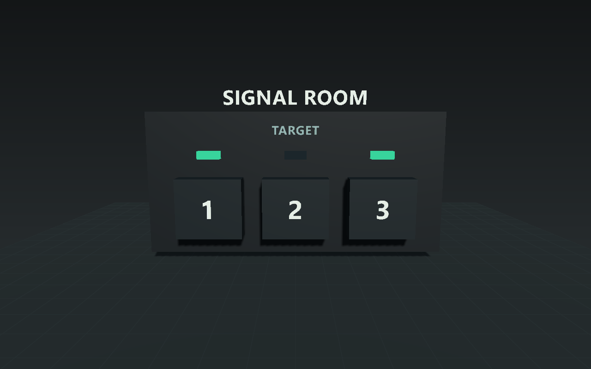
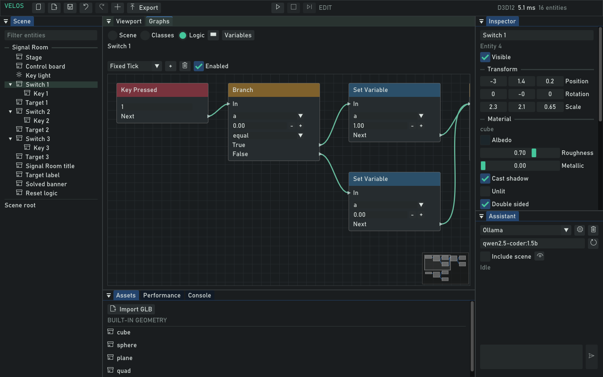

# Signal Room

A small keyboard puzzle built entirely through the Velos MCP authoring tools. The label PNGs
are generated bitmap assets; scene objects, materials, imports, hierarchy, gameplay variables,
behavior nodes, camera, simulation checks and export are authored through the official MCP client.



## Play

```powershell
.\out\build-control\Release\VelosRuntime.exe --scene=samples/signal-room/scene.velos
```

Press **1**, **2** and **3** to toggle different combinations of the lower signals. Match the
upper target: on, off, on. The **ALIGNED** indicator confirms success. **R** resets the puzzle;
**Escape** exits the runtime. In the editor, start Play before using the puzzle keys.

The puzzle has three binary variables (`a`, `b`, `c`) and a `solved` flag. Key 1 toggles `a/b`,
key 2 toggles `b/c`, and key 3 toggles all three. One solution from reset is 1 then 2.
The complete game loop is intentionally small; it does not imply audio, networking or general UI support.

## Inspect and Reproduce

```powershell
.\out\build-control\Release\VelosEditor.exe --scene=samples/signal-room/scene.velos
node tools/mcp/create-sample.mjs --output=out/signal-room-copy --adapter=nvidia
```

Select Switch 1, Switch 2, Switch 3, Solved banner or Reset logic, then open Graphs > Logic.
Scene variables are available from the Variables popup. The sample generator refuses existing
output directories, preserving any authored changes. It tests solve/reset through MCP, captures
the actual editor/runtime and exports to a new folder under `out`.



See [../../docs/MCP.md](../../docs/MCP.md) for connection setup, the complete tool catalog and limits.